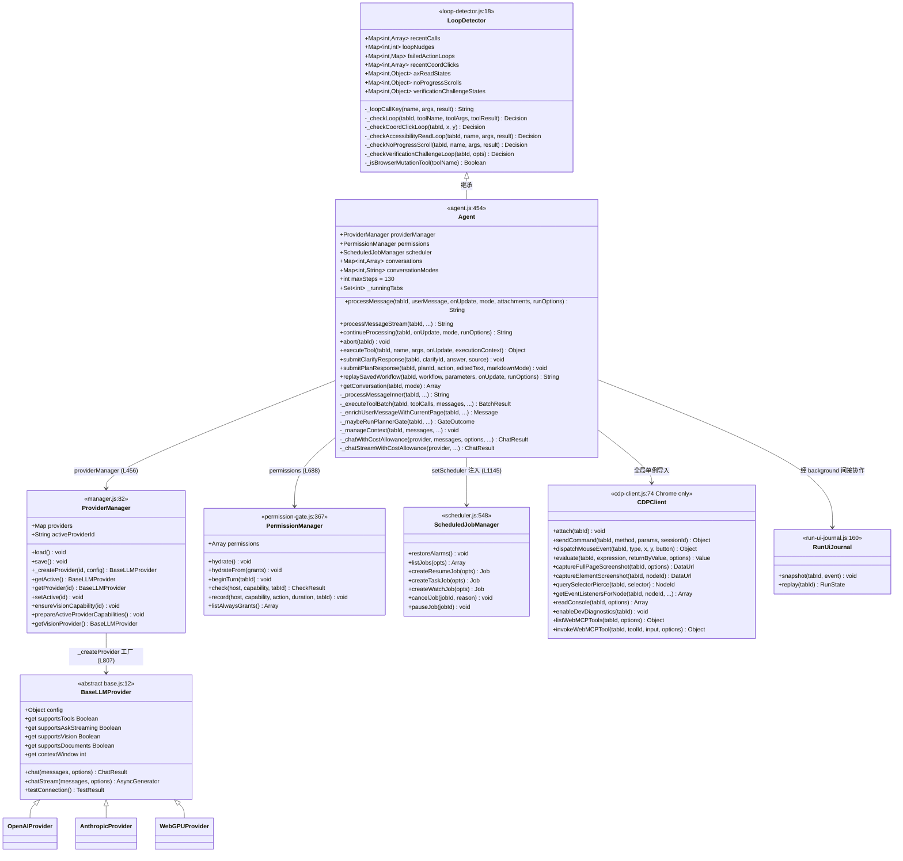
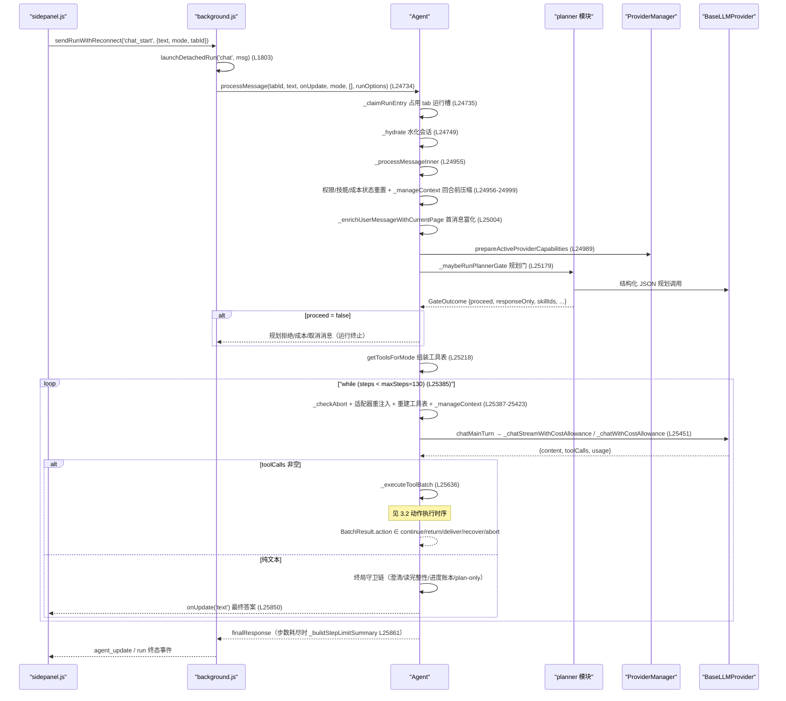
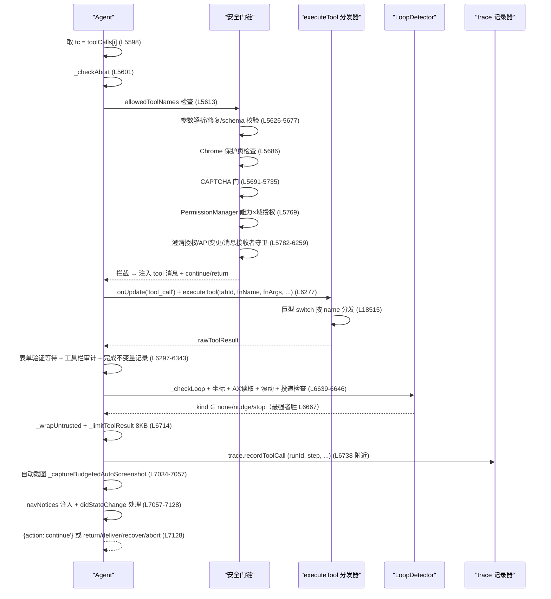
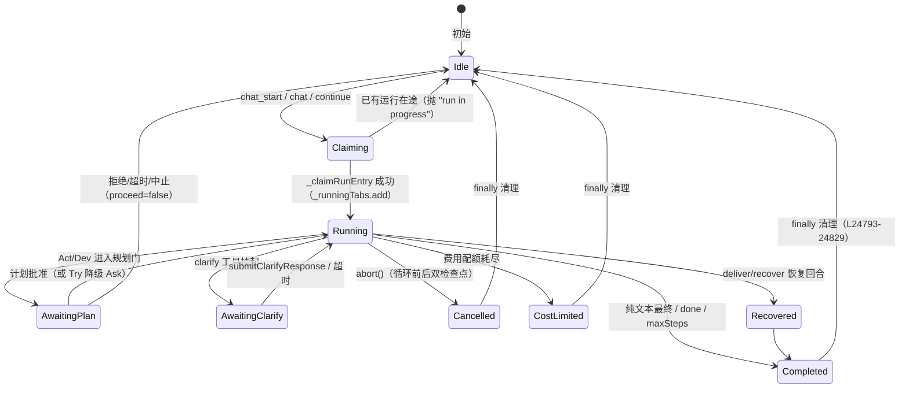
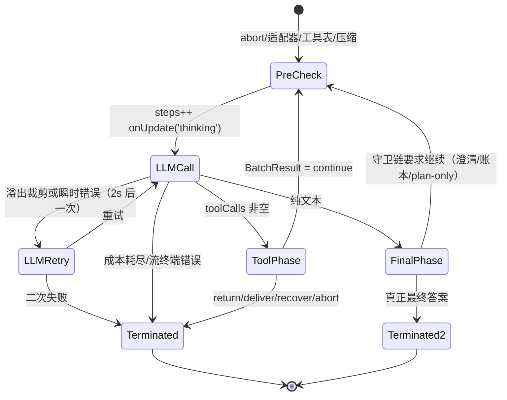
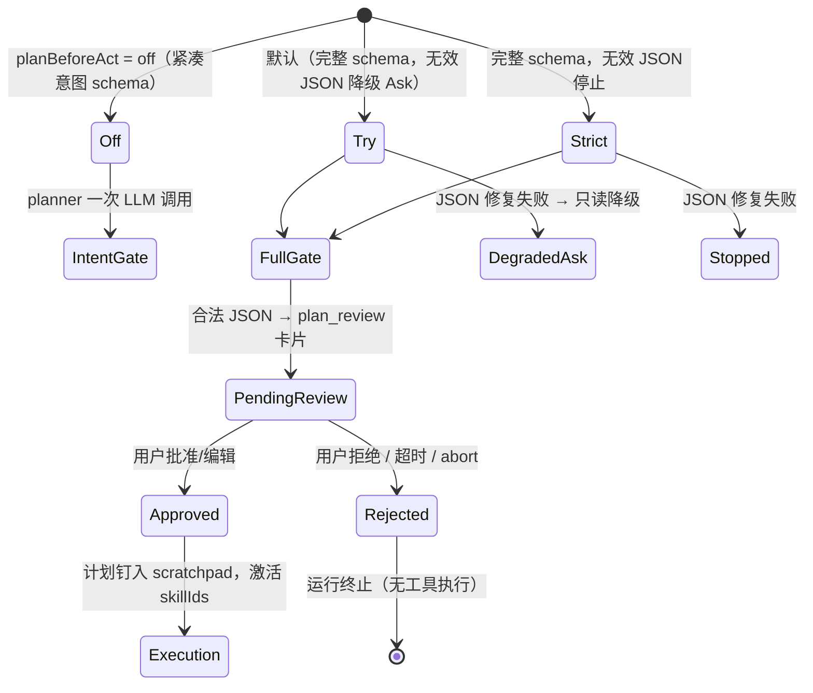

# WebBrain Agent 运行逻辑分析

> 📋 分析对象：`src/chrome/src/agent/agent.js`（26,590 行）为核心的 Chrome 构建（Firefox 镜像同理）
> 📅 分析日期：2026-08-16 · 版本 32.0.0
> 🔍 所有行号均指 `src/chrome/src/agent/agent.js`，除非另行标注文件名

---

## 1. 🎯 架构总览

**一句话概括**：WebBrain 是一个**单 Agent、单主循环的 ReAct 式浏览器 Agent**——`Agent` 类（继承 `LoopDetector`）在一个 `while` 循环中反复调用 LLM（带工具 schema）→ 解析 `toolCalls` → 经过多重安全门执行工具 → 把结果回填消息数组，直到模型给出纯文本最终答案、`done` 工具终止、循环检测硬停、步数耗尽或用户中止。

**核心设计原则**：

| 原则 | 体现 |
|---|---|
| **运行归属后台（detached run）** | 运行由 background service worker 持有，面板只是重连的观察者（`background.js:1803` `launchDetachedRun`），关闭面板不终止运行 |
| **安全门串联在工具分发前** | Chrome 保护页 → CAPTCHA 门 → 权限门 → 澄清授权 → API 变更门 → 消息接收者守卫，逐个拦截（`_executeToolBatch` L5598-6259） |
| **信任边界文本包装** | 页面派生内容用 `<untrusted_page_content>` 包装，运行时注入的指导用 `[TRUSTED ...]` 前缀，二者严格分离（`_wrapUntrusted` L16940） |
| **结果即决策（action 协议）** | `_executeToolBatch` 返回 `{action: 'continue'\|'return'\|'deliver'\|'recover'\|'abort', value, status}`，主循环据此分派（L25636-25672） |
| **每 tab 全状态隔离** | 几十个 `Map<tabId, ...>` 保存会话、运行覆盖、守卫状态（构造器 L455-752） |
| **LLM 层完全抽象** | 所有模型交互经 `ProviderManager` → `BaseLLMProvider.chat()/chatStream()`，Agent 不知道具体厂商（`providers/base.js:12`） |

**技术形态**：原生 ES Modules、无框架、无打包器；`Agent` 是一个约 600 个方法的**巨石类**，通过继承 `LoopDetector` 获得循环检测，通过组合持有 `PermissionManager`、`ProviderManager`、`ScheduledJobManager`、`CDPClient`、trace 记录器等协作对象。

---

## 2. 🎨 类图（阶段二已细化）



> 注：`tools.js`、`planner.js`、`adapters.js`、`skills.js`、`workflows.js`、`user-memory.js`、`trace/recorder.js` 是**模块级函数集**而非类，以 ES Module 导入方式协作，不出现在类图中（协作图见各职责文档）。
>
> 📁 各核心类的**方法级职责文档**见 [`类的职责/`](类的职责/) 目录：
> [`Agent类职责.md`](类的职责/Agent类职责.md) · [`LoopDetector类职责.md`](类的职责/LoopDetector类职责.md) · [`PermissionManager类职责.md`](类的职责/PermissionManager类职责.md) · [`ProviderManager与BaseLLMProvider类职责.md`](类的职责/ProviderManager与BaseLLMProvider类职责.md) · [`ScheduledJobManager类职责.md`](类的职责/ScheduledJobManager类职责.md) · [`CDPClient类职责.md`](类的职责/CDPClient类职责.md)

**继承与组合的关键点**：

- `Agent extends LoopDetector`（L454）——循环检测刻意做成"browser-free"纯逻辑类（`loop-detector.js:1-17` 注释），单测与扩展共用同一生产实现，子类提供 `_isBrowserMutationTool()` 分类。
- `PermissionManager` 在构造器中实例化（L688），`ScheduledJobManager` 由 background 注入（`setScheduler` L1146，agent.js）。
- Chrome 构建独有 `CDPClient`（`cdp-client.js:74`）；Firefox 构建无此组合。

---

## 3. 🔄 核心运行流程 — 时序图

> 📁 **阶段三展开**：本节时序图的每个 Phase 已在 [`step内部流程/`](step内部流程/) 目录按两轮模式展开——5 个 Phase 概述 + 18 个子步骤详细文档：
> [1-回合初始化与状态准备](step内部流程/1-回合初始化与状态准备.md) · [2-Plan-before-Act规划门](step内部流程/2-Plan-before-Act规划门.md) · [3-主循环LLM决策](step内部流程/3-主循环LLM决策.md) · [4-工具批执行](step内部流程/4-工具批执行.md) · [5-终局守卫与最终答案](step内部流程/5-终局守卫与最终答案.md)

### 3.1 回合级时序：从用户输入到最终答案（`processMessage` 主循环）



### 3.2 单步执行时序：LLM 决策 → 工具批执行（`_executeToolBatch` L5567）



### 3.3 动作执行流程（`executeTool` L18515 单工具分发）

```
executeTool(tabId, name, args, onUpdate, executionContext)
├─ 坐标规范化（click x/y ∈ [0,1] → 拒绝并给恢复提示；截图坐标映射）L18523-18548
├─ _richTextToolbarToolBlock 富文本工具栏拦截 L18549
├─ load_skill 特例 L18560
├─ 巨型 switch(name) —— 每个工具一个分支
│   ├─ 内容脚本类: click/type_text/press_keys/scroll/read_page/... → chrome.tabs.sendMessage
│   ├─ 标签页类: navigate/new_tab/go_back/go_forward → chrome.tabs API
│   ├─ 网络类: fetch_url/research_url → network-tools
│   ├─ CDP 类: 可信点击/截图/shadow DOM → CDPClient
│   ├─ Dev 类: read_page_source/execute_js/inject_css/... → CDP Runtime
│   ├─ done → 捕获验证截图 + 页面状态探针 → 触发完成
│   ├─ clarify → 挂起等待用户输入（Promise + 定时器）
│   ├─ schedule_resume / schedule_task → ScheduledJobManager
│   ├─ 技能 HTTP 工具 → executeHttpSkillTool
│   └─ scratchpad_write / _downloadPublicMedia ... 等专用分支
└─ 返回 {success, error?, ...工具特定字段, _attachImage?, _attachDocument?}
```

---

## 4. 📊 状态图

### 4.1 运行生命周期（per tab）



### 4.2 单步内状态转换（主循环一次迭代）



### 4.3 Plan 状态机（`planner.js` + `_waitForPlanReview` L9552）



---

## 5. 🔍 关键子系统详解

### 5.1 LLM 交互层

```
chatMainTurn (L25354) ── 带消息完成度聚合 + onUpdate('message_info')
 └─ chatMainTurnRaw (L25259)
     ├─ _interactiveAskStreamingDecision (L1920) 判定是否走 Ask 流式
     ├─ 非流式 → _chatWithCostAllowance (L1885)
     │             └─ provider.chat(messages, options) → {content, toolCalls, usage}
     └─ 流式 → _chatStreamWithCostAllowance (L1990)
                 ├─ text_delta 实时 onUpdate
                 ├─ 终端事件后才返回完整结果
                 └─ 传输失败 → _shouldFallbackAskStream → 清空已发文本
                    + askStreamingDisabledForRun=true + 一次非流式重试 (L25323-25351)
```

**费用配额**贯穿每次调用：`_checkCostAllowance`（L1844）在调用前检查会话/累计限额，`_recordCostUsage`（L1850）在调用后记账（优先用提供商上报的 `usage.cost_usd`，否则 `_estimateUsageCostUsd` L1760 按模型单价估算）；超限抛出可识别错误（`_isCostAllowanceError` L1876），主循环以 `cost_limit` 状态终止（L25482-25488）。

### 5.2 动作执行层（安全门链）

`_executeToolBatch` 对批内每个 toolCall 依次过门，**门失败不抛异常**，而是注入结构化 `tool` 消息让模型看到拒绝原因并 `continue`：

| 顺序 | 门 | 行号 | 失败动作 |
|---|---|---|---|
| 1 | 工具目录白名单 | L5613 | tool 消息 + continue |
| 2 | 参数解析/修复/schema 校验 | L5626-5677 | tool 消息 + continue |
| 3 | Chrome 保护页 | L5686 | 结构化失败结果 |
| 4 | CAPTCHA 门 | L5691-5735 | 三级 TRUSTED 指导 / return `captcha_manual_required` |
| 5 | WebMCP 准备 / 公共媒体守卫 | L5737, L5751 | tool 消息 + continue |
| 6 | **PermissionManager 权限门** | L5769-5773 | allow once/always/deny，人是信任锚 |
| 7 | 澄清授权块 | L5782-5834 | 阻断至用户显式应答 |
| 8 | 技能端点重定向 / 媒体下载重定向 | L5836, L5846 | tool 消息 + continue |
| 9 | API 变更门（`/allow-api`） | L5859 | tool 消息 + continue |
| 10 | 消息接收者守卫（发送类动作） | L6239-6259 | no-dispatch 阻断 |
| 11 | 富文本工具栏预检 | L6272 | block 即结果 |
| — | **executeTool 实分发** | **L6277** | — |

`missingResponseOutcomeUnknown`（L5779）：凡有能力要求或状态变更的调用，若后续回复丢失，一律按"结果未知"处理——**失败关闭**。

### 5.3 消息管理（conversation 生命周期）

- 会话存取：`getConversation(tabId, mode)`（L13786）、`_hydrate`（L9053）从 `storage.session` 的 `agentConv:<tabId>` 水化；`_persist`（L9292）带降级标记（`_markPersistenceDegraded` L9232）。
- 三条固定消息：scratchpad（`_findScratchpadIndex` L13950）、进度账本（L13957）、Agent 记忆（L13964）——压缩时保留、内容可原位替换。
- 消息形状遵循 OpenAI 风格：`{role: user/assistant/tool/system, content, tool_calls, tool_call_id}`；工具结果始终 `JSON.stringify` 后包装。

### 5.4 循环检测（`LoopDetector`，6 个并行检测器）

| 检测器 | 方法（loop-detector.js） | 目标失效模式 |
|---|---|---|
| 精确调用重复 | `_checkLoop` L509 | 同名+同参+同结果反复 |
| 坐标点击 | `_checkCoordClickLoop` L486 | 5px 分桶内反复点击（参数噪声无法稀释） |
| AX 语义读 | `_checkAccessibilityReadLoop` L295 | ref_1→ref_2→… 无限翻页 |
| 无进度滚动 | `_checkNoProgressScroll` L387 | 成功但窗格未动 |
| 验证挑战 | `_checkVerificationChallengeLoop` L201 | ref churn 伪装的同一挑战循环 |
| 失败动作域 | `failedActionLoops` | 同一稳定失败域反复重试 |

合成规则（agent.js L6667-6703）：**stop > nudge > none**，最强者胜；nudge 以 `[LOOP DETECTED]` 注入工具结果之后（`_wrapUntrusted` 之后追加，保证提示在不可信包装外，L6705 注释）。

### 5.5 计划系统（Plan-before-Act）

- 入口 `_maybeRunPlannerGate`（L10034）→ `_runPlannerIntentGate`（L10839，Off 模式意图门）/ `_runPlannerGate`（L11037，Try/Strict 完整规划）。
- 规划器见到：用户任务 + 消毒后的 URL/标题 + 1500 字符历史摘要（`_buildPlannerHistoryDigest` L9726）；页面上下文按不可信数据包装、图像块丢弃。
- 产出 `GateOutcome`：`{proceed, message, reason, responseOnly, skillIds, progressLedgerPolicy, progressAction, responseLanguagePolicy}`；批准的计划经 `formatPlanScratchpad()` 钉入 scratchpad（抗压缩）。
- 计划调用同样受成本守卫、abort 检查、一次 JSON 修复重试（`_plannerRepairMessages` L10299）与 Qwen/DeepSeek no-think 处理（L10294）。

### 5.6 上下文管理（`_manageContext` L16344）

触发条件（任一）：消息数 > 50 / 原始字符 > 80,000 / token 预算越 `contextCompactRatio`（0.75）× 提供商 `contextWindow`。压缩保留：系统提示 + 原始任务（`_findOriginalTaskIndex` L16251）+ LLM 摘要的旧消息 + 最近 30 条原文。溢出硬兜底 `_emergencyTrim`（L17437）仅保 6 条；`_pruneOldImages`（L17176）每次调用前剥离旧图。

---

## 6. ⚠️ 错误处理策略

| 异常/失效 | 检测点 | 处理 | 终态 trace 状态 |
|---|---|---|---|
| 上下文溢出 | `_isContextOverflow` L17421 | 紧急裁剪 + **一次**重试 | `error`（二次失败） |
| 瞬时 LLM 错误（限流/网络） | catch L25480 | 等 2s 重试一次 | `error`（二次失败） |
| Ask 流式传输失败 | `_shouldFallbackAskStream` L1980 | 清空已发文本、本回合禁流、一次非流式重试 | 正常完成 |
| 成本配额耗尽 | `_isCostAllowanceError` L1876 | 立即 break，assistant 消息 + warning | `cost_limit` |
| 空输出（无 content 无 toolCalls） | L25684 | 一次恢复 nudge（`_emptyOutputRecoveryNudge`）→ 仍空则透明失败或调度自动续跑 | `empty_output` |
| 压缩占位符输出 | `_isCompressionPlaceholderResponse` L24729 | 一次 nudge → 仍占位则透明终止 | `placeholder_output` |
| 循环检测 stop | L6671 | `_recoverLoopStoppedTurn` 恢复回合 | `loop_stopped` |
| 投递检查点未验证 | `deliveryCheck` L6647 | `_recoverDeliveryCheckpointTurn` | `deliver` 恢复 |
| 用户中止 | 双检查点 L25387 / L25547 + 工具前 L5601 | `[Stopped by user]` | `cancelled` |
| 步数耗尽 | L25854 | `_buildStepLimitSummary` 合成透明摘要 + `max_steps_reached`（面板给 Continue） | `max_steps` |
| 规划 JSON 无效 | `_plannerRepairMessages` | 一次修复；Try 降级 Ask / Strict 停止 | `plan_only_output` 等 |
| 运行中 setup 抛错 | try/finally L25162/L25869 | 记录 trace error 并 rethrow；finally 恒结束 trace | `error` |

**终止条件全集**：纯文本最终（守卫链全过）、`done` 工具、`maxSteps`（130，可配至 195）、abort、cost_limit、loop stop、empty/placeholder 输出二次失败、clarification 强制停止、规划门拒绝。

---

## 7. 🌱 初始化流程

`Agent` 实例在 service worker 顶层创建一次（`background.js:185`），随后 MV3 每次唤醒都复用模块级实例：

```
background.js 顶层 (service worker 启动即执行)
├─ new ProviderManager() ── 从 provider-catalog.js 装载 106 张卡片定义
├─ const agent = new Agent(providerManager)  (background.js:185)
│   ├─ super() → LoopDetector 构造器（9 个 per-tab 环形缓冲 Map）(loop-detector.js:20-52)
│   ├─ this.providerManager = providerManager (L456)
│   ├─ 会话状态: conversations / conversationModes / conversationIds / submittedRunRequestIds (L457-472)
│   ├─ 信任边界: selectionGroundingScopes / responseLanguagePolicies (L459-467)
│   ├─ 进度系统: progressLedgers / progressPageScopes / progressSessions (L462-464)
│   ├─ 守卫状态: completionInvariants / readCompletenessStates / _formValidationBlocks ... (L473-490)
│   ├─ this.maxSteps = 130 (L486)
│   ├─ this.permissions = new PermissionManager({...}) (L688)
│   └─ this.scheduler = null（待 setScheduler 注入，L749）
├─ agent.setScheduler(new ScheduledJobManager(...)) (经 setScheduler L1145)
├─ agent.setRunStartGuard(...) / setCustomSkills(...) / setUserMemory(...) / setWebMCPEnabled(...)
└─ chrome.runtime.onMessage.addListener(handleMessage) ── 路由 chat/chat_start/continue/abort/...
```

每 tab 每回合的"再初始化"发生在 `processMessage` 前段（L24735-24792）：占用运行槽 → 水化 → 重置技能/循环/审计状态 → 开启完成不变量与读完整性 token → 记录模式/提供商/截图策略覆盖 → 进入 `_processMessageInner`。

---

## 8. 🎮 控制流 — 暂停 / 恢复 / 停止

```
【停止 abort(tabId)】(L9331)
  └─ abortFlags.add(tabId)
      ├─ 主循环步前检查 _checkAbort (L25387) → break，cancelled
      ├─ LLM 返回后检查 (L25547) → 区分"有未执行 toolCalls"文案
      ├─ 工具批内逐调用检查 (L5601) → 合成剩余 tool 结果（防孤儿 tool_calls 400）→ {action:'abort'}
      └─ clarify/plan 等待中被 _cancelClarifications/_cancelPendingPlans 取消

【暂停-恢复（两种机制）】
  A. clarify 工具（回合内暂停）
     └─ executeTool('clarify') 挂起 Promise + 超时定时器 (L9485-9527)
         ├─ submitClarifyResponse(tabId, clarifyId, answer) → resolve，主循环继续
         └─ 超时 → _settleClarification 按未应答处理
  B. schedule_resume 工具（跨会话暂停）
     └─ ScheduledJobManager.createResumeJob → chrome.alarms 定时
         └─ 触发时 background 以 resume 指令重启 processMessage（终态工具，当前运行先结束）

【Continue 继续】
  └─ continueProcessing(tabId, onUpdate, mode, runOptions) (L24673)
      └─ 直接调 processMessage，携带 trustedContinuation + 保存的语言策略
         （面板的 Continue 按钮在 max_steps_reached 后出现）

【计划审批暂停】
  └─ _waitForPlanReview (L9552)：Promise + submitPlanResponse(tabId, planId, action, editedText) (L9528)
```

---

## 9. 🔗 关键数据流

### 9.1 回合数据流（用户文本 → 最终答案）

```
用户文本 (sidepanel)
  ↓ chrome.runtime.sendMessage {action:'chat_start'}
launchDetachedRun (background.js:1803) ── runUi journal 快照
  ↓ processMessage(tabId, text, onUpdate, mode, [], runOptions)
enriched Message {role:'user', content:[text块, 适配器块, 截图 image_url 块, 附件块]}
  ↓ (planner: JSON 计划 → 批准 → 钉入 scratchpad)
messages: [system, scratchpad, 进度账本, 记忆, enriched, ...历史]
  ↓ ┌── while 循环每次迭代 ──────────────────────────┐
  │ prunedMessages = _pruneOldImages(modelMessagesForRun()) │
  │ ↓ chatMainTurn → {content, toolCalls, usage, responseItems} │
  │ ├─ toolCalls → assistant{tool_calls} push                  │
  │ │    ↓ _executeToolBatch                                   │
  │ │      每调用: 门链 → executeTool → toolResult              │
  │ │             → _wrapUntrusted(_limitToolResult(8KB))      │
  │ │             → messages.push({role:'tool', content})       │
  │ └─ 纯文本 → repairAssistantDisplayText → finalResponse     │
  └──────────────── continue ─────────────────────┘
  ↓ _persist(tabId) → storage.session agentConv:<tabId>
finalResponse → onUpdate('text') → runUi journal → sidepanel 渲染
```

### 9.2 onUpdate 事件流（Agent → UI）

```
Agent.onUpdate(type, data)
  ├─ 'thinking' {step}                     每步开始
  ├─ 'text_delta' {content}                Ask 流式增量
  ├─ 'text' {content, replace?}            最终/替换文本
  ├─ 'tool_call' {name, args, outcomeUnknown}
  ├─ 'tool_result' {name, result}
  ├─ 'plan_review' {plan, markdown}        规划审批卡
  ├─ 'clarify' {question, clarifyId}       澄清挂起
  ├─ 'warning' {message, code?}            循环/降级/守卫提示
  ├─ 'error' {message}
  ├─ 'message_info' {completion}           聚合完成度
  ├─ 'context_compacted'                   压缩分隔线
  ├─ 'captcha_gate' / 'run_status' / 'max_steps_reached'
  └─ 'attachment_rejected' {error}
      ↓ background 中继 chrome.runtime.sendMessage('agent_update')
runUi:<tabId> journal（200ms 合并写）→ 面板重连重放
```

---

## 10. 💡 总结

| 维度 | 结论 |
|---|---|
| 架构模式 | 单 Agent ReAct 工具循环 + Plan-before-Act 前置门 + 编译式工作流重放 |
| 主入口 | `processMessage` (L24734) → `_processMessageInner` (L24955)，主循环 `while (steps < maxSteps)` (L25385) |
| 单步执行体 | 主循环一次迭代本身（无独立 step() 方法）；动作执行在 `_executeToolBatch` (L5567) |
| LLM 层 | `chatMainTurn` (L25354) → `_chat(With|StreamWith)CostAllowance` → `provider.chat/chatStream` |
| 循环检测 | 继承 `LoopDetector`，6 检测器并行，stop>nudge>none |
| 状态管理 | 全部 per-tab `Map` + `storage.session` 持久化（`agentConv:<tabId>`） |
| 安全设计 | 11 道串联门 + 不可信包装 + 失败关闭 + 人是信任锚的权限门 |
| 规模特征 | `Agent` 单类 ~600 方法 / 26k 行；`executeTool` 单方法 5000+ 行 switch |

> 📌 阶段二将细化类图并产出核心类职责文档；阶段三将按 Phase 展开 `_processMessageInner` 与 `_executeToolBatch` 的逐步详细流程。
