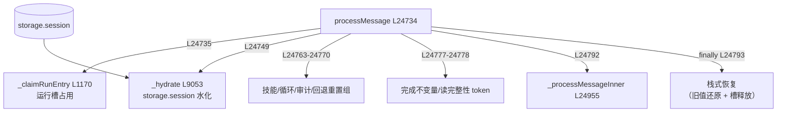

# 🔒 子步骤 1：运行槽占用与状态重置

> 📍 `processMessage`（agent.js L24734-24830）
> 🎯 作用：建立"每 tab 单运行"约束，重置所有跨运行不该残留的状态，并以 try/finally 保证异常路径也完整恢复。

## 🔍 主要逻辑流程（带行号）

```javascript
async processMessage(tabId, userMessage, onUpdate = () => {}, mode = 'ask', attachments = [], runOptions = {}) {
  await this._claimRunEntry(tabId, 'interactive', runOptions);           // L24735 占用运行槽
  // 包一层 onUpdate：观察 max_steps_reached → 标记 continuationEligible
  let continuationEligible = false;                                      // L24736-24741
  try {
    await this._hydrate(tabId);                                          // L24749 水化（独立 catch，见下）
  } catch (error) {
    this._runningTabs.delete(tabId); throw error;                        // L24750-24753 防 storage 读失败卡死 tab
  }
  // Continuation 语言策略：受信 Continue 才继承，否则删除并立即持久化
  const trustedContinuationResponseLanguagePolicy = ...;                 // L24754-24762
  this._resetActiveSkillsForRun(tabId, { refreshPrompt: false });        // L24763 清技能活跃集
  this._clearRunLoopState(tabId);                                        // L24764 清循环状态
  this._resetChromeProtectedGalleryRunState(tabId);                      // L24765
  if (runOptions?.trustedContinuation !== true && !preserveAudit) {
    this._resetRichTextToolbarAudit(tabId);                              // L24766-24768 审计重置
  }
  this._continuationExecutionEvidence.delete(tabId);                     // L24769
  this._clickAxCdpFallbacks.delete(tabId);                               // L24770
  // standalone 运行集合登记（保存/恢复旧值供 finally 恢复）
  ...                                                                    // L24771-24776
  const completionRunToken = this._beginCompletionInvariant(tabId);      // L24777 完成不变量 token
  const readCompletenessRunToken = await this._beginReadCompleteness(...);// L24778 读完整性 token
  this.persistenceDegradedTabs.delete(tabId);                            // L24779
  this._runUpdateCallbacks.set(tabId, onUpdate);                         // L24780
  const previousForegroundCapture = this._configureCapturePolicyForRun(tabId, runOptions); // L24781
  this._runModeOverrides.set(tabId, mode);                               // L24782 运行级模式覆盖
  const requestedRunProvider = String(runOptions?.providerId || '').trim();
  if (requestedRunProvider) this._runProviderOverrides.set(tabId, requestedRunProvider); // L24783-24786
  if (runOptions.cloudRun) this.cloudRunContexts.set(tabId, {...});      // L24787-24790 云运行上下文
  try {
    return await this._processMessageInner(tabId, userMessage, onUpdate, mode, attachments, runOptions); // L24792
  } finally {                                                            // L24793-24829 栈式恢复
    this.currentCostState.delete(tabId);
    this._discardProvisionalSelectionGroundingScope(tabId);
    this._storeContinuationExecutionEvidence(tabId);
    // continuationEligible 时保存语言策略，否则删除
    this._planExecutionGuards.delete(tabId);
    this._runModeOverrides.delete(tabId);
    // 恢复 providerOverride / standalone 集合 / 云上下文的旧值
    await this._restoreCapturePolicyAfterRun(tabId, previousForegroundCapture);
    this._userAttachmentHandles.delete(tabId);
    this._runUpdateCallbacks.delete(tabId);
    this._runningTabs.delete(tabId);                                     // L24823 释放运行槽
    this._clearRunLoopState(tabId);
    this._clearCompletionInvariant(tabId, completionRunToken);           // L24827 token 校验清除
    this._clearReadCompleteness(tabId, readCompletenessRunToken);       // L24828
  }
}
```

## ✨ 设计亮点

1. **单飞行规则**：`_claimRunEntry`（L1170）+ `_runningTabs`——同 tab 新请求在旧运行未结束前直接被拒，杜绝并发写同一会话。
2. **水化的独立 catch**（L24743-24748 注释）：`_hydrate` 是标记 busy 后的第一个 await，位于释放标记的 try/finally **之外**——没有这个 catch，一次 storage 读拒绝会把 tab 永久卡在"An agent run is already in progress"直到 worker 重启。
3. **token 化的运行作用域状态**：完成不变量与读完整性都以 runToken 开启/清除，迟到的异步清理无法误删下一个运行的状态（`_clearCompletionInvariant(tabId, runToken)` L762）。
4. **栈式保存/恢复**：提供商覆盖、前台捕获策略、standalone 集合、云上下文全部"先存旧值，finally 恢复"——异常路径不留脏状态。
5. **观察者包装**：`onUpdate` 被包一层只为观察 `max_steps_reached`（L24738-24741），让 finally 知道是否该为 Continue 按钮保留语言策略。

## 📥 返回值结构

`processMessage` 返回 `finalResponse: string`（最终答案文本或结构化错误文案）；本子步骤自身无返回值，产物是**干净的就绪状态** + finally 闭包。

## 🔗 协作图



## 📊 总结

| 维度 | 结论 |
|---|---|
| 并发约束 | 每 tab 单飞行，`_runningTabs` 守卫 |
| 重置项 | 技能活跃集、循环状态、审计、CDP 回退、续跑证据、语言策略 |
| 作用域 token | 完成不变量、读完整性（防跨运行误删） |
| 异常安全 | try/finally 栈式恢复 + 水化独立 catch |
