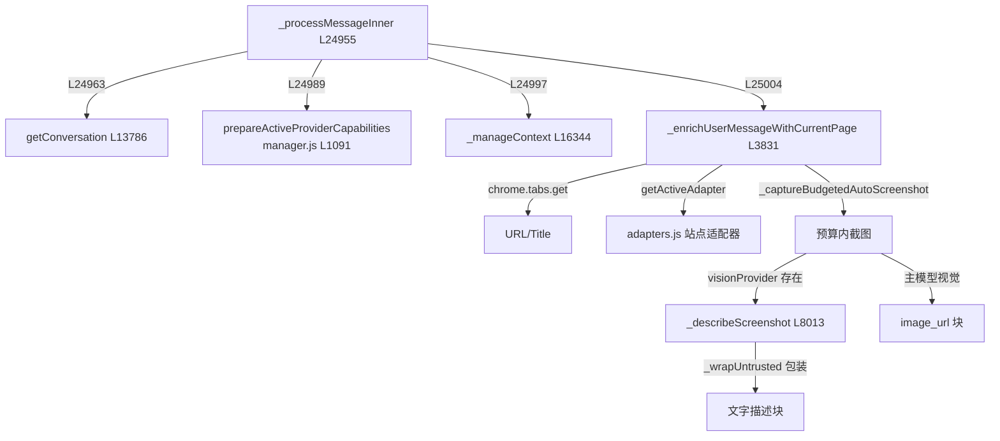

# 💬 子步骤 2：会话水化与首条消息富化

> 📍 `_processMessageInner` 前段（L24955-25056）+ `_enrichUserMessageWithCurrentPage`（L3831-3988）
> 🎯 作用：把用户的裸文本变成模型可安全消费的**enriched 首条消息**——可信运行时信封 + 消毒的页面上下文 + 站点适配器指导 + 可选截图，同时决定哪些历史对本次运行可见。

## 🔍 主要逻辑流程

### A. 水化与回合级重置（L24955-24999）

```javascript
await this._hydrate(tabId);                                  // L24956 二次水化（幂等）
this.autoScreenshotCount.delete(tabId);                      // L24958 重置截图预算（issue #311）
this.toolbarAuditScreenshotCount.delete(tabId);
this._prepareClarificationAuthorizationForRun(tabId);        // L24961
this._preactivateRecommendedActionSkill(tabId, runOptions, mode); // L24962 确定性技能预激活
const messages = this.getConversation(tabId, mode);          // L24963 取会话数组
this._expireCurrentToolReasoning(messages);                  // L24964 过期陈旧推理块
// 附件发送 = 显式来源变更：结束继承的选区 scope（L24965-24975）
runOptions = this._selectionGroundedRunOptions(tabId, messages, runOptions); // L24976
userMessage = this._augmentScheduledResumeMessage(tabId, userMessage);  // L24980 定时续跑注入账本
const costState = this._newCostRunState();                   // L24981 成本状态
this.permissions.beginTurn(tabId);                           // L24984 清本 tab once 授权
try { await this.providerManager.prepareActiveProviderCapabilities?.(); } catch {} // L24989 视觉能力预解析（失败非致命）
if (!selectionOnly && !standaloneChatRun) {
  await this._manageContext(tabId, messages, onUpdate, costState);      // L24997-24999 回合前压缩
}
```

### B. 富化四层（`_enrichUserMessageWithCurrentPage` L3831-3988）

```
① standalone 边界：直接返回裸消息（L3838-3840）
② 可信信封层（L3844-3914）
   ├─ buildTrustedRuntimeContext({runtimeMode})     模式信封——规划器与执行器共享
   ├─ [Current page context — URL/Title]            safeField 消毒：剥 <>[]"`、
   │                                                消灭 untrusted_page_content 字样、300 字符上限
   ├─ [Recording status]                            录制状态每回合注入真值（历史可能说谎）
   └─ [USER OVERRIDE — API MUTATIONS ALLOWED]       /allow-api 一次性注入
③ 站点适配器层（L3918-3932）
   └─ getActiveAdapter(url) 首回合或站点变更时注入 [Site guidance for X]
      finance 类标注 FINANCE / HIGH-STAKES
④ 视觉层（L3937-3987，仅首回合且非选区/standalone）
   ├─ 无视觉能力 → 纯文本结束
   ├─ 专用视觉模型 → _describeScreenshot 子调用 → 描述以 _wrapUntrusted 包装注入（像素不给主模型）
   └─ 主模型支持视觉 → image_url 块 + [UNTRUSTED SCREENSHOT] 免责说明（像素≠CSS 坐标警告）
```

## ✨ 设计亮点

1. **可信/不可信物理隔离**：信封与适配器指导是"指令"；截图描述与视觉像素是"数据"——描述即使来自自家视觉模型也走 `_wrapUntrusted`（L3965-3968 注释：nonce + 防逃逸包装，而非散文标签）。
2. **safeField 消毒**（L3859-3866）：`document.title` 是页面可控的——剥掉能突破可信括号注记的字符，防止规划器级注入；保留原始 url 仅用于下游适配器匹配。
3. **录制状态每回合注入真值**（L3871-3878 注释）：录制可能被侧边栏按钮、安全上限、状态核对等带外方式停止，历史里的"Recording started"会骗过模型——live 状态覆盖陈旧记忆。
4. **压缩放在富化之前**（L24997）：先瘦身历史再注入本回合上下文，避免刚压缩又膨胀。
5. **定时续跑的账本注入**（L24977-24979 注释）：调度器在触发时把 live 账本行追加进消息，模型第一轮就看到当前进度，无需先调 progress_read。

## 📥 返回值结构

```javascript
// 富化产物（三种形态之一）
{ role: 'user', content: string }
// 或（主模型视觉路径）
{ role: 'user', content: [
    { type: 'text', text: contextLine + screenshotNote + userMessage },
    { type: 'image_url', image_url: { url: dataUrl, detail? } },
] }
```

## 🔗 协作图



## 📊 总结

| 维度 | 结论 |
|---|---|
| 富化层数 | 4 层（信封 / 页面上下文 / 适配器 / 视觉） |
| 消毒点 | URL/Title safeField、截图描述 untrusted 包装 |
| 注入时机 | 适配器仅首回合或站点变更；API 覆盖每"允许运行"一次 |
| 前置动作 | 水化、预算重置、技能预激活、权限 beginTurn、能力预解析、回合前压缩 |
