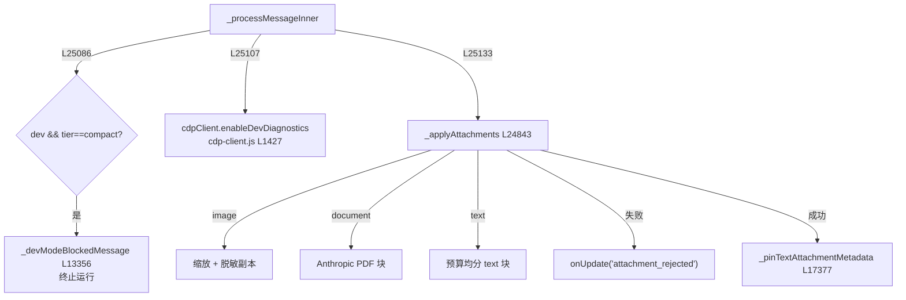

# 🛡️ 子步骤 3：Dev 模式守卫与附件验证

> 📍 `_processMessageInner`（L25086-25157）+ `_applyAttachments`（L24843-24953）
> 🎯 作用：在规划门与 trace 之前拦截四类"不是 Agent 运行"的情况——Dev+Compact 组合不可用、Dev 诊断启动、选区与附件冲突、提供商不支持的附件。

## 🔍 主要逻辑流程（带行号）

```javascript
// ① Dev + Compact 提供商：直接拒绝（Compact 无法承载 Dev 提示与工具）
if (mode === 'dev' && provider.promptTier === 'compact') {               // L25086
  const msg = this._devModeBlockedMessage(provider);                     // L25087
  // 附件存在 → attachment_rejected 结构化信号 + 错误文案
  messages.push(enriched);                                               // L25093 消息仍入历史
  messages.push({ role: 'assistant', content: msg });                    // L25097
  await this._persistSubmittedTurn(tabId, runOptions?.detachedRequestId);// L25098
  onUpdate('warning', { message: msg });
  return (finalResponse = msg);                                          // L25100 终止
}

// ② Dev 诊断缓冲先行启动（规划/模型循环前的页面动作可被诊断工具观察）
if (mode === 'dev' && !standaloneChatRun) {
  try { await cdpClient.enableDevDiagnostics(tabId); } catch {}          // L25107-25109 失败非致命
}

// ③ 选区运行不允许附件：显式错误，不静默丢弃
if (selectionOnly && attachments?.length) {                               // L25114
  // 删除临时 scope + attachment_rejected + return 错误文案            // L25115-25122
}

// ④ 附件验证与落地
const sourceBoundAttachments = selectionOnly ? [] : attachments;          // L25123
if (sourceBoundAttachments?.length) {
  // 先按 mode+tier 确定可用工具名集（standalone 清空）
  const attachmentToolNames = new Set(getToolsForMode(mode, {tier}).map(...)); // L25125-25130
  const attachResult = await this._applyAttachments(enriched, sourceBoundAttachments, provider, {
    canUseScratchpadTool, canUseUploadTool, tabId, messages,              // L25133-25138
  });
  if (!attachResult.ok) {
    onUpdate('attachment_rejected', { error: attachResult.error });       // L25143 结构化信号
    return (finalResponse = attachResult.error);                          // 消息绝以该形态入历史
  }
  this._pinTextAttachmentMetadata(tabId, sourceBoundAttachments, ...);    // L25146 文本附件元数据钉入
}
// traceAttachments 元数据（kind/name/mimeType/size/source）并入 runOptions  // L25148-25157
```

### `_applyAttachments` 三类附件处理（L24843-24953）

| kind | 条件 | 产物 | 拒绝条件 |
|---|---|---|---|
| `image` | `provider.supportsVision` | 预算缩放后的 `image_url` 块；slash 截图保留本地原像素、模型副本按需脱敏 | 无视觉能力（文案建议换 Claude 3+/GPT-4o）；脱敏副本创建失败（拒绝发送而非泄露未脱敏像素 L24910-24921） |
| `document` | `provider.supportsDocuments`（当前仅 Anthropic） | `{type:'document', source:{base64 pdf}}` 块 | 提供商不支持（文案明示仅 Claude） |
| `text` | 无条件 | 按剩余预算均分的 `{type:'text'}` 块 + 元数据钉入 scratchpad 供上传工具回查 | 无 |

## ✨ 设计亮点

1. **附件在规划门之前验证**（L25111-25113 注释）：不支持的附件是"告诉用户"的纯文本响应而非 Agent 运行——消息绝不能以这种形态被推入历史。
2. **结构化拒绝信号**：`attachment_rejected` 事件（而非从 finalResponse 嗅探错误文案）让面板能恢复被拒的附件 + 提示词（L25139-25142 注释）。
3. **脱敏失败 = 拒绝发送**（L24910-24921 注释）：`_redactScreenshotDataUrl` 的多个非抛错失败路径（矩形越界、canvas 不可用、JPEG 回退）都返回输入原样——宁可拒绝发送也不让未脱敏像素过模型边界。
4. **文本附件预算均分**：多个 text 附件按 `textBudgetRemaining / textAttachmentsRemaining` 公平分配，元数据（文件名/大小）钉入 scratchpad 抗压缩（`_pinTextAttachmentMetadata` L17377）。
5. **Dev 诊断先于循环启动**：保证运行内第一个页面动作就可被 console/network 工具回看；失败非致命（attach 不可用时工具各自返回聚焦的 CDP 错误）。

## 📥 返回值结构

```javascript
_applyAttachments → { ok: true } | { ok: false, error: string }
// enriched.content 原位变异：字符串 → [text 块, 附件 notice, ...blocks]
```

## 🔗 协作图



## 📊 总结

| 维度 | 结论 |
|---|---|
| 提前终止条件 | Dev+Compact、选区×附件冲突、附件不支持 |
| 附件种类 | image / document / text 三类 |
| 安全不变量 | 脱敏失败拒绝发送；拒绝消息不入历史；结构化 attachment_rejected |
| Dev 诊断 | 循环前启动，失败非致命 |
