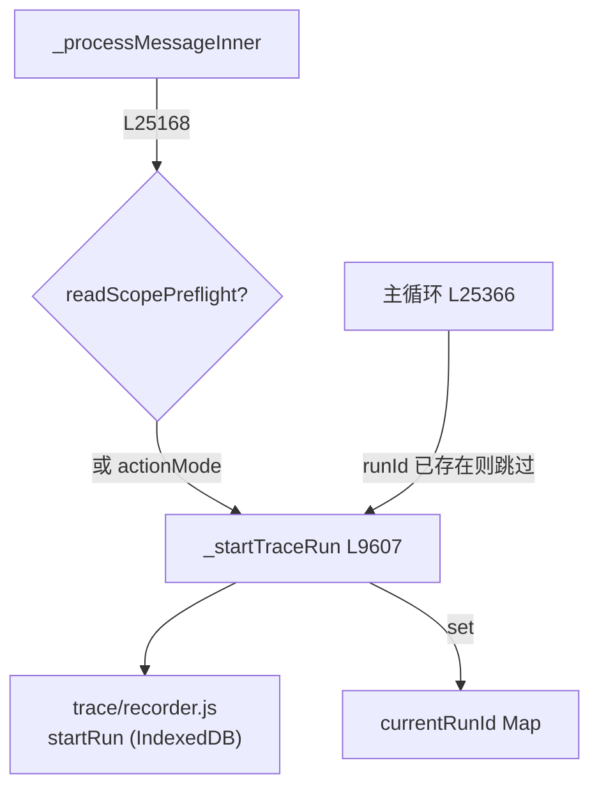

# 📝 子步骤 1：Trace 启动

> 📍 `_processMessageInner`（L25159-25177）+ `_startTraceRun`（L9607-9645）
> 🎯 作用：当规划门将运行时，trace run **先行创建**，使规划 LLM 调用也被记录在本次运行之下；普通路径则推迟到主循环前才启动。

## 🔍 主要逻辑流程（带行号）

```javascript
let plannerTabInfo = null;
// 读范围预检：Ask 场景下需要先判定"是否要求全线程完整读"（Gmail 类）
const readScopePreflight = !selectionOnly && !standaloneChatRun
  && this._readCompletenessNeedsScopeClassification(tabId);              // L25168
if ((this._isActionMode(mode) && runOptions?.cloudRun !== true && !standaloneChatRun)
    || readScopePreflight) {
  // 取一次 tab 信息供 trace 元数据；选区/standalone 强制空（不泄漏页面上下文）
  const traceTabInfo = await this._getTabUrlTitle(tabId);                // L25172
  plannerTabInfo = selectionOnly || standaloneChatRun
    ? { tabUrl: '', tabTitle: '' } : traceTabInfo;                       // L25173
  runId = await this._startTraceRun(tabId, userMessage, mode, provider, traceTabInfo, runOptions); // L25174
}
```

`_startTraceRun`（L9607）内部：取 manifest 版本 → `trace.startRun({conversationId, mode, provider, tabUrl/Title, userMessage, ...})` → `this.currentRunId.set(tabId, runId)`。全程幂等保护：主循环前若 `runId` 已存在则跳过第二次启动（L25366-25370）。

## ✨ 设计亮点

1. **单一事实源**（L25163-25166 注释）：`_startTraceRun` 是 trace run 创建的唯一入口，无重复的 tab fetch / startRun 载荷——规划路径与普通路径共享。
2. **选区隐私**：选区绑定运行强制 `plannerTabInfo = {tabUrl:'', tabTitle:''}`——来源边界不许出现页面 URL/标题。
3. **版本可追溯**：每个 trace run 记录创建它的 manifest 版本；`/export` 导出时区分"导出版本"与"各回合记录版本"（阶段一 5.5）。
4. **局部性**：trace 失败不阻断运行——记录器是 opt-in（IndexedDB 本地），异常路径在 `_endTraceRun` 里被 finally 恒定调用（L25882）。

## 📥 返回值结构

```javascript
runId: string | null  // trace run 标识；null = 记录器未启用
// 副作用：currentRunId.set(tabId, runId)
```

## 🔗 协作图



## 📊 总结

| 维度 | 结论 |
|---|---|
| 启动时机 | 规划门路径：门之前；普通路径：主循环之前 |
| 隐私规则 | 选区/standalone 运行 tabInfo 置空 |
| 幂等性 | `runId` 判重，单一事实源 |
| 失败语义 | trace 异常不影响运行（finally 恒收尾） |
