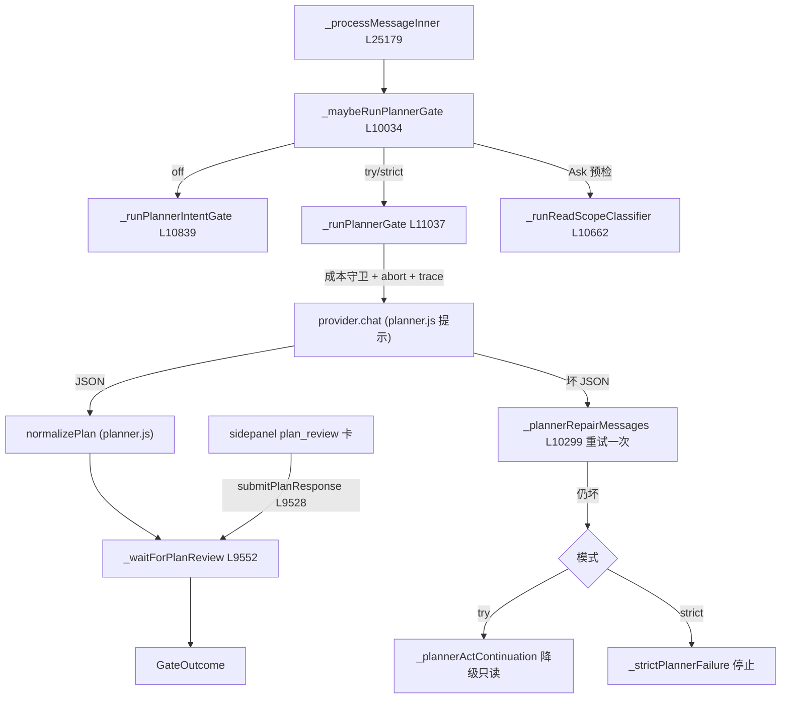

# 🚪 子步骤 2：规划门执行

> 📍 `_maybeRunPlannerGate`（L10034-10215）→ `_runPlannerGate`（L11037）/ `_runPlannerIntentGate`（L10839）/ `_runReadScopeClassifier`（L10662）；主循环调用点 L25179-25187
> 🎯 作用：按 planBeforeAct 模式选择门类型，发起一次结构化 JSON 规划调用，校验/修复/审批，产出 GateOutcome。

## 🔍 主要逻辑流程

### A. 门类型路由（`_maybeRunPlannerGate` L10034）

```
入参检查（跳过条件）
 ├─ Ask 模式 + 无读范围预检 → 直接 proceed（Ask 无动作门）
 ├─ 云运行 / standaloneChat → 跳过
 ├─ _shouldSkipPlannerForShortFollowUp（L9914）→ 短追问跳过完整门
 ├─ _hasApprovedPlannerHandoff（L9907）→ 已有批准交接 → 跳过
 └─ _recommendedActionFastPathPlan（L9925）→ 推荐动作快路径计划
路由
 ├─ readScopePreflight → _runReadScopeClassifier（L10662）  Ask 读范围分类
 ├─ planBeforeAct = 'off'  → _runPlannerIntentGate（L10839）紧凑意图 schema
 └─ 'try' | 'strict'      → _runPlannerGate（L11037）      完整规划 schema
```

### B. 完整规划调用（`_runPlannerGate` L11037）

```
1. 组装规划器消息：planner.js 提示词 + 用户任务 + 消毒 URL/标题
   + _buildPlannerHistoryDigest（L9726，≤1500 字符）+ 不可信包装的页面上下文（图像丢弃）
2. _plannerChatOptions（L10216）：temperature、no-think 处理（Qwen/DeepSeek L10294）、
   _supportsInteractiveAskStreaming 不适用（非交互流式）
3. _chatWithCostAllowance 发起调用 —— phase:'planner' 追踪（_tracePlannerAttemptRequest L10242）
   + abort 检查 + 费用守卫（成本耗尽 → {proceed:false, reason:'cost_limit'}）
4. 解析 JSON：
   ├─ 合法 → normalizePlan（planner.js）逐字段边界清洗
   ├─ 非法 → _plannerRepairMessages（L10299）注入修复提示重试一次
   │    ├─ 修复成功 → 继续
   │    └─ 修复失败 → try: _plannerActContinuation 降级 Ask 只读回合（L10417）
   │                   strict: _strictPlannerFailure 停止（L10459）
5. 计划审批（非调度自动批准）：
   _waitForPlanReview（L9552）→ onUpdate('plan_review', {plan, markdown})
   → Promise 挂起 → submitPlanResponse(tabId, planId, action, editedText)（L9528）
       ├─ approve（可携带编辑文本）→ 计划钉入 scratchpad
       ├─ reject / 超时 / abort → {proceed:false, reason:'plan_rejected'|'cancelled'}
6. 计划一致性复检：_plannerIntentConsistencyIssue（L10313）、
   _shouldRecheckReadOnlyFollowUpIntent（L10337）——只读追问误判动作时二次确认
7. 技能路由：plan.skillIds 经目录过滤（enabled + mode/tier 合格），
   批准后 _activateSkillsForRun（L13559）激活
```

### C. 主循环消费点（L25179-25187）

```javascript
const gateOutcome = await this._maybeRunPlannerGate(tabId, messages, enriched, onUpdate, mode, costState, runId, plannerTabInfo, runOptions);
if (!gateOutcome.proceed) {
  _traceStatus = gateOutcome.reason === 'cost_limit' ? 'cost_limit'
    : (gateOutcome.reason === 'plan_only' ? 'plan_only_output' : gateOutcome.reason || 'cancelled');
  return (finalResponse = gateOutcome.message || 'More information is required.');  // 运行终止
}
```

## ✨ 设计亮点

1. **失败不能授权**：JSON 修复失败的降级路径要么变只读（Try）要么停（Strict）——坏计划永远不会转化为动作授权。
2. **短追问豁免**：`_shouldSkipPlannerForShortFollowUp`（L9914）让"再往下翻一页"这类追问不再过完整规划，节省一次 LLM 调用。
3. **意图一致性复检**：规划器把只读追问误判为动作时（`_plannerIntentConsistencyIssue` L10313），用 `recheckedIssueKind` 二次确认，防"计划惯性"。
4. **审批即数据**：编辑后的计划文本回读 `formatPlanScratchpad`，与规划器原始输出同等信任（用户签过字）。
5. **规划调用全量防护**：成本守卫、abort、追踪、no-think 适配——与主循环同一套生产守卫，没有"轻量旁路"。

## 📥 返回值结构（GateOutcome）

```javascript
{
  proceed: boolean,            // 是否进入主循环
  reason?: 'cost_limit' | 'plan_rejected' | 'cancelled' | 'plan_only' | ...,
  message?: string,            // proceed=false 时的终止文案
  responseOnly?: boolean,      // 只读短回合（Try 降级）
  responseLanguagePolicy?,     // 批准计划的语言覆盖
  skillIds?: string[],         // 批准激活的技能
  progressLedgerPolicy?, progressAction?,   // 进度会话策略
  approvedPlanScratchpad?,     // 钉入的 scratchpad 文本
}
```

## 🔗 协作图



## 📊 总结

| 维度 | 结论 |
|---|---|
| 门类型 | 意图门（off）/ 完整门（try/strict）/ 读范围分类器（Ask 预检） |
| LLM 防护 | 成本守卫 + abort + trace + no-think + 一次 JSON 修复 |
| 审批协议 | plan_review 事件 → Promise 挂起 → submitPlanResponse |
| 失败语义 | Try 降级只读；Strict 停止；永不授权坏计划 |
