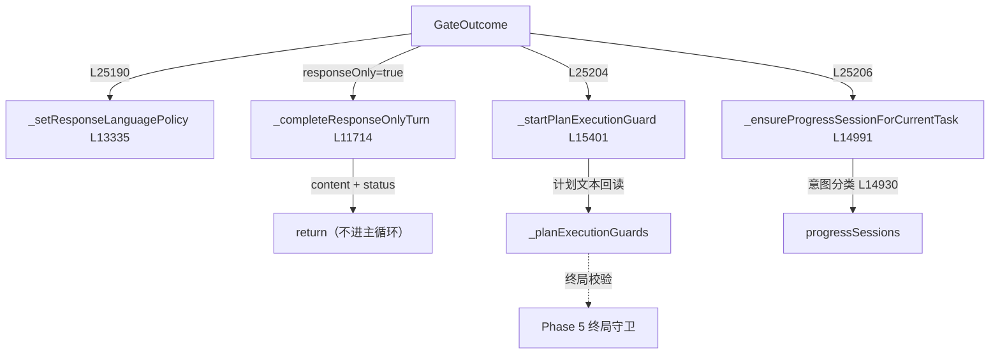

# 🔚 子步骤 3：门后处置

> 📍 `_processMessageInner`（L25188-25213）
> 🎯 作用：消费 GateOutcome——设置语言策略、处理 responseOnly 短路、武装计划执行守卫、建立进度会话，为主循环铺平最后的轨道。

## 🔍 主要逻辑流程（带行号）

```javascript
// ① 语言策略：受信 Continue 继承 > 规划器产出的策略
const responseLanguagePolicy = runOptions?.trustedContinuationResponseLanguagePolicy
  || gateOutcome.responseLanguagePolicy;                                  // L25188-25189
this._setResponseLanguagePolicy(tabId, responseLanguagePolicy, runOptions?.locale || 'en', {
  approvedPlanLanguageOverride: responseLanguagePolicy?.approved_plan_language_override === true
    || gateOutcome.responseLanguageApprovedPlanOverride === true,         // L25190-25194
  trustedContinuation: runOptions?.trustedContinuation === true,
});

// ② responseOnly 短路：Try 降级的只读回合，走专用"仅响应"通道
if (gateOutcome.responseOnly === true) {                                  // L25195
  const responseOnly = await this._completeResponseOnlyTurn(
    tabId, messages, onUpdate, provider, costState, runId,
    runOptions, enriched, sourceBoundPriorMessages,                      // L25196-25199
  );
  finalResponse = responseOnly.content;
  _traceStatus = responseOnly.status;
  return finalResponse;                                                   // 不进主循环
}

// ③ 计划执行守卫：武装"已批准计划必须真执行"的不变量
this._startPlanExecutionGuard(tabId, mode, gateOutcome, runOptions);      // L25204

// ④ 进度会话：动作模式为当前任务建立语言无关的进度意图会话
if (this._isActionMode(mode) && !selectionOnly && !standaloneChatRun) {
  await this._ensureProgressSessionForCurrentTask(tabId, {                // L25206-25212
    provider, costState,
    progressLedgerPolicy: gateOutcome.progressLedgerPolicy,
    progressAction: gateOutcome.progressAction,
  });
}
```

## 关键协作方法

| 方法 | 行号 | 职责 |
|---|---|---|
| `_completeResponseOnlyTurn` | L11714 | 只读短回合：`_contextOnlySystemPrompt`（L11589）+ 单次模型调用，无工具循环 |
| `_startPlanExecutionGuard` | L15401 | 从批准计划文本提取调度工具与执行证据要求（`_plannerSubmissionGateFieldFromApprovedPlanText` L10588 等），武装 `_planExecutionGuards` |
| `_ensureProgressSessionForCurrentTask` | L14991 | 进度意图分类（`_classifyProgressIntentWithProvider` L14930）或确定性启发 → 建立/复用 `progressSessions` |

## ✨ 设计亮点

1. **responseOnly 是短回路而非降级标记**：降级回合不进主循环、不装配工具表，用专用系统提示完成一次回答——省 token 且语义清晰。
2. **计划执行守卫闭环**：批准计划里的"必须提交/必须下载/必须调度"字段（从计划文本回读）变成运行时不变量——模型只说不做时，`_markPlanExecutionToolCall`（L15583）记录的真实证据不满足 → 终局守卫阻止假完成（Phase 5 呼应）。
3. **进度策略双来源**：规划器给出 `progressLedgerPolicy/progressAction` 优先；无规划时用意图分类器兜底——账本只在"任务值得追踪"时建立。
4. **语言策略的批准覆盖**：用户编辑过计划的语言即"签过字"，覆盖运行时推导（`approved_plan_language_override`）。

## 📥 返回值结构

```javascript
// 本子步骤无直接返回；产物：
// - responseLanguagePolicies.set(tabId, policy)
// - _planExecutionGuards.set(tabId, guard)      // 或 responseOnly 短路返回
// - progressSessions 更新
```

## 🔗 协作图



## 📊 总结

| 维度 | 结论 |
|---|---|
| 短路条件 | responseOnly=true → 只读短回合直接返回 |
| 武装的守卫 | 计划执行证据守卫（提交/下载/调度） |
| 建立的会话 | 进度意图会话（规划策略优先，分类器兜底） |
| 语言策略 | 受信 Continue > 批准计划覆盖 > 规划器推导 |
