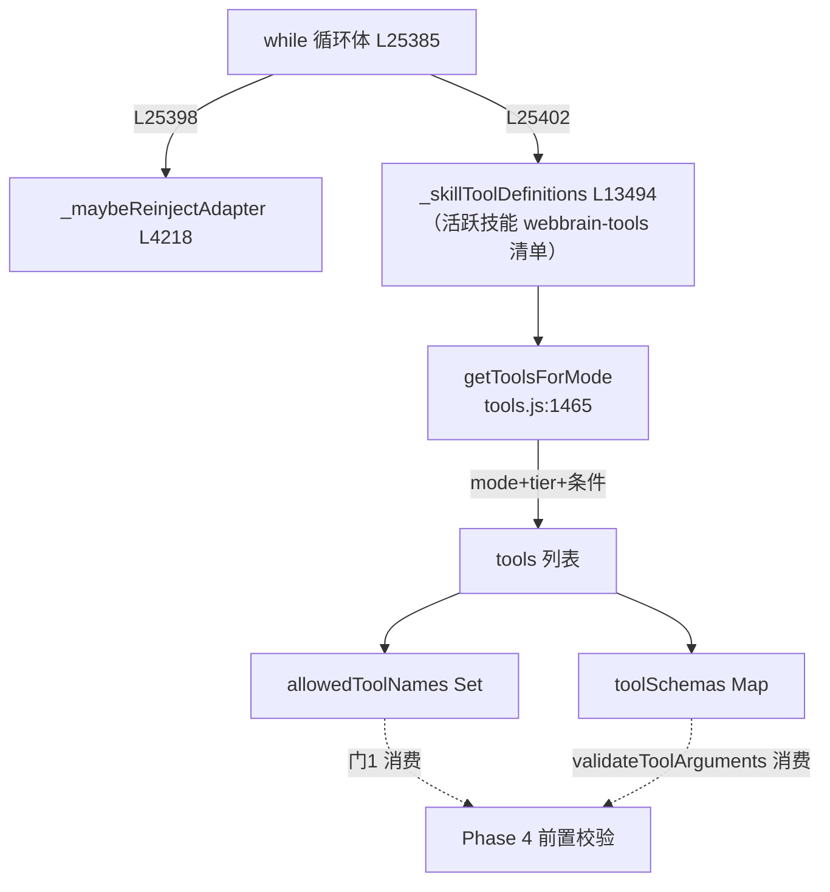

# 🧰 子步骤 1：工具目录组装

> 📍 首次组装（L25214-25244）+ 每迭代重建（L25398-25423）
> 🎯 作用：把 mode × tier × 活跃技能 × 站点适配器 × 运行选项（云/WebMCP/watch）折叠成一份工具 schema 列表与白名单——模型每轮看到的世界。

## 🔍 主要逻辑流程（带行号）

```javascript
// —— 首次组装（进入循环前）——
const tier = provider.promptTier;                                        // L25214
const readWindow = this._readWindowLimits(provider);                     // L25215 读窗口（能力感知）
let skillTools = this._skillToolDefinitions(tabId, mode, tier, this._activeSkillSiteAdapter(tabId)); // L25216
const cloudRunContext = this.cloudRunContexts.get(tabId) || null;        // L25217
let tools = getToolsForMode(mode, {                                      // L25218-25228
  strictSecretMode: this.strictSecretMode,
  tier,
  accessibilityTreeMaxChars: readWindow.treePageChars,
  webMcpAvailable: this.webMcpEnabled === true,
  skillLoaderTool: this._skillLoaderDefinition(mode, tier),
  skillTools,
  cloudRun: !!cloudRunContext,
  outputSchema: cloudRunContext?.outputSchema ?? null,
  watchBeep: this.scheduledRunPolicies.get(tabId)?.watch?.beep === true,
});
// 选区/standalone：工具全清——选区文本已在可信信封里，
// 广告页面/网络工具会让注入的选区诱导第二来源，击穿选区边界
if (selectionOnly || standaloneChatRun) tools = [];                       // L25232
let allowedToolNames = new Set(tools.map(t => t.function.name));          // L25233
let toolSchemas = new Map(tools.map(t => [t.function.name, t.function.parameters])); // L25234
const plannerTemperature = this._isActionMode(mode) ? 0.15 : 0.3;         // L25235

// —— 每迭代重建（while 内部开头）——
if (steps > 0 && !selectionOnly && !standaloneChatRun) {
  await this._maybeReinjectAdapter(tabId, messages);                      // L25398-25400 跨站点适配器重注入
}
skillTools = this._skillToolDefinitions(...);                             // L25402 活跃技能可能已变
tools = getToolsForMode(mode, { ...同上... });                            // L25403-25413
if (selectionOnly || standaloneChatRun) tools = [];                       // L25414
allowedToolNames = new Set(...); toolSchemas = new Map(...);              // L25415-25416
```

## 工具目录的分层来源（tools.js）

```
getToolsForMode(mode, opts) (tools.js:1465)
 ├─ mode='ask' → AGENT_TOOLS ∩ ASK_ONLY_TOOLS (tools.js:1139)
 ├─ tier 过滤 → COMPACT_TOOL_NAMES (1931) ⊂ MID_TOOL_NAMES (2007) ⊂ 全量
 ├─ Dev 附加 → DEV_TOOL_NAMES（compact 被拒，mid/full 才有）
 ├─ 动态注入 → skillLoaderTool（load_skill）+ skillTools（webbrain-tools 清单）
 ├─ 条件注入 → webMcpAvailable ? WEBMCP 工具 : ∅；cloudRun ? done_json : ∅
 └─ 参数重写 → accessibilityTreeMaxChars 按 readWindow 调整 AX 工具 schema
```

## ✨ 设计亮点

1. **白名单与 schema 双产物**：`allowedToolNames`（批执行门 1 消费）与 `toolSchemas`（参数校验消费）同源生成——门与校验永不失配。
2. **选区边界靠空工具表实施**（L25229-25231 注释）：不是靠提示词劝阻，而是物理上不给工具——注入的选区无法诱导第二来源。
3. **watch 的 beep 工具按需出现**：只有 `/watch ... /beep` 的运行才见到 `beep` 工具——临时工具不污染常规目录。
4. **读窗口进 schema**：`accessibilityTreeMaxChars` 直接改写 AX 工具的 maxChars 参数描述——强模型看到更大的每页字符预算，弱模型保守（`_readWindowLimits` L812）。
5. **每迭代重建的必要性**：`load_skill` 在批内改变活跃技能集（`_activateSkillForRun`），下一次模型调用必须看到新工具（阶段一 5.5 技能系统第 5 步）。

## 📥 返回值结构

```javascript
tools: Array<{type:'function', function:{name, description, parameters}}>
allowedToolNames: Set<string>
toolSchemas: Map<string, parameters>
```

## 🔗 协作图



## 📊 总结

| 维度 | 结论 |
|---|---|
| 组装时机 | 循环前一次 + 每迭代开头重建 |
| 正交维度 | mode（3）× tier（3）× 技能 × 适配器 × 运行选项 |
| 边界实施 | 选区/standalone → 空工具表（物理边界） |
| 双产物 | 白名单 Set + schema Map 同源 |
