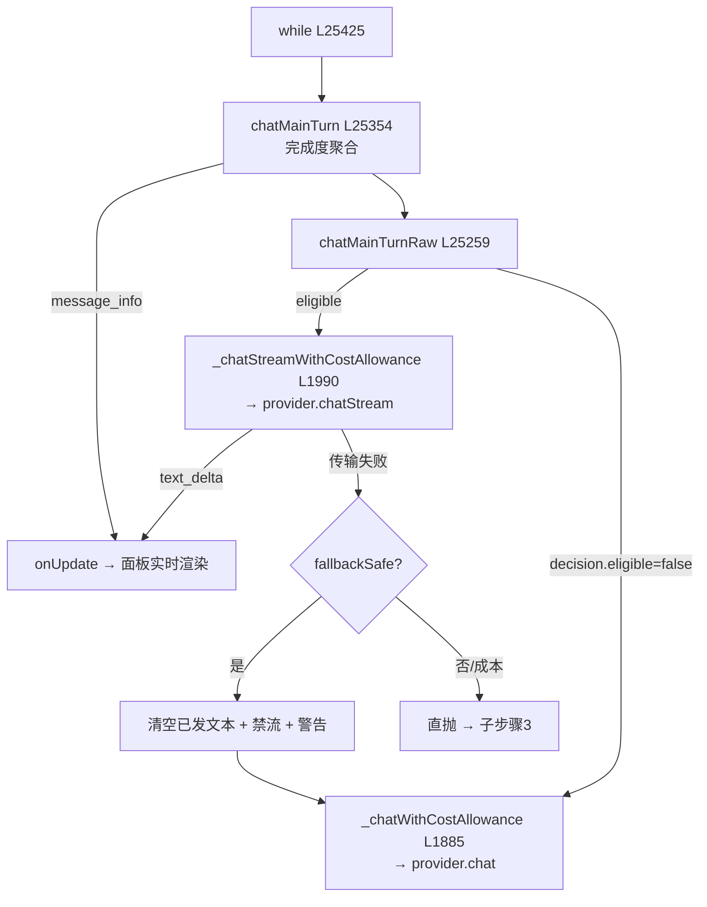

# 🌊 子步骤 2：LLM 调用与流式回退

> 📍 `chatMainTurn`（L25354-25364）+ `chatMainTurnRaw`（L25259-25352）+ 主循环调用点（L25428-25479）
> 🎯 作用：主循环的 LLM 调用层——完成度聚合、Ask 流式资格判定、text_delta 实时广播、传输失败的一次性非流式回退。

## 🔍 主要逻辑流程（带行号）

### A. 两层闭包包装

```javascript
// 原始层：决定流式还是非流式
const chatMainTurnRaw = async (chatMessages, chatOptions, requestContext) => {
  const decision = this._interactiveAskStreamingDecision(              // L25260 流式资格
    provider, mode, runOptions, askStreamingDisabledForRun);
  const protocol = this._interactiveAskStreamingProtocol(provider);    // L25266
  if (!decision.eligible) {
    // 交互 Ask 且未走流式 → 记录跳过原因到 trace
    return this._chatWithCostAllowance(provider, chatMessages, chatOptions, costState, requestContext); // L25275
  }
  // 流式指标采集：firstDeltaMs / textDeltaCount / textChars
  try {
    const result = await this._chatStreamWithCostAllowance(            // L25301
      provider, chatMessages, chatOptions, costState, requestContext,
      (delta) => { onUpdate('text_delta', { content: delta }); },      // L25307-25313 实时广播
    );
    return result;                                                      // 终端事件后返回
  } catch (error) {
    const fallbackSafe = this._shouldFallbackAskStream(error);          // L25324 回退安全性
    if (this._isCostAllowanceError(error)) throw error;                 // 成本错误直抛
    if (emittedText) onUpdate('text', { content: '', replace: true });  // L25332 清空已发文本！
    if (!fallbackSafe) throw error;                                     // 终端错误直抛
    askStreamingDisabledForRun = true;                                  // L25334 本回合禁流
    onUpdate('warning', { code: 'ask_stream_fallback', ... });          // 用户可见提示
    return this._chatWithCostAllowance(...);                            // L25344 一次非流式重试
  }
};
// 聚合层：完成度聚合 + message_info
const chatMainTurn = async (chatMessages, chatOptions, requestContext) => {
  const startedAt = Date.now();
  const result = await chatMainTurnRaw(chatMessages, chatOptions, requestContext);
  messageCompletion = aggregateMessageCompletion(messageCompletion, result, Date.now() - startedAt); // L25357
  onUpdate('message_info', messageCompletion);                          // L25362
  return result;
};
```

### B. 主循环调用点（L25428-25479）

```javascript
steps++; onUpdate('thinking', { step: steps });                         // L25425-25426
const useTools = provider.supportsTools && tools.length > 0;            // L25430
const chatOpts = { tools: useTools ? tools : undefined,
                   temperature: plannerTemperature, maxTokens: 4096 };  // L25431
const prunedMessages = this._pruneOldImages(modelMessagesForRun(), provider); // L25432 剥旧图
// trace.recordLLMRequest（隐私安全元数据）L25434-25449
const _llmStart = Date.now();
result = await chatMainTurn(prunedMessages, chatOpts, { tabId, generationName: 'main' }); // L25451 ★
if (result?.usage?.prompt_tokens) {
  this._lastInputTokens.set(tabId, result.usage.prompt_tokens);        // L25453 压缩反馈环
  this._lastEstCharsAtReport.set(tabId, this._estimateContextChars(messages)); // L25456
}
// trace.recordLLMResponse（延迟：content/toolCalls/usage/latencyMs/model）L25460-25479
```

## 流式资格条件（`_interactiveAskStreamingDecision` L1920 全集）

| 条件 | 来源 |
|---|---|
| mode === 'ask' | 主循环 |
| 交互式 chat_start 来源 | runOptions.interactiveChat |
| 高级 Ask 流式开关未关 | 持久化 legacy key |
| `provider._supportsInteractiveAskStreaming() === true` | 显式 opt-in |
| 非 Continue/云/调度/非交互运行 | runOptions |
| 流式断路器未打开 | askStreamingDisabledForRun |

## ✨ 设计亮点

1. **回退先清屏**（L25332）：流式失败时 `onUpdate('text', {content:'', replace:true})` 把已渲染的半截答案清掉，再走非流式——用户不会看到"半截流式 + 完整重答"的拼接。
2. **断路器作用域**：`askStreamingDisabledForRun` 只禁本回合——瞬时失败不永久改变持久化设置（阶段一 5.1）。
3. **text_delta 即时、其余缓冲**：推理/usage/工具调用缓存到终端事件（`response.completed`/`message_stop`/`[DONE]`）才返回——规范的工具调用语义不被流式破坏。
4. **成本错误优先于回退**：`_isCostAllowanceError` 先判——配额耗尽不是"传输问题"，不做无谓重试。
5. **双指标留痕**：firstDeltaMs/textDeltaCount/textChars 进 trace（`recordAskStreaming`），流式质量可观测。

## 📥 返回值结构

```javascript
// chatMainTurn 返回（所有 provider 归一化）
{
  content: string | null,          // 文本部分
  reasoningContent?: string,       // 推理部分（选存）
  toolCalls: Array|null,           // [{id, function:{name, arguments}}]
  usage: { prompt_tokens?, completion_tokens?, cost_usd? } | null,
  responseItems?: Array,           // Responses API 原生条目（选存）
  costAllowanceMessage?: string,   // 配额警告（有 toolCalls 时主循环消费 L25616）
}
```

## 🔗 协作图



## 📊 总结

| 维度 | 结论 |
|---|---|
| 调用参数 | tools（能力感知）、温度 0.15/0.3、maxTokens 4096 |
| 预处理 | `_pruneOldImages` 每次剥旧图 |
| 流式路径 | 6 条件全满足才启用；终端事件聚合 |
| 回退语义 | 清屏 + 本回合断路 + 一次非流式重试 |
| 观测 | trace 请求/响应/流式指标 + message_info |
