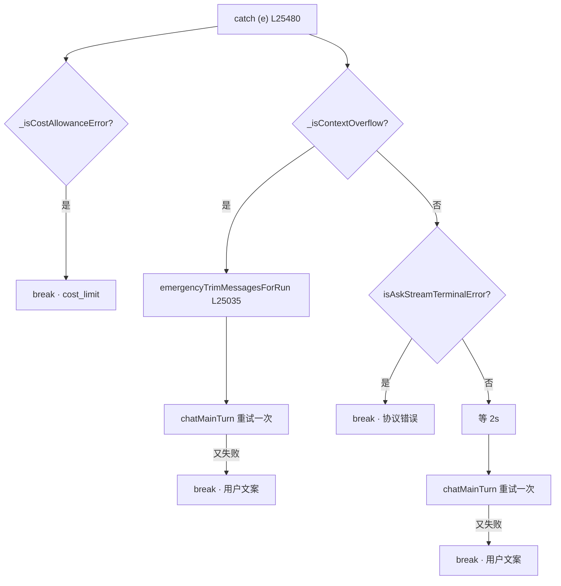

# ⚠️ 子步骤 3：LLM 错误处理与重试

> 📍 主循环 catch 块（L25480-25543）
> 🎯 作用：把 LLM 调用失败分成三类——成本耗尽（立即终止）、上下文溢出（裁剪后重试一次）、瞬时错误（延时后重试一次）——每类路径明确、重试有界。

## 🔍 主要逻辑流程（带行号）

```javascript
} catch (e) {
  this._logDebug({ type: 'llm_error', step: steps, error: e.message });  // L25481
  // ① 成本配额：立即终止，不重试
  if (this._isCostAllowanceError(e)) {                                   // L25482
    finalResponse = e.message; _traceStatus = 'cost_limit';
    messages.push({ role: 'assistant', content: finalResponse });        // L25485
    onUpdate('warning', { message: finalResponse });
    break;                                                               // L25487
  }
  // ② 上下文溢出：紧急裁剪 + 一次重试
  if (this._isContextOverflow(e.message)) {                              // L25490
    onUpdate('thinking', { step: steps, note: 'Context too large, trimming...' });
    emergencyTrimMessagesForRun();                                       // L25492 选区感知的裁剪
    try {
      // 重建 chatOpts + prunedMessages，重调 chatMainTurn                // L25494-25498
      result = await chatMainTurn(prunedMessages, chatOpts, ...);
    } catch (e2) {
      if (this._isCostAllowanceError(e2)) { ...break; }                  // L25502-25508 成本仍优先
      onUpdate('error', { message: `Context still too large after trimming: ${e2.message}` });
      finalResponse = 'The conversation got too long. Please start a new conversation (click the + button).'; // L25510
      messages.push({ role: 'assistant', content: finalResponse });
      break;                                                             // L25512 二次失败放弃
    }
  } else {
    // ③ Ask 流式终端错误：直接终止（不做非流式重试——协议层失败）
    if (e?.isAskStreamTerminalError === true) {                          // L25515
      onUpdate('error', { message: e.message });
      finalResponse = `Error communicating with LLM: ${e.message}`;
      messages.push({ role: 'assistant', content: finalResponse });
      break;
    }
    // ④ 瞬时错误（限流/网络）：2 秒后重试一次
    await new Promise(r => setTimeout(r, 2000));                         // L25523
    try {
      result = await chatMainTurn(this._pruneOldImages(modelMessagesForRun(), provider), chatOpts2, ...); // L25527
    } catch (e2) {
      if (this._isCostAllowanceError(e2)) { ...break; }                  // L25531-25537
      onUpdate('error', { message: e2.message });
      finalResponse = `Error communicating with LLM: ${e2.message}`;     // L25539
      messages.push({ role: 'assistant', content: finalResponse });
      break;                                                             // L25541
    }
  }
}
```

### `emergencyTrimMessagesForRun` 的选区感知（L25035-25044）

```javascript
// 普通运行：原位裁剪共享的 messages（保 6 条）
if (!selectionOnly && !standaloneChatRun) { this._emergencyTrim(messages); return; }
// 选区/standalone：裁剪"模型视图副本"，不动持久历史——
// sourceBoundTrimmedMessages 替换前缀 + 追加新消息（L25040-25043）
```

## ✨ 设计亮点

1. **成本错误的三重优先**：无论首次、溢出重试还是瞬时重试中遇到，一律立即 break——配额语义压倒一切重试逻辑。
2. **溢出与瞬时的分流**：`_isContextOverflow`（L17421，按错误消息特征识别各家"context length exceeded"）决定"裁剪重试"还是"延时重试"——对症下药，不做无谓的 2s 等待或无谓的裁剪。
3. **重试严格有界**：每类最多一次，二次失败产出面向用户的可行动文案（"start a new conversation / 换更强模型"）。
4. **选区历史的不可变性**：选区/standalone 运行的紧急裁剪作用于模型视图副本而非持久消息——来源边界不因错误恢复而丢失（`_emergencyTrimModelCopy` L17156）。
5. **透明失败**：每条终止路径都有 assistant 消息 + onUpdate——没有静默失败。

## 📥 返回值结构

```javascript
// 成功路径：result = {content, toolCalls, usage, ...}
// 失败路径：break 出循环，finalResponse 为面向用户的错误文案，_traceStatus ∈
//   'cost_limit' | 'error'（由外层 catch/finally 记录）
```

## 🔗 协作图



## 📊 总结

| 错误类 | 识别 | 动作 | 上限 |
|---|---|---|---|
| 成本耗尽 | `_isCostAllowanceError` | 立即终止 | 0 次重试 |
| 上下文溢出 | `_isContextOverflow` | 紧急裁剪 + 重试 | 1 次 |
| 流式终端 | `isAskStreamTerminalError` 标记 | 立即终止 | 0 次 |
| 瞬时（限流/网络） | 兜底 | 2s 延时 + 重试 | 1 次 |
