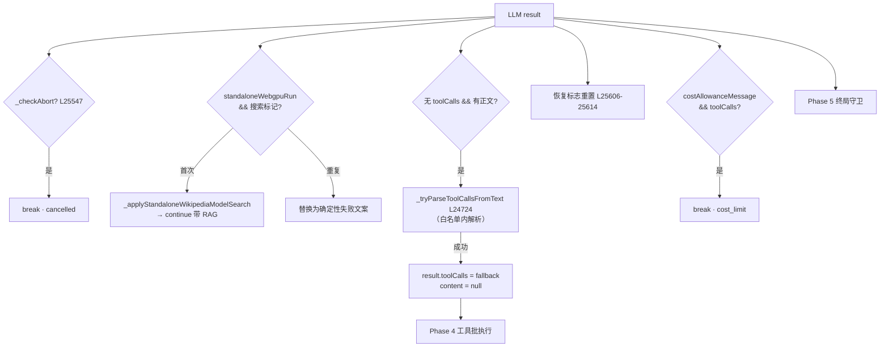

# 🧩 子步骤 4：响应解析与文本兜底

> 📍 主循环 LLM 返回后、动作分支前（L25546-25622）
> 🎯 作用：LLM 响应的"入库前处理"——abort 检查点②、LFM 原生搜索标记的本地拦截、文本形态工具调用的兜底解析、恢复标志重置、成本消息与工具调用并存时的拦截。

## 🔍 主要逻辑流程（带行号）

```javascript
// ① abort 检查点②：LLM 返回后（有未执行 toolCalls 用不同文案）
if (this._checkAbort(tabId)) {                                           // L25547
  const hadToolCalls = !!(result?.toolCalls && result.toolCalls.length > 0);
  finalResponse = hadToolCalls
    ? '[Stopped by user before executing requested tool calls.]'         // L25549-51
    : '[Stopped by user]';
  _traceStatus = 'cancelled';
  messages.push(this._localCancellationMessage(finalResponse));
  break;
}

// ② LFM 原生搜索标记：无工具的本地模型也可能吐 Google/Wikipedia 搜索标记——
//    视为"查本地归档"请求，绝不视为浏览器/网络许可；重试有界防循环
if (standaloneWebgpuRun && result.content) {                             // L25562
  const localSearchQueries = this._standaloneWikipediaSearchQueriesFromModelText(result.content, runOptions);
  if (localSearchQueries.length && !standaloneWikipediaModelSearchAttempted) {
    standaloneWikipediaModelSearchAttempted = true;                      // 只试一次
    const fallbackRag = await this._applyStandaloneWikipediaModelSearch(...); // L25566
    if (fallbackRag) { runOptions = {...runOptions, localWikipediaRag: fallbackRag}; continue; } // L25583
  } else if (localSearchQueries.length) {
    // 二次标记：替换为确定性失败文案                       // L25585-25589
    result.content = runOptions.localWikipediaRag?.status === 'matched'
      ? 'I found relevant Offline Wikipedia references, ...' : 'I could not find a matching entry ...';
  }
}

// ③ 文本形态工具调用兜底：模型把 tool_calls 写成了正文
if ((!result.toolCalls || result.toolCalls.length === 0) && result.content) { // L25594
  const fallback = this._tryParseToolCallsFromText(result.content, allowedToolNames); // L25595
  if (fallback.length > 0) {
    result.toolCalls = fallback;                                         // L25598
    result.content = null;                                               // 正文让位
  }
}

// ④ 恢复标志重置：真进展让下一次占位符/空输出重新获得恢复机会
const hasToolCallsAfterFallback = !!(result.toolCalls?.length > 0);      // L25606
const hasContentAfterFallback = !!(result.content?.trim());
const isCompressionPlaceholderAfterFallback = this._isActionMode(mode)
  && this._isCompressionPlaceholderResponse(result.content);             // L25608
if (hasToolCallsAfterFallback || hasContentAfterFallback) {
  emptyOutputRecoveryAttempted = false;                                  // L25610
  if (hasToolCallsAfterFallback || !isCompressionPlaceholderAfterFallback) {
    compressionPlaceholderRecoveryAttempted = false;                     // L25612
  }
}

// ⑤ 成本消息与工具调用并存：配额到线但模型还想要工具 → 终止
if (result.costAllowanceMessage && result.toolCalls && result.toolCalls.length > 0) { // L25616
  finalResponse = result.costAllowanceMessage; _traceStatus = 'cost_limit';
  messages.push({ role: 'assistant', content: finalResponse });
  onUpdate('warning', { message: finalResponse });
  break;
}
// → result.toolCalls 非空 → Phase 4；纯文本 → Phase 5
```

## ✨ 设计亮点

1. **文本兜底解析仅在白名单内**（`_tryParseToolCallsFromText(text, allowedNames)`）：从正文救回的"工具调用"也必须过工具目录门——救的是格式，不放过权限。
2. **LFM 标记的权限语义**：本地 WebGPU 模型输出的搜索标记被映射到本地 ZIM 归档查询（`_applyStandaloneWikipediaModelSearch`），并且 `continue` 重新进循环带上 RAG 上下文——标记永远换不来浏览器工具。
3. **恢复标志的"进展重置"语义**（L25603-25614 注释）：占位符不是进展，但真正的工具调用或实体响应让下一个占位符重新获得一次恢复机会——防"一次恢复终身免疫"与"永远恢复"两个极端。
4. **abort 文案区分**：有未执行 toolCalls 时明确说"在执行请求的工具调用前停止"——用户能判断副作用是否已发生。
5. **成本×工具并存的显式拦截**：配额消息由 provider 层附加在带 toolCalls 的响应上，主循环在进批执行**前**拦截——不再烧一次配额外的工具执行。

## 📥 返回值结构

```javascript
// 本子步骤不返回；产出规整后的 result：
// {content: string|null, toolCalls: Array|null, usage, ...}
// 以及可能被改写的 runOptions.localWikipediaRag
```

## 🔗 协作图



## 📊 总结

| 维度 | 结论 |
|---|---|
| abort 检查点 | ②在 LLM 返回后（区分工具文案） |
| 兜底解析 | 白名单约束的正文工具调用解析 |
| 本地模型标记 | 映射本地归档搜索，有界重试 |
| 恢复语义 | 真进展重置恢复标志 |
| 成本拦截 | 配额消息 × 工具调用 → 批执行前终止 |
