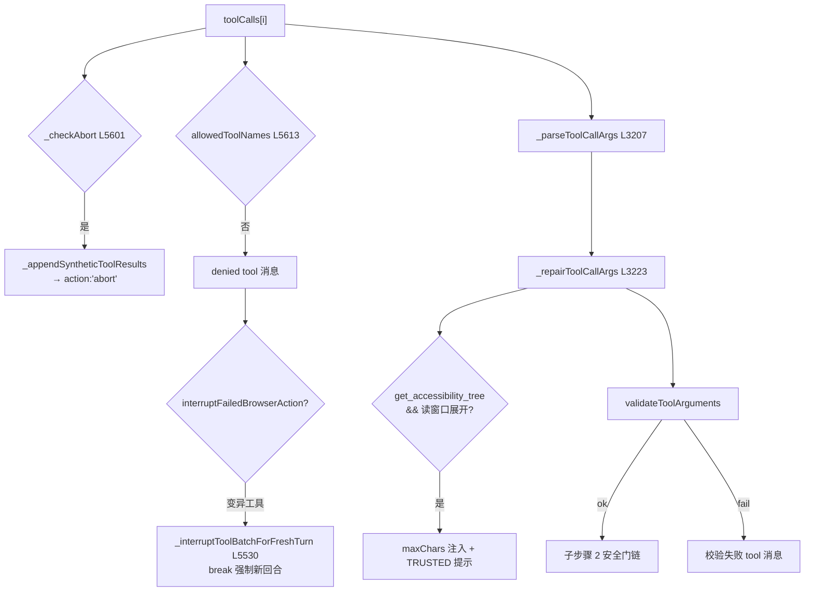

# ✅ 子步骤 1：前置校验链

> 📍 `_executeToolBatch`（L5598-5677）
> 🎯 作用：每个 toolCall 进入安全门**之前**的硬校验——中止检查、工具目录白名单、参数解析与修复、读窗口提示注入、schema 校验。失败全部走"tool 消息 + continue"，模型可见原因。

## 🔍 主要逻辑流程（带行号）

```javascript
for (let toolIndex = 0; toolIndex < toolCalls.length; toolIndex++) {
  const tc = toolCalls[toolIndex];
  // ① abort：合成剩余结果（防孤儿 tool_calls）→ {action:'abort'}
  if (this._checkAbort(tabId)) {                                         // L5601
    const value = '[Stopped by user before executing requested tool calls.]';
    this._appendSyntheticToolResults(tabId, toolCalls, toolIndex, messages, onUpdate, step,
      () => ({ success: false, cancelled: true, error: value }));        // L5603-5607
    return { action: 'abort', value };                                   // L5609
  }
  // ② 白名单：不在本 mode/tier 工具目录内 → 拒绝
  const fnName = tc.function?.name || '';
  if (!allowedToolNames.has(fnName)) {                                   // L5613
    const error = fnName
      ? `Tool ${fnName} is not available in the current mode/provider tool set. ...`
      : 'Tool call is missing a function name.';
    messages.push({ role:'tool', tool_call_id: tc.id,
      content: JSON.stringify({success:false, denied:true, error}) });   // L5618-5622
    if (interruptFailedBrowserAction(toolIndex, fnName)) { navNotices.length = 0; break; } // L5623
    continue;
  }
  // ③ 参数解析：JSON.parse + 形状修复
  const parsedArgs = this._parseToolCallArgs(tc);                         // L5626
  if (parsedArgs.error) {
    const result = this._invalidToolArgumentsResult(fnName, parsedArgs); // L5628
    // tool 消息 + warning + trace + continue（或批中断）               // L5629-5645
  }
  // ④ 参数修复：常见畸形参数的启发式纠正（如越界 maxChars）
  const argRepair = this._repairToolCallArgs(fnName, parsedArgs.args, {  // L5647
    treePageChars: readLimits.treePageChars });
  let fnArgs = this._toolCallArgsWithReplayMethod(tabId, fnName, argRepair.args); // L5650 bulk 重放方法回填
  // ⑤ 读窗口提示：强 provider 的必需全线程读自动加 maxChars
  if (fnName === 'get_accessibility_tree' && readLimits.expanded
      && readState?.required === true && fnArgs.maxChars == null ...) {  // L5653-5662
    fnArgs = { ...fnArgs, maxChars: readLimits.treePageChars };
    readWindowNotice = `[TRUSTED READ WINDOW: ... Preserve maxChars in every returned continuationArgs.]`; // L5664
  }
  // ⑥ schema 校验：toolSchemas 的 parameters → validateToolArguments
  const parameters = this._toolParametersForValidation(tabId, fnName, toolSchemas); // L5666
  const argumentValidation = parameters
    ? validateToolArguments(fnName, fnArgs, parameters) : { ok: true };  // L5667
  if (!argumentValidation.ok) {
    // tool_call + tool_result 事件 + tool 消息 + trace + continue      // L5668-5676
  }
```

## `interruptFailedBrowserAction` 辅助（L5585-5596）

变异工具失败时调用 `_interruptToolBatchForFreshTurn`（L5530）：把批内剩余调用合成为跳过结果 + 注入导航通知 + `break`——**变异失败后的同批后续变异不再执行**，强制模型带着新证据开新回合。注释（L5581-5584）强调：helper 已注入合成结果，必须 `break` 而非 `return`，让共享批尾路径仍能刷出前面调用的自动截图。

## ✨ 设计亮点

1. **白名单是物理边界**：文本兜底解析救回的调用（Phase 3 子步骤 4）到这里的白名单仍会被拒——格式宽容不等于权限宽容。
2. **修复优先于拒绝**：`_repairToolCallArgs` 纠正常见畸形（带 note 提示模型），减少因小错烧步数。
3. **abort 的结构完整性**：即使第 3 个调用时中止，前 2 个的 assistant tool_calls 也有完整 tool 消息配对。
4. **读窗口的自适应**：强模型 + 必需完整读 → 自动扩大 maxChars 并要求保留 continuationArgs——能力感知的读策略进参数层。

## 📥 返回值结构

```javascript
// 每个失败路径产出：
{ role:'tool', tool_call_id, content: JSON.stringify({success:false, denied?, error, ...}) }
// 校验通过的调用继续进入子步骤 2（安全门链），携带：fnName, fnArgs, argRepairNotice, readWindowNotice
```

## 🔗 协作图



## 📊 总结

| 校验 | 行号 | 失败动作 |
|---|---|---|
| abort | L5601 | 合成剩余 + action:'abort' |
| 白名单 | L5613 | denied tool 消息 + continue/中断 |
| 参数解析 | L5626 | 错误 tool 消息 + continue |
| 参数修复 | L5647 | 原位纠正 + note |
| schema 校验 | L5666 | tool_call/result 事件 + tool 消息 |
