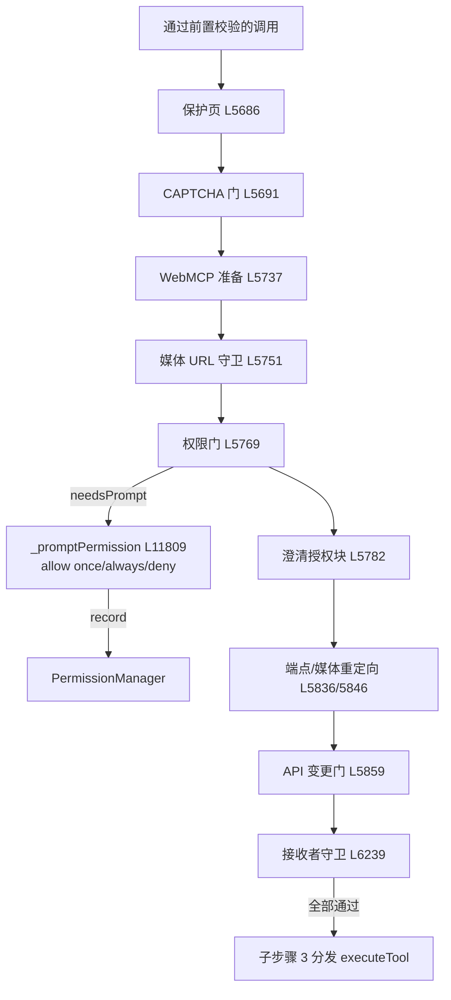

# 🚧 子步骤 2：安全门链

> 📍 `_executeToolBatch`（L5679-6259）
> 🎯 作用：工具真正分发前的 7 道运行时安全门——保护页、CAPTCHA、权限、澄清授权、端点重定向、API 变更、消息接收者。全部以"结构化 tool 消息"收场，人是关键决策的信任锚。

## 🔍 门链总览（按执行顺序）

| # | 门 | 行号 | 拦截对象 | 失败动作 |
|---|---|---|---|---|
| 1 | Chrome 保护页 | L5686 | chrome:// 商店/仪表盘等 | 结构化失败进普通结果管道（L5679-5685 注释：保持 trace/循环/恢复语义一致） |
| 2 | CAPTCHA 门 | L5691-5735 | 活动验证挑战下的页面变更 | 三级 `[TRUSTED CAPTCHA GATE]` 指导；manual → return `captcha_manual_required`；其余 continue |
| 3 | WebMCP 准备 | L5737-5749 | `execute_webmcp_tool` | 错误 tool 消息 + continue |
| 4 | 公共媒体 URL 守卫 | L5751-5760 | feed 页无 permalink 的 `download_public_media` | 引导 tool 消息 + continue |
| 5 | **权限门** | L5769-5773(+弹窗) | 一切有后果能力 | `capabilitiesFor(fnName, fnArgs)` → `permissions.check` → `needsPrompt` 时 `_promptPermission`（allow once/always/deny） |
| 6 | 澄清授权块 | L5782-5834 | 把超时澄清当授权的调用 | 阻断 + 合成跳过；重复/末步 → return `clarification_required` |
| 7a | 技能端点重定向 | L5836-5845 | 技能端点的通用工具误用 | "用 X 而不是 Y" tool 消息 |
| 7b | 媒体下载重定向 | L5846-5858 | 已有专用下载器时的 `download_social_media` | 引导/跳过 tool 消息 |
| 8 | API 变更门 | L5859-5879 | `fetch_url` 写方法 | Ask 模式拒绝 / 未开 `/allow-api` 拒绝（文案含 `requiresApiAllow`） |
| 9 | 消息接收者守卫 | L6239-6259 | 发送类 click/submit/Enter（受保护路由） | no-dispatch 阻断 tool 消息 + 批中断 |

### 权限门细节（L5762-5781）

```javascript
// 确定性 capability × origin 门（permission-gate.js）。
// 不读文本、不用模型：语言无关、不可注入——人是信任锚。
// 一次调用可能需要多个能力：set_field({submit}) = TYPE + CLICK。
const skillCallTool = this._activeSkillToolForName(tabId, fnName);
let capabilities = protectedPageFailure ? [] : capabilitiesFor(fnName, fnArgs);  // L5770
if (skillCallTool?.requiresDownloadPermission && !capabilities.includes(Capability.DOWNLOAD)) {
  capabilities.push(Capability.DOWNLOAD);                                       // L5771-5773
}
// 分发前分类保留：确认路径移除已满足能力后，missingResponse 仍按未知处理
const isStateChangingCall = !protectedPageFailure && Agent.STATE_CHANGE_TOOLS.has(fnName); // L5778
const missingResponseOutcomeUnknown = capabilities.length > 0 || isStateChangingCall;        // L5779
const executionMutationEvidence = this._isExecutionMutationEvidence(fnName, fnArgs, capabilities); // L5780
```

（弹窗交互：`_promptPermission` L11809——`onUpdate('permission_prompt')` → 面板原生确认 → `permissions.record()`。）

### 澄清授权块细节（L5782-5834）

超时的 clarify 不能成为后续动作的授权来源：`_clarificationAuthorizationBlock` 判定"此调用是否在把未应答澄清当授权"→ 阻断结果 + 后续调用合成跳过（`skipped: a waited clarification timeout requires explicit authorization...`）→ 重复尝试或最后一步 → `return {action:'return', status:'clarification_required'}`（L5826-5832）。

## ✨ 设计亮点

1. **CAPTCHA 门是运行时状态边界而非提示建议**（L5688-5690 注释）：一旦观察到挑战，任何模型作者化的 click/close/submit 都不得运行，直到一次受支持的 solve 完成；三种状态（solve_required / manual_required / verification_pending）各配精确的 TRUSTED 指导。
2. **missingResponseOutcomeUnknown 的失败关闭**：有能力要求或状态变更的调用，响应丢失 = 结果未知（`_normalizeToolResult` L3295 消费）——绝不假设成功。
3. **澄清授权的防滥用闭环**：阻止"模型自问自答"式把超时澄清当作用户同意。
4. **保护页失败的管道一致性**：保护页失败不早退，走普通结果管道——trace、循环处理、可信恢复提示与其它工具结果行为完全一致（L5679-5685 注释）。
5. **技能下载能力的补位**：技能 HTTP 工具声明 `requiresDownloadPermission` 时补 DOWNLOAD 能力——技能工具不绕过下载权限门。

## 📥 返回值结构

```javascript
// 各门的 tool 消息形状
{ role:'tool', tool_call_id, content: JSON.stringify({
    success: false, denied?, skipped?, requiresApiAllow?, error, ...
}) }
// 或运行级出口：{action:'return', status:'captcha_manual_required'|'clarification_required', value}
// 通过者携带：capabilities, isStateChangingCall, missingResponseOutcomeUnknown, executionMutationEvidence
```

## 🔗 协作图



## 📊 总结

| 维度 | 结论 |
|---|---|
| 门数量 | 9 处拦截点（含重定向类） |
| 人的决策点 | 权限弹窗（能力×域）、澄清应答、CAPTCHA 手动完成 |
| 失败语义 | 结构化 tool 消息（模型可见）或运行级 return |
| 失败关闭 | 响应丢失 = 结果未知；超时澄清 ≠ 授权 |
