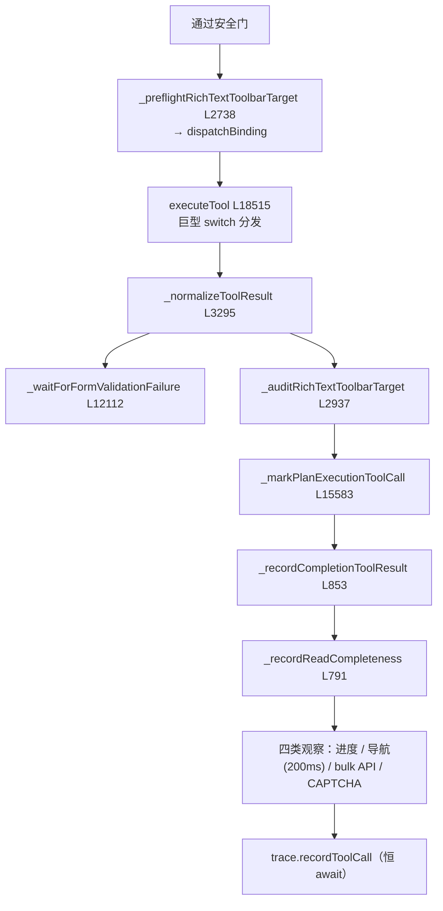

# 🔀 子步骤 3：工具分发与结果审计

> 📍 分发段（L6261-6290）+ 审计段（L6291-6493）
> 🎯 作用：真正的工具执行（`executeTool` 巨型 switch）+ 分发后的三层审计（表单验证、工具栏审计、不变量记录）+ 四类观察（进度、导航、bulk API、CAPTCHA）。

## 🔍 主要逻辑流程（带行号）

### A. 分发（L6261-6296）

```javascript
onUpdate('tool_call', { name: fnName, args: fnArgs, outcomeUnknown: missingResponseOutcomeUnknown }); // L6261-6265
// 有后果调用前钩子：runOptions.beforeConsequentialTool（截图终态化用）
if (missingResponseOutcomeUnknown && typeof runOptions?.beforeConsequentialTool === 'function') {
  try { await runOptions.beforeConsequentialTool({ name: fnName }); } catch {}   // L6266-6270
}
const toolbarPreflight = protectedPageFailure ? { block: null }
  : await this._preflightRichTextToolbarTarget(tabId, fnName, fnArgs, provider, { onUpdate }); // L6272
const rawToolResult = protectedPageFailure
  || toolbarPreflight.block
  || await this.executeTool(tabId, fnName, fnArgs, onUpdate, {               // L6275-6289 ★分发
    completionBatchStartState, promptTier,
    dispatchBinding: toolbarPreflight.probe?.dispatchBinding || null,        // 一次性绑定
    ...messageRecipientExecutionContext,                                    // 接收者一次性绑定
    iframeTargetUnresolved: toolbarPreflight.iframeTargetUnresolved === true,
  });
let toolResult = this._normalizeToolResult(fnName, rawToolResult, missingResponseOutcomeUnknown); // L6290 结果未知归一
```

### B. 分发后审计（L6291-6363）

```javascript
this._maybePromoteChromeProtectedGalleryResult(...)                     // L6291 保护页视觉回退提升
// 表单验证：提交类调用后等待验证失败出现（字段红字/警告条）
const formValidationFailure = await this._waitForFormValidationFailure(...); // L6311
if (formValidationFailure) this._applyFormValidationFailure(tabId, toolResult, failure); // L6325
await this._auditRichTextToolbarTarget(tabId, fnName, fnArgs, toolResult, toolbarPreflight.probe); // L6329
if (fnName !== 'done') this._markPlanExecutionToolCall(tabId, fnName, toolResult, {  // L6330 计划证据
  consequential: executionMutationEvidence, download: capabilities.includes(Capability.DOWNLOAD) });
const completionStateAfterTool = this._recordCompletionToolResult(tabId, fnName, fnArgs, toolResult); // L6337
const readCompletenessAfterTool = this._recordReadCompleteness(tabId, fnName, fnArgs, toolResult);    // L6339
// 剥离二进制附件（走专用通道，不进 trace/持久化文本）              // L6346-6355
// NYTimes pageGate 回退标注                                        // L6357-6363
```

### C. 四类观察（L6366-6493）

```javascript
this._pinDownloadHandles(tabId, fnName, toolResult);                    // L6368 下载句柄钉入抗压缩
this._trackBulkApiReplayResult(tabId, fnName, fnArgs, toolResult);      // L6369
// ① 进度观察（非 done）
mastodonObserved = await this._rememberMastodonObservation(...);        // L6377
progressObserved = await this._recordProgressObservation(...);          // L6378
progressAuto = this._autoRecordProgressAction(...);                     // L6379 自动记账 + 警告
// ② 导航检测：导航倾向调用 → 200ms 让 SPA 提交 → 比对 URL
await new Promise(r => setTimeout(r, 200));                             // L6397
afterUrl = await this._currentUrl(tabId);
if (fullUrlChanged) { toolResult.pageUrlChanged = true; ... }           // L6402-6408
// path 级变化且非显式导航工具 → navNotices 累积（批尾注入）        // L6423-6425
this._recordCompletionSubmitAttempt(...);                               // L6427
// ③ bulk API 捷径：重复同形 UI 动作 → webRequest 缓冲里找同 URL+方法
bulkApiShortcut = this._detectBulkApiMutationShortcut(tabId, fnName, fnArgs, toolResult, {...}); // L6432
// ④ CAPTCHA 观察：solve_captcha 的结果转换门状态；_observeCaptchaChallenge 检测新挑战 // L6451-6489
if (!toolResult?.done) onUpdate('tool_result', { name: fnName, result: toolResult }); // L6492
await recordFinalToolTrace(toolResult);                                 // L6507 trace（恒 await 防乱序）
```

## ✨ 设计亮点

1. **一次性绑定（dispatchBinding）**：工具栏预检与接收者守卫产出的绑定在 `executeTool` 消费时立即重验证——"执行不能在预检后静默改目标"（阶段一架构文档：rich-text probe 边界）。
2. **分发前推 UI、分发后补审计**：`tool_call` 事件先于执行（用户实时看到），`tool_result` 后于审计（带表单验证失败等增强信息）。
3. **表单验证的等待式检测**：提交后等页面出现验证失败信号（`_waitForFormValidationFailure` L12112），把页面红字转化为模型可读的 toolResult 字段——"提交成功≠表单通过"。
4. **trace 写序保证**：`recordFinalToolTrace` 恒 await（L6504-6506 注释：曾经浮动导致 trace 条目晚于下一个工具的到达）。
5. **导航的 SPA 宽限**：200ms 等待让 history API/真实导航提交后再读 URL——避免误报与漏报。

## 📥 返回值结构

```javascript
toolResult: { success, error?, dispatched?, pageUrlChanged?, currentUrl?, previousUrl?,
              _attachImage?/_attachDocument?（已剥离）, bulkApiMutationPattern?,
              captchaGate?, progressAutoRecorded?, pageGateFallback?, ... }
```

## 🔗 协作图



## 📊 总结

| 维度 | 结论 |
|---|---|
| 分发器 | executeTool（5000+ 行 switch，见阶段一 3.3） |
| 分发前 | tool_call 事件、beforeConsequentialTool 钩子、工具栏预检绑定 |
| 分发后审计 | 表单验证、工具栏审计、计划证据、完成不变量、读完整性 |
| 四类观察 | 进度、导航、bulk API 捷径、CAPTCHA 状态机 |
