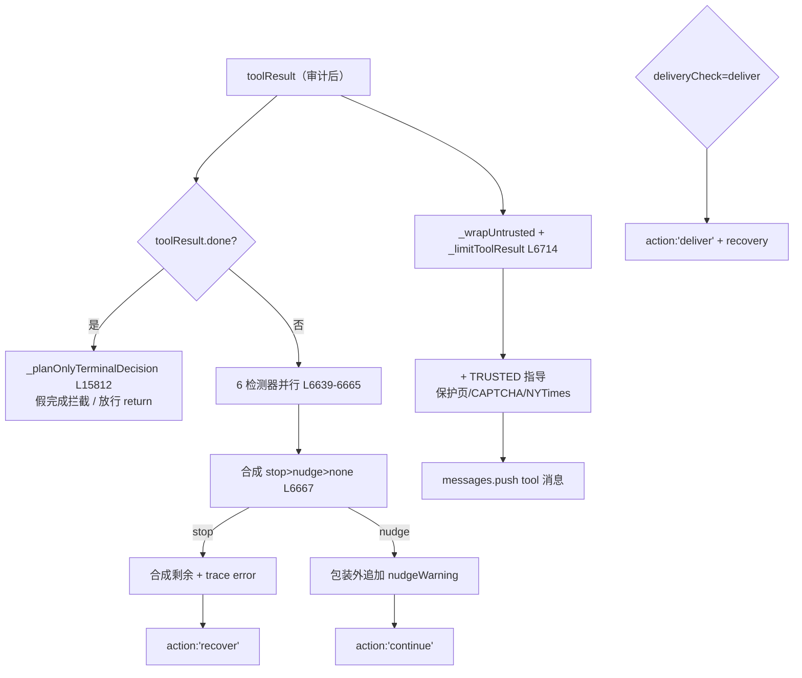

# 🔁 子步骤 4：循环检测合成与结果包装

> 📍 done 短路（L6520-6630）+ 循环检测合成（L6632-6703）+ 包装与出口（L6705-6990）
> 🎯 作用：done 终态的 plan-only 拦截、6 个循环检测器的并行与合成、工具结果的 8KB 截断 + 不可信包装 + TRUSTED 附加指导、nudge/stop/deliver 三类出口。

## 🔍 主要逻辑流程（带行号）

### A. done 短路（L6520-6630）

```javascript
if (toolResult && toolResult.done) {
  // done 也要过 plan-only 守卫：假完成（只复述计划）拦截
  const planOnlyDecision = this._planOnlyTerminalDecision(              // L6522-6526
    tabId, toolResult.summary || partialAssistantText || '', { viaDone: true, outcome: toolResult.outcome });
  if (planOnlyDecision?.retry) {
    const blockedResult = { success:false, blockedDone:true, planOnlyTerminal:true, error: planOnlyDecision.nudge };
    // 补齐剩余调用（陈旧批不再执行）→ return {action:'continue'}        // L6527-6560
  }
  // 终局 done：验证截图 + 完成不变量/进度账本块 →
  // wrapUntrusted(done 结果) push → 合成剩余 → persist
  return { action: 'return', value: finalResponse };                     // L6629
}
```

### B. 循环检测合成（L6632-6703）

```javascript
// 6 个检测器并行，最强者胜
let loopCheck = { kind: 'none' };
const loopKey = this._loopCallKey(fnName, fnArgs, toolResult);
const failedApiMutation = this._isFailedApiMutationForLoop(fnName, fnArgs, toolResult);
if (!failedApiMutation || !failedApiMutationLoopKeysThisBatch.has(loopKey)) {  // 同批去重 L6637
  loopCheck = this._checkLoop(tabId, fnName, fnArgs, toolResult);        // L6639 精确重复/失败域
}
let coordCheck = fnName === 'click' && fnArgs?.x != null
  ? this._checkCoordClickLoop(tabId, fnArgs.x, fnArgs.y) : {kind:'none'}; // L6642 坐标
const axReadCheck = this._checkAccessibilityReadLoop(tabId, fnName, fnArgs, toolResult); // L6645 AX 读
const scrollCheck = this._checkNoProgressScroll(tabId, fnName, fnArgs, toolResult);     // L6646 滚动
const deliveryCheck = this._checkDeliveryObservationStreak(tabId, fnName, fnArgs, toolResult, { // L6647 投递
  consequential: executionMutationEvidence,
  verifiedPendingAction: this._deliveryCheckpointVerifiedPendingAction(before/after完成态),
  requiredReadProgress, enforceTerminal: runOptions?.cloudRun !== true && allowedToolNames.has('done') });
// 合成：stop > nudge > none（含 challengeLoopCheck 来自 CAPTCHA 观察）    // L6667-6703
```

### C. 包装与出口（L6705-6990）

```javascript
// 先包不可信，后加可信——nudge 必须在包装外
const resultTrustName = this._toolResultTrustName(fnName, toolResult);   // L6708
let resultContent = this._wrapUntrusted(
  resultTrustName,
  this._limitToolResult(toolResult, modelResultChars),                   // L6714 8KB（AX 扩展窗）
);
// TRUSTED 附加指导（按需追加）：
// + chrome_protected_page 路由指导                                      // L6718-6722
// + CAPTCHA 四态指导（solve_required/manual/verification_pending/cleared）// L6727-6752
// + NYTimes pageGate 回退说明                                           // L6753-6758
// （后接 nudge 追加、messages.push、图片附件块、fresh-turn 中断、
//   bulk API 捷径 return、deliver/stop 出口）
if (deliveryCheck.kind === 'deliver') {
  // 合成剩余（"delivery recovery requires a terminal done turn"）→
  return { action: 'deliver', value: '...browser observation limit...', status: 'delivery_required' }; // L6953
}
if (effectiveKind === 'stop') {
  // 合成剩余（"run stopped by loop detector"）→ trace.recordError(loop) →
  return { action: 'recover', value: stopMessage, status: 'loop_stopped' }; // L6970
}
// nudge：resultContent += nudgeWarning（[LOOP DETECTED] 在包装外）       // L6986 附近
```

## ✨ 设计亮点

1. **包装顺序即信任语义**（L6705-6707 注释）：`_wrapUntrusted` 在前、TRUSTED 指导与 nudge 在后——页面内容进 `<untrusted_page_content>` 盒子，运行时指令在盒子外被当作指令读取。
2. **done 不豁免守卫**：`done` 也要过 plan-only 决策（`viaDone:true`）——"假完成"（复述计划、meta 摘要）被拦截后强制新回合（陈旧批不执行，L6541-6543 注释）。
3. **同批 API 失败去重**：`failedApiMutationLoopKeysThisBatch`——同一失败 API 重放只在批内计一次循环证据，防双重计数误停。
4. **投递检查点的终端执行**（L6659-6663 注释）：Ask research 与 Act/Dev 一样受第二检查点终端恢复——任何广告 `done` 的交互模式都拿到 deliver 恢复。
5. **AX 扩展读窗的结果预算**：强 provider 的整树读用 `readLimits.toolResultChars` 而非标准 8KB（L6709-6713）——读策略与结果预算联动。

## 📥 返回值结构

```javascript
// messages 增量：{role:'tool', tool_call_id, content: wrappedResultContent}
// 可能的批级出口：
{ action:'return', value: finalResponse }                    // done 完成
{ action:'deliver', value, status:'delivery_required', recovery }  // 投递恢复
{ action:'recover', value: stopMessage, status:'loop_stopped' }    // 循环停止恢复
{ action:'continue' }                                        // 常规（含 nudge 后）
```

## 🔗 协作图



## 📊 总结

| 维度 | 结论 |
|---|---|
| 检测器 | 6 个并行（loop/coord/axRead/scroll/delivery/challenge） |
| 信任包装 | untrusted 盒内数据 + 盒外 TRUSTED 指导/nudge |
| 结果预算 | 标准 8KB / AX 扩展窗 |
| done 守卫 | plan-only 拦截（viaDone） |
| 出口 | return / deliver / recover / continue（+nudge） |
