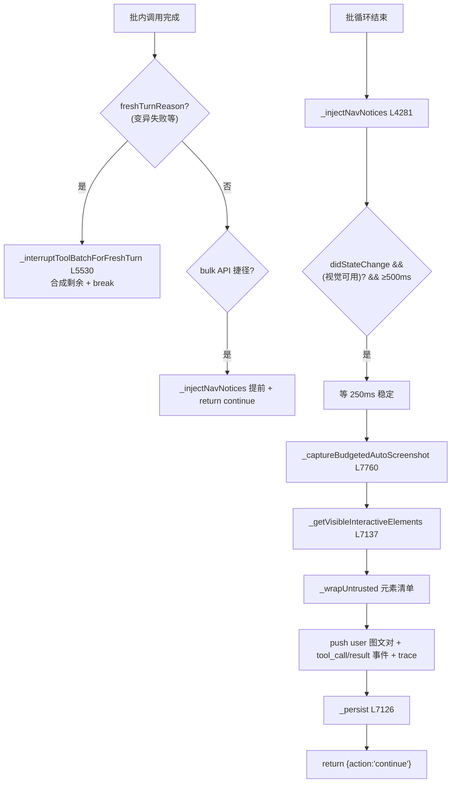

# 📸 子步骤 5：终局工具与自动截图

> 📍 批内 fresh-turn 中断（L6962-6990）+ 批尾（L7031-7128）
> 🎯 作用：批的三类收尾——变异失败后的 fresh-turn 强制中断、导航通知注入、去抖自动截图与可点元素清单配对，最后统一持久化并返回 `{action:'continue'}`。

## 🔍 主要逻辑流程（带行号）

### A. fresh-turn 中断（L6962-6990）

```javascript
const freshTurnReason = this._browserActionFreshTurnReason(promptTier, fnName, toolResult); // L6962
if (freshTurnReason && this._interruptToolBatchForFreshTurn(
  tabId, toolCalls, toolIndex + 1, messages, onUpdate, step,
  { tier: promptTier, triggeringTool: fnName, reason: freshTurnReason, navNotices })) {
  // helper 已注入合成结果与导航通知；break 走共享批尾（截图仍要发）
  if (this._shouldAutoScreenshot(fnName) && !toolResult?.error) didStateChange = true; // L6986
  navNotices.length = 0;                                                // L6987
  break;                                                                // L6988
}
// bulk API 捷径 return：点击同时触发 bulk 模式与导航时，此处提前注入 navNotices
// （否则模型会拿着旧页 URL 重放）→ return {action:'continue'}           // L7020-7030
if (this._shouldAutoScreenshot(fnName) && !toolResult?.error) {
  didStateChange = true;                                                // L7034-7036
}
```

### B. 批尾：导航通知 + 自动截图（L7038-7126）

```javascript
// ① 导航通知先于截图注入——模型同一回合看到警告 + 新视口
this._injectNavNotices(messages, navNotices, onUpdate);                  // L7041-7042

// ② 自动截图：批内一次，500ms 去抖；主模型有视觉或配置了专用视觉模型
const visionProvider = await this.providerManager.getVisionProvider();
if (didStateChange && (provider.supportsVision || visionProvider)) {     // L7045-7046
  const lastTs = this.lastAutoScreenshotTs.get(tabId) || 0;
  if (Date.now() - lastTs >= 500) {                                      // L7047-7048
    await new Promise(r => setTimeout(r, 250));                          // L7049 稳定等待
    // 共享预算检查+自增（issue #311）：与初始视口捕获同一 helper，
    // 配置值是真上限；预算跳过不静默（带 onUpdate + messages）
    const shot = await this._captureBudgetedAutoScreenshot(tabId, { onUpdate, messages }); // L7057
    if (shot) {
      this.lastAutoScreenshotTs.set(tabId, Date.now());
      // 图 + 文配对：可点元素清单（页面派生 → untrusted 包装）
      const visible = await this._getVisibleInteractiveElements(tabId);  // L7064
      const rawElements = this._formatElementsList(visible);
      const elementsText = rawElements
        ? '\n' + this._wrapUntrusted('get_interactive_elements', rawElements) : rawElements; // L7068-7070
      // push {role:'user', content:[{text 块 + elementsText}, {image_url}]}  // L7072-7082
      onUpdate('tool_call', { name: 'auto_screenshot', args: {} });      // L7084 UI 呈现
      onUpdate('tool_result', { name: 'auto_screenshot', result: {success:true, bytes, elements, blankFrameRetry} });
      trace.recordScreenshot(_runIdForShot, null, shot.dataUrl, 'auto-screenshot after tool batch'); // L7095
    }
  }
}
this._persist(tabId);                                                    // L7126
return { action: 'continue' };                                           // L7128
```

## ✨ 设计亮点

1. **截图消息伪装为 user 角色**：`auto_screenshot` 的图文对以 `role:'user'` push——OpenAI 兼容协议里 tool 消息必须紧跟对应 tool_call，追加图文只能走 user 通道。
2. **图 + 文配对解决"猜像素"**（L7060-7070 注释）：截图附带 CSS 像素坐标的可点元素清单（untrusted 包装）——本地视觉模型能按名字而非像素定位 "the Publish button"。
3. **预检截图不可复用**（L7053-7056 注释）：工具栏预检的截图在分发**前**拍摄，复用会让模型看到自己编辑**前**的页面——事后截图必须重拍。
4. **预算是回合级真上限**：初始视口与事后截图共享 `autoScreenshotCount` 预算（issue #311），limit=1 时整个回合只拍一张。
5. **navNotices 的批级聚合**：批内多次隐式导航只在批尾注入一次（query/hash 级 SPA 变化不强制重规划，L6420-6425）。

## 📥 返回值结构

```javascript
// 批尾统一出口
{ action: 'continue' }
// 副作用：messages += navNotices（若有）+ auto_screenshot 图文对（若拍）
//        storage.session 持久化
```

## 🔗 协作图



## 📊 总结

| 维度 | 结论 |
|---|---|
| fresh-turn 中断 | 变异失败/挑战后强制新回合（共享批尾仍发截图） |
| 导航通知 | 批尾聚合注入，先于截图 |
| 截图策略 | 500ms 去抖 + 250ms 稳定 + 回合级预算 |
| 图文配对 | image_url + untrusted 元素清单（user 消息） |
| 批终态 | `_persist` + `{action:'continue'}` |
