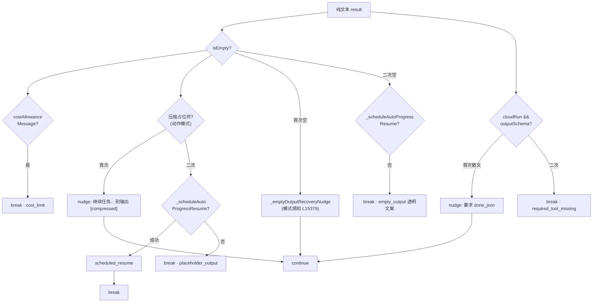

# 🩹 子步骤 1：空输出与占位符恢复

> 📍 `_processMessageInner`（L25675-25765）
> 🎯 作用：处理三类"模型没有给出可用输出"的失效——空响应（无 content 无 toolCalls）、压缩占位符（`[compressed]` 类文本）、云运行结构化输出缺失。每类一次 nudge 恢复，二次失败透明终止。

## 🔍 主要逻辑流程（带行号）

### A. 空输出（L25684-25742）

```javascript
// 注释（L25676-25683）：(b) 模型既无 content 也无 toolCalls —— "中途放弃"失效
//（常因 reasoning_tokens 烧光输出预算）。恢复一次；二次失败以透明文案放弃，
// 而不是静默记录一个空内容的"done"运行（旧行为）。
const isEmpty = !result.content || !result.content.trim();
if (isEmpty && result.costAllowanceMessage) {                            // L25685
  finalResponse = result.costAllowanceMessage; _traceStatus = 'cost_limit';
  messages.push({ role: 'assistant', content: finalResponse });
  onUpdate('warning', { message: finalResponse });
  break;                                                                 // 配额优先
}
if (this._isActionMode(mode) && this._isCompressionPlaceholderResponse(result.content)) {
  // → B 压缩占位符
}
if (isEmpty) {
  if (!emptyOutputRecoveryAttempted) {                                   // L25719
    emptyOutputRecoveryAttempted = true;
    messages.push({ role: 'user', content: this._emptyOutputRecoveryNudge(mode) }); // 模式感知 nudge L15379
    this._persist(tabId);
    continue;                                                            // L25726 给模型一次机会
  }
  // 二次空：先试自动调度续跑（进度任务可延后）
  const scheduledResume = await this._scheduleAutoProgressResume(tabId, onUpdate); // L25728
  if (scheduledResume) {
    finalResponse = scheduledResume.message; _traceStatus = 'scheduled_resume';
    messages.push({ role: 'assistant', content: finalResponse });
    this._persist(tabId); break;
  }
  finalResponse = '[Agent emitted no output and no tool call, even after a recovery nudge. ...]'; // L25737
  _traceStatus = 'empty_output';                                         // 透明终止
  messages.push({ role: 'assistant', content: finalResponse });
  onUpdate('warning', { message: finalResponse });
  break;
}
```

### B. 压缩占位符（L25692-25717）

```javascript
if (this._isActionMode(mode) && this._isCompressionPlaceholderResponse(result.content)) { // L25692
  if (!compressionPlaceholderRecoveryAttempted) {
    compressionPlaceholderRecoveryAttempted = true;
    // 占位符 assistant 消息保留（含 responseItems）+ 系统 nudge
    messages.push({ role:'assistant', content: result.content });        // L25695
    messages.push({ role:'user', content: '[System nudge: your previous response was a context-compression placeholder, not a real final answer or tool call. Continue the active browser task with tool calls. Do not output "[compressed]".]' }); // L25698
    continue;
  }
  // 二次占位：同样先试 _scheduleAutoProgressResume → 'placeholder_output' 透明终止  // L25704-25716
}
```

### C. 云运行结构化输出（L25743-25765）

```javascript
if (mode === 'ask' && runOptions?.cloudRun === true && cloudRunContext?.outputSchema != null) {
  if (!structuredOutputRecoveryAttempted) {                              // L25744
    structuredOutputRecoveryAttempted = true;
    // assistant 保留 + nudge：要求 done_json 而非散文
    messages.push({ role:'assistant', content: result.content });
    messages.push({ role:'user', content: '[System nudge: this cloud run requires structured output. ... Call done_json with a result that satisfies the supplied output schema.]' }); // L25754
    continue;
  }
  finalResponse = '[Structured cloud run stopped because the model returned prose instead of calling done_json after a recovery nudge.]'; // L25760
  _traceStatus = 'required_tool_missing';
  break;
}
```

## ✨ 设计亮点

1. **透明失败哲学**（L25781-25783 注释）：旧行为是静默记录空 `done`；现在每条二次失败路径都有解释性文案 + 专属 trace 状态——用户与调用方知道**为什么**。
2. **进度任务的软着陆**：`_scheduleAutoProgressResume`（L16092）让有进度账本的空失败转为定时续跑——任务不丢，改天再试。
3. **恢复与进展联动**：Phase 3 子步骤 4 的标志重置（L25606-25614）保证占位符恢复后一旦有真进展，下次占位符又可获得新机会——既防死循环又防"终身免疫"。
4. **云运行的 schema 纪律**：散文答案不满足 `outputSchema` 时被显式打回要求 `done_json`——结构化消费方（MCP `webbrain_extract`）拿到的承诺有运行时强制。

## 📥 返回值结构

```javascript
// 恢复路径：messages += nudge user 块 → continue（回到主循环）
// 终止路径：finalResponse 文案 + _traceStatus ∈
//   'empty_output' | 'placeholder_output' | 'required_tool_missing' | 'scheduled_resume' | 'cost_limit'
```

## 🔗 协作图



## 📊 总结

| 失效类 | nudge | 二次失败 trace 状态 |
|---|---|---|
| 空输出 | 模式感知恢复提示 | `empty_output` / `scheduled_resume` |
| 压缩占位符 | "继续任务别输出占位符" | `placeholder_output` |
| 云运行散文 | "必须 done_json" | `required_tool_missing` |
| 配额（并存） | 无 | `cost_limit` |
