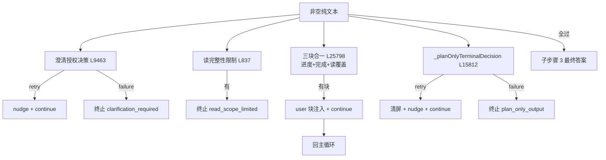

# 🛡️ 子步骤 2：终局守卫链

> 📍 `_processMessageInner`（L25766-25839）
> 🎯 作用：真正最终答案前的四道守卫——澄清授权、读完整性、账本闭合（进度/完成/读）、plan-only 拦截。未满足的账本以 user 块打回循环；不可满足的以专属状态终止。

## 🔍 主要逻辑流程（带行号）

### ① 澄清授权（L25766-25787）

```javascript
// 重复项进度恢复优先：未解账本仍可驱动下一个工具回合
const clarificationFinalDecision = this._isActionMode(mode)
  ? this._clarificationAuthorizationPlainFinalDecision(tabId) : null;    // L25768-25770
if (clarificationFinalDecision?.retry && steps < this.maxSteps) {
  messages.push(assistant(content));                                     // L25772
  messages.push({ role:'user', content: clarificationFinalDecision.nudge }); // L25773
  onUpdate('warning', { message: 'Plain final completion blocked until the user answers the clarification explicitly.' }); // L25774
  await this._persistNow(tabId);
  continue;                                                              // L25776
}
if (clarificationFinalDecision?.failure) {
  finalResponse = clarificationFinalDecision.failure;                    // L25779
  _traceStatus = clarificationFinalDecision.status;
  // assistant + text(replace) + warning + run_status                    // L25780-25786
  return finalResponse;                                                  // 终止
}
```

### ② 读完整性限制（L25788-25797）

```javascript
const readFinalLimitation = this._readCompletenessLimitation(tabId);     // L25788
if (readFinalLimitation) {
  finalResponse = readFinalLimitation; _traceStatus = 'read_scope_limited';
  messages.push({ role:'assistant', content: finalResponse });
  onUpdate('text', { content: finalResponse, replace: true });
  onUpdate('warning', { message: 'Ask mode could not verify that every Gmail message was expanded.' });
  await this._persistNow(tabId);
  return finalResponse;                                                  // 终止
}
```

### ③ 账本闭合块（L25798-25812）

```javascript
const progressFinalBlock = this._plainFinalProgressBlock(tabId);         // L25798 进度账本
const completionFinalBlock = this._completionPlainFinalBlock(tabId);     // L25799 完成不变量
const readFinalBlock = this._readCompletenessBlock(tabId);               // L25800 读覆盖
const plainFinalBlocks = [progressFinalBlock, completionFinalBlock, readFinalBlock].filter(Boolean);
if (plainFinalBlocks.length) {
  messages.push(this._withResponseItems({role:'assistant', content: result.content}, ...)); // L25803
  messages.push({ role:'user', content: plainFinalBlocks.join('\n\n') }); // L25804 三块合一注入
  onUpdate('warning', { message: readFinalBlock
    ? 'Whole-thread answer blocked until every read page is covered.'
    : completionFinalBlock ? 'Runtime completion invariant requires an explicit done outcome.'
    : 'Progress ledger has unresolved rows; continuing.' });             // L25805-25809
  this._persist(tabId);
  continue;                                                              // L25811 打回循环
}
```

### ④ plan-only 拦截（L25813-25839）

```javascript
const planOnlyDecision = this._planOnlyTerminalDecision(tabId, result.content); // L25813
if (planOnlyDecision?.retry) {
  // 重试：清掉已渲染的计划/承诺文本（空气泡 + text replace），注入 nudge
  messages.push(this._withResponseItems({ role:'assistant',
    content: planOnlyDecision.retryAssistantContent ?? result.content }, ...)); // L25815-25823
  messages.push({ role:'user', content: planOnlyDecision.nudge });
  onUpdate('text', { content: '', replace: true });                      // L25828 清屏
  onUpdate('warning', { message: 'Plan-only response was rejected; continuing into execution.' });
  this._persist(tabId);
  continue;                                                              // L25831
}
if (planOnlyDecision?.failure) {
  finalResponse = planOnlyDecision.failure;
  _traceStatus = planOnlyDecision.status || 'plan_only_output';          // L25833-25838
  break;
}
```

## 守卫一览表

| 守卫 | 判定方法（行号） | retry 注入 | failure 状态 |
|---|---|---|---|
| 澄清授权 | `_clarificationAuthorizationPlainFinalDecision` L9463 | "先回答澄清"nudge | `clarification_required` 族 |
| 读完整性 | `_readCompletenessLimitation` L837 | —（直接终止） | `read_scope_limited` |
| 进度账本 | `_plainFinalProgressBlock` L16130 | 未解行块 | — |
| 完成不变量 | `_completionPlainFinalBlock` L1118 | 显式 done 要求块 | — |
| 读覆盖 | `_readCompletenessBlock` L830 | 全线程覆盖块 | — |
| plan-only | `_planOnlyTerminalDecision` L15812 | "继续执行"nudge + 清屏 | `plan_only_output` |

## ✨ 设计亮点

1. **三块合一注入**：进度/完成/读三块 join 后一次 continue——一个回合解决全部账本，不逐条消耗步数。
2. **plan-only 清屏**（L25825-25828 注释）：拒绝的终端文本从 assistant 气泡清掉——run-complete 才能把真摘要写进空气泡，用户不见"被拒的计划文本残留"。
3. **守卫与规划门闭环**：Phase 2 武装的 `_planExecutionGuards`（`_startPlanExecutionGuard` L15401）在这里消费——批准计划要求的提交/下载证据由 `_isExecutionMutationEvidence`/`_isSuccessfulDownloadEvidence` 判定，"只说不做"过不了关。
4. **每道守卫都有 trace 状态**：失败路径状态唯一，事后可审计。

## 📥 返回值结构

```javascript
// retry：messages += [assistant, user 守卫块] → continue
// failure：finalResponse + _traceStatus → break/return
```

## 🔗 协作图



## 📊 总结

| 维度 | 结论 |
|---|---|
| 守卫数 | 6 条（2 直接终止 + 3 合一打回 + 1 双路） |
| 共同协议 | retry = user 块 continue；failure = 透明状态终止 |
| 与前段闭环 | 规划门武装的执行证据守卫在此消费 |
| trace 状态 | `clarification_required` / `read_scope_limited` / `plan_only_output` 等 |
