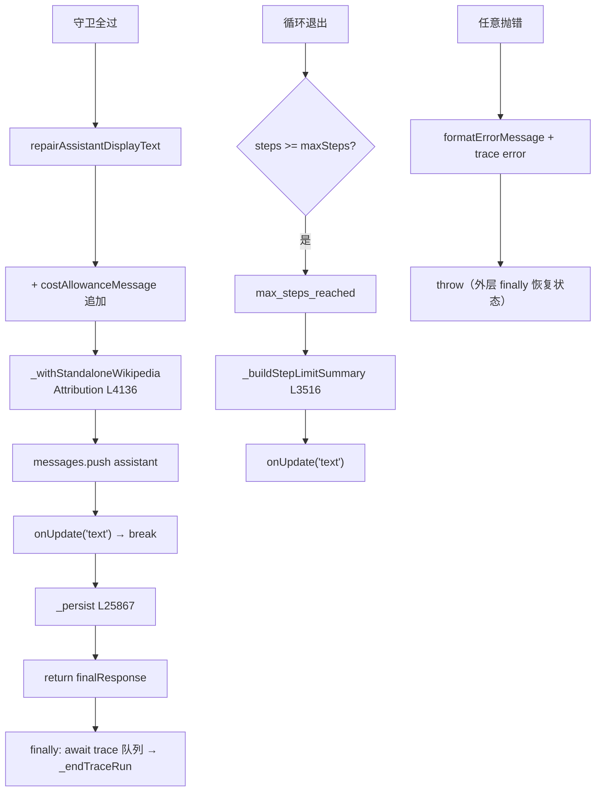

# 🎬 子步骤 3：最终答案与步数耗尽

> 📍 `_processMessageInner`（L25840-25868）+ 外层 catch/finally（L25869-25883）
> 🎯 作用：守卫链全过后的最终答案装配与发出；步数耗尽的透明摘要合成；回合级错误处理与 trace 收尾。

## 🔍 主要逻辑流程（带行号）

### A. 最终答案（L25840-25852）

```javascript
const repairedFinalContent = repairAssistantDisplayText(result.content); // L25840 显示文本修复
finalResponse = result.costAllowanceMessage
  ? `${repairedFinalContent}\n\n${result.costAllowanceMessage}`          // L25841-43 配额信息追加
  : repairedFinalContent;
finalResponse = this._withStandaloneWikipediaAttribution(                // L25844-48
  finalResponse, standaloneWikipediaReferences, runOptions);
messages.push(this._withResponseItems({ role:'assistant', content: finalResponse },
  result.responseItems, result.reasoningContent, provider));             // L25849 入历史
onUpdate('text', { content: finalResponse });                           // L25850 ★发出
break;                                                                   // L25851
```

### B. 步数耗尽（L25854-25865）

```javascript
if (steps >= this.maxSteps) {
  onUpdate('max_steps_reached', { steps: this.maxSteps });               // L25855 面板出 Continue
  _traceStatus = 'max_steps';
  // 自动 done：步数上限退出且无真实最终答案 → 合成透明摘要，
  // 让用户看到运行结束的"为什么"而不是空 done 事件
  if (!finalResponse || !finalResponse.trim()) {
    finalResponse = this._buildStepLimitSummary(messages, steps);        // L25861 从消息合成
    messages.push({ role: 'assistant', content: finalResponse });
    onUpdate('text', { content: finalResponse });
  }
}
this._persist(tabId);                                                    // L25867
return finalResponse;                                                    // L25868
```

### C. 错误与 finally（L25869-25883）

```javascript
} catch (error) {                                                        // L25869
  const message = formatErrorMessage(error);
  _traceStatus = 'error';
  finalResponse = `Error: ${message}`;
  if (runId) {
    // trace 错误写入（Ask 流式时排队保序）
    const writeErrorTrace = () => trace.recordError(runId, null, 'agent', message); // L25874
    if (shouldOrderInteractiveAskTrace) await queueAskStreamingTraceWrite(writeErrorTrace);
    else writeErrorTrace();
  }
  throw error;                                                           // L25878 rethrow（processMessage finally 接管状态恢复）
} finally {
  this.currentCostState.delete(tabId);
  await askStreamingTraceWrite;                                          // L25881 排队 trace 全落盘
  this._endTraceRun(tabId, runId, _traceStatus, finalResponse);          // L25882 恒收尾
}
```

## ✨ 设计亮点

1. **显示修复层**：`repairAssistantDisplayText` 在入历史前修复模型文本的显示问题——历史与 UI 看到的是同一份修复后文本，重连/导出一致。
2. **配额信息是追加而非替换**：配额警告附在答案尾部（`costAllowanceMessage`）——答案本体保留，用户知情。
3. **maxSteps 摘要的证据性**：`_buildStepLimitSummary`（L3516）从消息流合成"做了什么/卡在哪"——不是模板话术，是从真实轨迹提取的摘要。
4. **trace 的排序保证**：`await askStreamingTraceWrite` 在 `_endTraceRun` 之前——流式增量、请求/响应、错误全部先落盘，run 终态事件最后写入，生命周期不乱序（L25246-25249 注释）。
5. **双层 finally 分工**：内层（这里）管 trace 生命周期；外层 `processMessage` finally 管运行状态恢复（Phase 1 子步骤 1）——各管各的，无交叉遗漏。

## 📥 返回值结构

```javascript
finalResponse: string   // 修复+归因后的最终答案 / 步数摘要 / 错误文案
// onUpdate 终态事件：'text'（最终）、'max_steps_reached'（Continue 入口）
// trace 终态：_traceStatus ∈ done/max_steps/cancelled/cost_limit/error/...
```

## 🔗 协作图



## 📊 总结

| 维度 | 结论 |
|---|---|
| 最终答案管线 | 显示修复 → 配额追加 → 归因 → 入历史 → 发出 |
| 步数耗尽 | 透明摘要 + Continue 入口 |
| 错误路径 | trace error + rethrow（状态恢复归外层 finally） |
| trace 收尾 | 排队写全落盘后 `_endTraceRun` 恒调用 |
