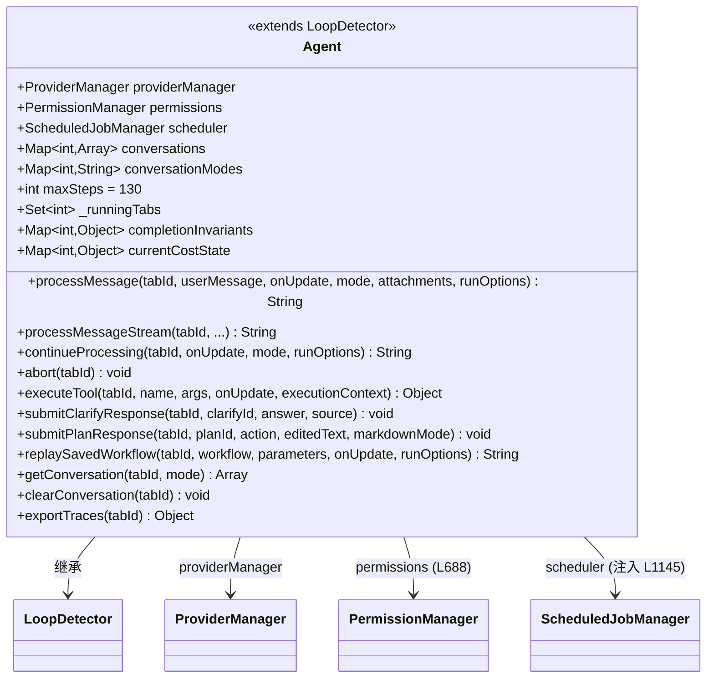
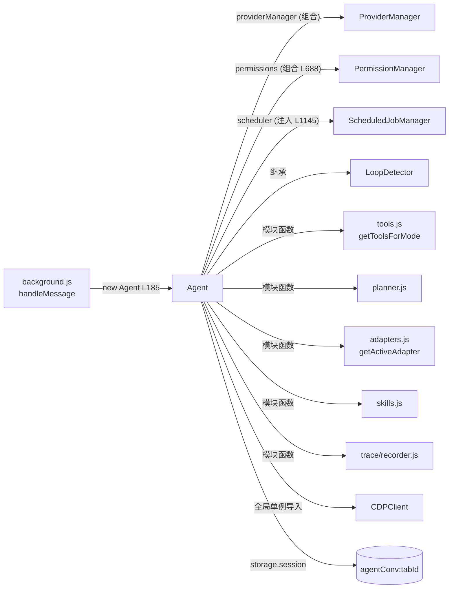

# 🤖 Agent 类职责

> 📁 `src/chrome/src/agent/agent.js:454` — `export class Agent extends LoopDetector`
> ⚖️ 规模：约 600 个方法 / 26,590 行（含类内注释），WebBrain 当之无愧的核心巨石类

## 🎯 类作用

浏览器 Agent 的**运行时容器与总指挥**：持有每 tab 的全部会话与守卫状态，实现完整回合生命周期（消息富化 → 规划门 → ReAct 主循环 → 工具批执行 → 终局守卫 → 持久化），并通过继承 `LoopDetector` 内联获得循环检测能力。它同时是**安全边界的执行者**——11 道工具前置门、不可信内容包装、失败关闭语义全部在本类中串联。



## 📋 属性概览（构造器 L455-752，按职责分组）

| 分组 | 代表属性（行号） | 用途 |
|---|---|---|
| 会话核心 | `conversations` (L457)、`conversationModes` (L467)、`conversationIds` (L730 附近)、`submittedRunRequestIds` | 每 tab 的消息数组、模式、稳定 ID、已提交请求幂等标记 |
| 信任边界 | `selectionGroundingScopes` (L459)、`responseLanguagePolicies` | 选区文本的耐久来源边界；运行级语言策略 |
| 进度系统 | `progressLedgers` (L462)、`progressPageScopes` (L463)、`progressSessions` (L464) | 结构化进度行、页面范围、意图会话 |
| 守卫状态 | `completionInvariants` (L485)、`readCompletenessStates` (L487)、`_formValidationBlocks` (L480)、`_doneBlockCount` | 完成不变量、读完整性、表单验证、done 阻断计数 |
| 运行控制 | `_runningTabs` (L736)、`_runModeOverrides`、`_runProviderOverrides`、`_foregroundCaptureTabs` | 运行占用槽、单运行模式/提供商覆盖、前台捕获策略 |
| 成本 | `currentCostState` (L733)、`_lastInputTokens` | 每 tab 费用状态、上步输入 token |
| 能力常量 | `maxSteps = 130` (L486)、静态 `STATE_CHANGE_TOOLS`、`IMAGE_BUDGET` | 步数上限、状态变更工具集、图像字节预算 |

## 🔧 方法概览（按子系统分组，全部为实际行号）

### ① 回合生命周期（主入口族）

| 方法 | 行号 | 职责 |
|---|---|---|
| `processMessage` | L24734 | 回合总入口：占用运行槽 → 状态重置 → 委托 `_processMessageInner` → finally 全量恢复 |
| `_processMessageInner` | L24955 | 回合主体：富化、规划门、`while` 主循环、终局守卫链 |
| `processMessageStream` / `_processMessageStreamInner` | L25889 / L25987 | 遗留流式路径（已被 Ask 流式集成取代，保留兼容） |
| `continueProcessing` | L24673 | Continue 按钮：带 `trustedContinuation` 直调 processMessage |
| `abort` | L9331 | 置 abort 标志（主循环 3 个检查点消费） |
| `_claimRunEntry` | L1170 | 运行槽占用与 run entry 断言（防同 tab 并发运行） |
| `_checkAbort` | L13273 | 消费中止标志 |

### ② 消息富化与上下文

| 方法 | 行号 | 职责 |
|---|---|---|
| `_enrichUserMessageWithCurrentPage` | L3831 | 首条用户消息富化：URL/标题、适配器、视觉截图、allow-api 前言 |
| `_maybeReinjectAdapter` | L4218 | 循环内跨站点导航后重注入适配器指导 |
| `_manageContext` | L16344 | 自动压缩（50 消息 / 80k 字符 / 0.75 窗口） |
| `_emergencyTrim` | L17437 | 溢出硬兜底（保 6 条） |
| `_pruneOldImages` | L17176 | LLM 调用前剥离旧 base64 图 |
| `_limitToolResult` / `_wrapUntrusted` | L16846 / L16940 | 8KB 截断 / 不可信内容包装 |

### ③ LLM 交互层

| 方法 | 行号 | 职责 |
|---|---|---|
| `chatMainTurn`（闭包） | L25354 | 主循环 LLM 调用：完成度聚合 + message_info 事件 |
| `chatMainTurnRaw`（闭包） | L25259 | Ask 流式决策 + 流式/非流式分派 + 失败回退 |
| `_chatWithCostAllowance` | L1885 | 非流式：配额检查 → provider.chat → 记账 |
| `_chatStreamWithCostAllowance` | L1990 | 流式：text_delta 透传 + 终端事件聚合 |
| `_interactiveAskStreamingDecision` | L1920 | 流式资格判定（模式/来源/开关/断路器） |
| `_describeScreenshot` | L8013 | 专用视觉模型子调用（截图描述） |

### ④ 工具执行层

| 方法 | 行号 | 职责 |
|---|---|---|
| `_executeToolBatch` | L5567 | 工具批执行：11 道门 → executeTool → 循环检测 → 包装 → 截图 → 返回 action 协议 |
| `executeTool` | L18515 | 单工具巨型 switch 分发器（5000+ 行） |
| `_parseToolCallArgs` / `_repairToolCallArgs` | L3207 / L3223 | 参数解析与常见形状修复 |
| `_appendSyntheticToolResults` | L3323 | 中断后补齐剩余 tool 消息（防孤儿 tool_calls） |
| `_tryParseToolCallsFromText` | L24724 | 文本形态工具调用兜底解析 |

### ⑤ 规划门

| 方法 | 行号 | 职责 |
|---|---|---|
| `_maybeRunPlannerGate` | L10034 | 规划门编排总入口 |
| `_runPlannerGate` | L11037 | Try/Strict 完整规划调用与校验 |
| `_runPlannerIntentGate` | L10839 | Off 模式紧凑意图门 |
| `_runReadScopeClassifier` | L10662 | 读范围分类器（完整线程读判定） |
| `_waitForPlanReview` | L9552 | 计划审批 Promise 挂起 |
| `submitPlanResponse` | L9528 | 用户批准/拒绝/编辑回调 |

### ⑥ 守卫与不变量

| 方法 | 行号 | 职责 |
|---|---|---|
| `_recordCompletionToolResult` | L853 | 完成不变量：提交/下载证据记录 |
| `_beginReadCompleteness` / `_recordReadCompleteness` | L769 / L791 | 读完整性（Gmail 全线程展开） |
| `_clarificationAuthorizationBlock` | L9402 | 澄清超时后阻断动作授权 |
| `_messageRecipientGuardBlock` | L12528 | 消息接收者守卫（发送类动作前身份验证） |
| `_captchaMutationPreflight` / `_captchaGateBlockResult` | L5072 / L4872 | CAPTCHA 门 |
| `_preflightRichTextToolbarTarget` | L2738 | 富文本工具栏预检 |

### ⑦ 澄清 / 暂停 / 调度

| 方法 | 行号 | 职责 |
|---|---|---|
| `submitClarifyResponse` | L9345 | 澄清应答 resolve |
| `_settleClarification` / `_cancelClarifications` | L9502 / L9515 | 澄清定时器与批取消 |
| `_scheduleAutoProgressResume` | L16092 | 空输出时自动调度续跑 |
| `setScheduler` | L1145 | ScheduledJobManager 注入点 |

### ⑧ 持久化与恢复

| 方法 | 行号 | 职责 |
|---|---|---|
| `_hydrate` / `_hydrateFromSession` | L9053 / L9069 | 从 storage.session 水化会话 |
| `_persist` / `_persistNow` / `_persistSubmittedTurn` | L9292 / L9262 / L9303 | 三档持久化（降级标记感知） |
| `replaySavedWorkflow` | L18165 | 保存工作流确定性重放 |

### ⑨ 技能系统（⑨-⑪ 见源码 L13455-13790）

`setCustomSkills` L13455、`_skillCatalog` L13480、`_skillToolDefinitions` L13494、`_activateSkillForRun` L13542、`_loadSkillForRun` L13569、`_preactivateRecommendedActionSkill` L13595 等 20+ 方法。

### ⑩ 进度账本（L14159-16160）

`_progressUpdate` L14550、`_progressRead` L14731、`_ensureProgressSessionForCurrentTask` L14991、`_recordProgressObservation` L15285 等 40+ 方法。

### ⑪ 截图 / 视觉（L7492-9046）

`_captureAutoScreenshot` L7770、`_describeScreenshot` L8013、`_locateVisibleMediaWithVision` L8176、`_shrinkImageForBudget` L8613 等 25+ 方法。

## 💎 核心方法详解：`_processMessageInner` 主循环（L25385-25852）

```javascript
while (steps < this.maxSteps) {                    // L25385  maxSteps=130 (L486)
  if (this._checkAbort(tabId)) { ... break; }      // L25387  检查点①
  if (steps > 0) await this._maybeReinjectAdapter(tabId, messages);  // L25398
  tools = getToolsForMode(mode, {tier, skillTools, ...});            // L25402 重建工具表
  await this._manageContext(tabId, messages, ...); // L25421 途中压缩
  steps++; onUpdate('thinking', {step: steps});    // L25425-26
  try {
    result = await chatMainTurn(prunedMessages, chatOpts, ...);      // L25451 LLM 决策
  } catch (e) {
    // 成本耗尽 → break；上下文溢出 → 紧急裁剪重试一次；其他 → 2s 后重试一次
  }                                                 // L25480-25543
  if (this._checkAbort(tabId)) { ... break; }      // L25547  检查点②
  ...
  if (result.toolCalls?.length > 0) {              // L25624  动作分支
    messages.push({role:'assistant', tool_calls: result.toolCalls}); // L25630
    const batchResult = await this._executeToolBatch(...);           // L25636
    // return / deliver / recover / abort / continue 五路分派         // L25639-25672
    continue;
  }
  // 纯文本分支：空输出恢复 → 结构化输出 → 澄清守卫 → 读完整性 →
  // 进度账本 → plan-only 拒绝 → 真正最终答案                       // L25684-25851
}
if (steps >= this.maxSteps) {                       // L25854
  onUpdate('max_steps_reached', ...);               // 面板显示 Continue
  finalResponse ||= this._buildStepLimitSummary(messages, steps);    // L25861
}
```

## ✨ 设计亮点

1. **action 协议解耦**：`_executeToolBatch` 返回 `{action, value, status}` 而非直接操作主循环控制流，五种出口语义清晰可测。
2. **失败关闭的"结果未知"语义**：`missingResponseOutcomeUnknown`（L5779）——任何有后果调用的响应丢失都按未知处理，永不假设成功。
3. **孤儿 tool_calls 防护**：批内任何中断路径都用 `_appendSyntheticToolResults` 补齐剩余 tool 消息，避免提供商 400（L6620-6627 注释）。
4. **运行状态栈式恢复**：`processMessage` 的 finally 逐一恢复前置保存的旧值（提供商覆盖、前台策略、云上下文），异常路径不留脏状态（L24793-24829）。
5. **巨石的代价**：单类承担 15+ 子系统职责，方法间通过 per-tab Map 隐式共享状态——改动影响面大，但有完善的文档注释与 trace 弥补。

## 🔗 协作图



## 📊 总结

| 维度 | 评价 |
|---|---|
| 职责数量 | 15+ 子系统（回合、上下文、LLM、工具、规划、守卫、澄清、调度、持久化、技能、进度、视觉、成本、Dev、恢复） |
| 关键入口 | `processMessage` L24734 / `executeTool` L18515 / `abort` L9331 |
| 状态形态 | ~40 个 per-tab Map/Set，无全局锁，靠 `_runningTabs` 单飞行规则 |
| 可测性 | 依赖 browser API 较重；`LoopDetector` 被抽出即为可测性设计 |
| 扩展点 | `setScheduler` / `setCustomSkills` / `setUserMemory` / `setRunStartGuard` 注入器 |
