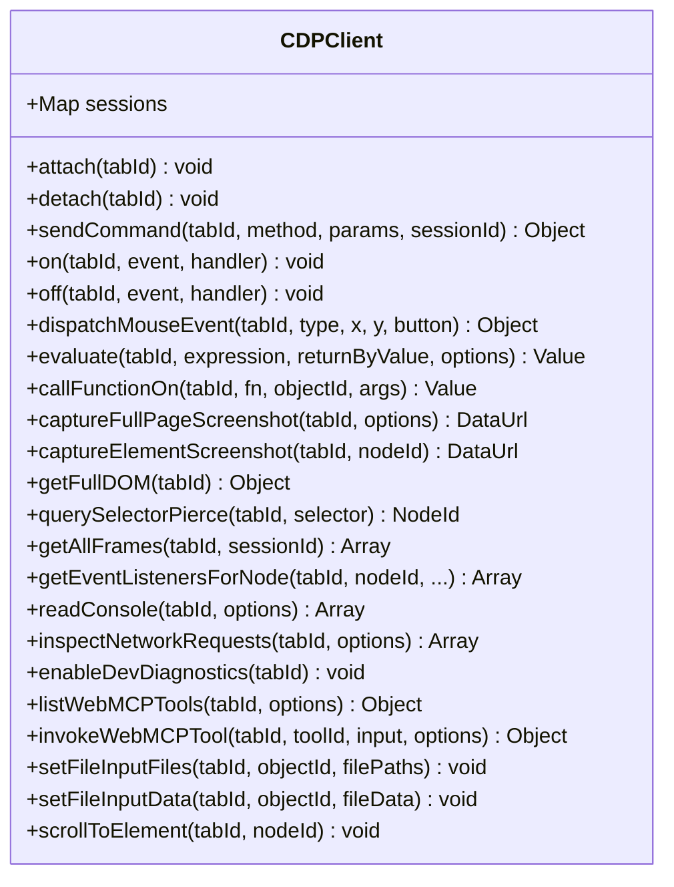
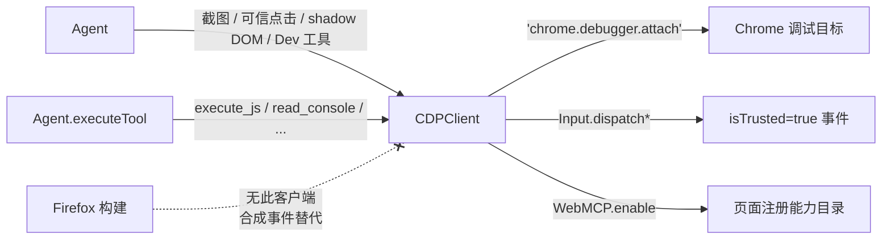

# 🖥️ CDPClient 类职责（Chrome 构建）

> 📁 `src/chrome/src/cdp/cdp-client.js:74` — `export class CDPClient`
> 🚫 仅 Chrome：Firefox 无 `chrome.debugger` 等价物，其构建不导入本类

## 🎯 类作用

封装 `chrome.debugger` 的 **Chrome DevTools Protocol 客户端**，为 Agent 提供 Synthetic（内容脚本）事件无法做到的四类能力：**可信输入事件**（`Input.dispatchMouseEvent/KeyEvent`，`event.isTrusted === true`）、**像素级截图**（`Page.captureScreenshot`，含后台 tab 焦点仿真）、**DOM 深穿透**（closed shadow root、iframe 文档、事件监听器枚举）与**实验性 WebMCP 域**。

## 🔧 方法分组表（实际行号）

### 会话与命令底座

| 方法 | 行号 | 职责 |
|---|---|---|
| `attach(tabId)` / `detach(tabId)` | L122 / L167 | 建立/断开调试会话（用户可见"正在调试此浏览器"提示的来源） |
| `sendCommand(tabId, method, params, sessionId)` | L187 | 协议命令发送底座（含 OOPIF 子会话路由） |
| `on` / `off` | L216 / L228 | 事件订阅 |

### 可信输入与 DOM

| 方法 | 行号 | 职责 |
|---|---|---|
| `dispatchMouseEvent` | L2631 | `Input.dispatchMouseEvent`——`isTrusted=true` 的点击（React/Vue 合成事件层可触发） |
| `evaluate` / `callFunctionOn` | L1893 / L1913 | `Runtime.evaluate`（15s 超时，Dev `execute_js` 后端） |
| `getFullDOM` / `querySelectorPierce` | L1801 / L1816 | 闭根 shadow DOM 穿透查询 |
| `getEventListenersForNode` / `ForExpression` | L1765 / L1781 | `DOMDebugger.getEventListeners`（Dev 事件诊断） |
| `findNodeByAttribute` / `describeNode` / `resolveNode` | L1736 / L1877 / L1885 | 节点解析链 |
| `getAllFrames` | L1927 | 帧树枚举 |

### 截图与文件

| 方法 | 行号 | 职责 |
|---|---|---|
| `captureFullPageScreenshot` | L1961 | 整页捕获（裁剪/缩放控制，后台 tab 焦点仿真） |
| `captureElementScreenshot` | L2125 | 元素级捕获 |
| `scrollToElement` | L2161 | 滚动到节点 |
| `setFileInputFiles` / `setFileInputData` | L2176 / L2189 | 上传两条路径（本地路径 / base64 数据） |
| `armFileInputClickGuard` / `consumeFileInputClickGuard` | L2281 / L2462 | 文件选择点击守卫（防误触发原生选择器） |
| `probeLocalFile` | L2570 | 本地文件存在性探测 |

### Dev 诊断与 WebMCP

| 方法 | 行号 | 职责 |
|---|---|---|
| `enableDevDiagnostics` / `disableDevDiagnostics` / `disableAllDevDiagnostics` | L1427 / L1588 / L1614 | 有界 Console/Log/Network 缓冲的域级开关 |
| `readConsole` / `inspectNetworkRequests` | L1620 / L1641 | Dev 模式读取诊断缓冲 |
| `enableWebMCP` / `disableWebMCP` / `disableAllWebMCP` | L874 / L1020 / L1063 | 实验 WebMCP 域会话管理（默认关闭） |
| `listWebMCPTools` / `getWebMCPToolContext` / `invokeWebMCPTool` | L1129 / L1164 / L1179 | 页面注册能力目录（≤200 注册 / 25 每页）/ 调用（不透明 `wmcp_*` 句柄） |
| `_sanitizeWebMCPValue` | L240 | 页面返回值的深度/字符预算消毒 |

## ✨ 设计亮点

1. **一个客户端，四个安全边界**：可信输入、像素捕获、DOM 穿透、WebMCP——每类都配有 Agent 侧的守卫（WebMCP 帧源即时重验证、200 上限、调用超时取消）。
2. **OOPIF 子会话路由**：`sendCommand` 的 `sessionId` 参数让跨进程 iframe（站点隔离）内的命令直达目标文档。
3. **页面控制的名称免疫**：WebMCP 用运行时生成的 `wmcp_*` 不透明 ID 作调用句柄，页面提供的名字/schema/标注一律视为不可信数据。
4. **会话生命周期与运行解耦**：CDP 会话可跨运行存活（焦点仿真按运行清理，agent.js L8444-8453），Dev 诊断域离开模式即整组排空并 `Runtime/Log/Network.disable`。

## 🔗 协作图

## 📊 总结

| 维度 | 评价 |
|---|---|
| 封装协议域 | Input / Page / Runtime / DOM / DOMDebugger / Log / Network / WebMCP |
| 不可替代能力 | 可信事件、整页/元素截图、闭根穿透、事件监听枚举 |
| WebMCP 边界 | 不透明句柄 + 帧源重验证 + 200 注册上限 + 调用超时取消 |
| 平台 | 仅 Chromium；Firefox 构建全量降级为合成事件 |
