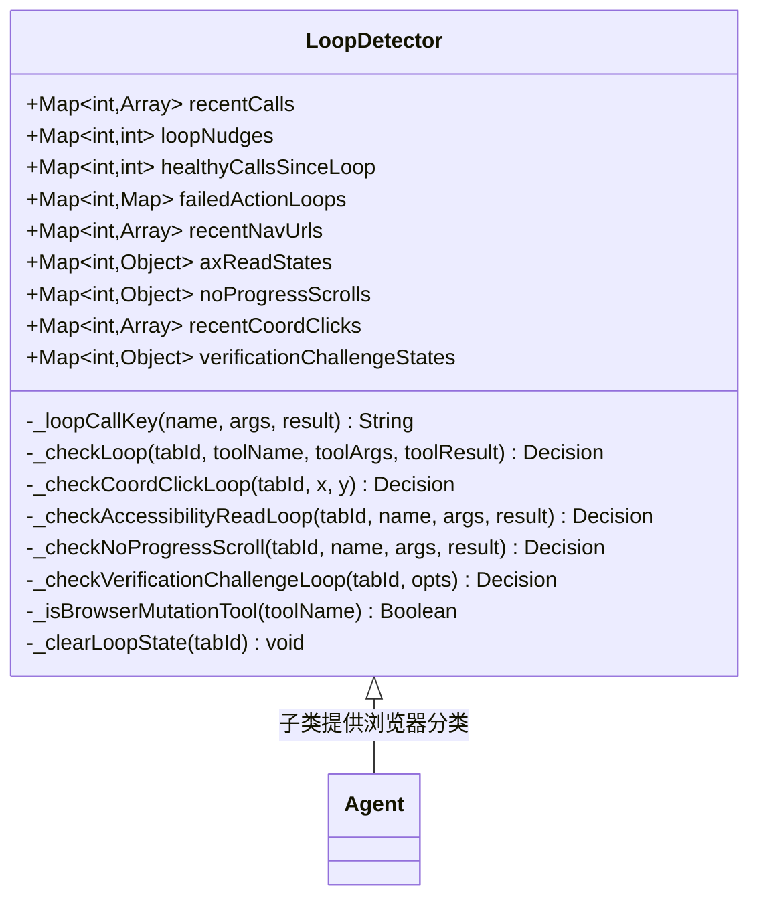
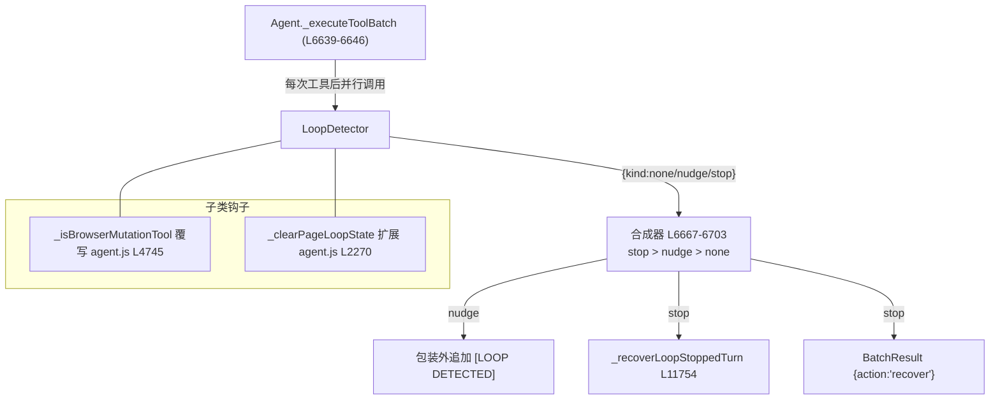

# 🔁 LoopDetector 类职责

> 📁 `src/chrome/src/agent/loop-detector.js:18` — `export class LoopDetector`
> 🧪 刻意 browser-free：无 chrome.*/DOM 依赖，Node 单测与扩展共用同一生产类（文件头注释 L1-17）

## 🎯 类作用

在每次工具执行后**廉价地检测 Agent 是否卡死**：重复无效动作、两态振荡、坐标空点、无限翻页读、假滚动、验证挑战循环。首次检测到注入 `[LOOP DETECTED]` 软提醒（nudge），同一循环内再次检测到则硬停（stop）。决策返回值是三态结构：

```
{ kind: 'none' }
{ kind: 'nudge', warning: string }   // 注入工具结果的软警告
{ kind: 'stop',  message: string }   // 硬停运行
```



## 📋 属性（环形缓冲，全部 per-tab）

| 属性 | 数据形状 | 用途 |
|---|---|---|
| `recentCalls` | `[{key, name, ts}]` | 最近 6 次调用的精确键环形缓冲 |
| `loopNudges` | `int` | 连续 nudge 计数 |
| `healthyCallsSinceLoop` | `int` | 上次 nudge 后的健康调用数 |
| `failedActionLoops` | `Map(scope→count)` | 稳定失败域计数（上限 32 个域） |
| `recentNavUrls` | `[url]` | 本运行到达过的 URL（**不**被 `_clearLoopState` 清除，L38-40 注释） |
| `axReadStates` | `{total, suspicious, nextPage, scopeKey, seenPages, warned}` | ref_1→ref_2 无限读检测 |
| `noProgressScrolls` | `{key, count}` | 成功但窗格未动的滚动 |
| `recentCoordClicks` | `[{key, ts}]` | 纯坐标点击缓冲（不受参数噪声稀释，L44-52 注释） |
| `verificationChallengeStates` | `{key, active, reopenCount}` | 挑战弹层的语义身份（ref churn 免疫） |

## 🔧 方法表

| 方法 | 行号 | 职责 |
|---|---|---|
| `_loopCallKey` | L119 | 生成调用身份键：`name\|bucketArgsKey(args)\|结果摘要` |
| `_checkLoop` | L509 | 主检测器：导航重置、变异失败域（3 次失败 stop / 2 次 nudge）、nonRetryable 重复、checkbox 三态卡死、精确重复（3 同/ABAB nudge，8 nudge stop） |
| `_checkCoordClickLoop` | L486 | 5px 分桶坐标点击：5 次 nudge / 8 次 stop |
| `_checkAccessibilityReadLoop` | L295 | AX 语义读：翻页计数与可疑比例 |
| `_checkNoProgressScroll` | L387 | 无进度滚动 |
| `_checkVerificationChallengeLoop` | L201 | 验证挑战重开循环 |
| `_isBrowserMutationTool` | L56 | 浏览器中立默认 false；Agent 覆写（agent.js L4745） |
| `_isToolResultErroredForLoop` | L64 | 结果错误判定（error/success=false/noProgress/URL族 4xx） |
| `_noteNavArrival` / `_clearLoopState` / `_noteHealthyLoopCall` / `_recordCall` | — | 状态维护辅助 |

## 💎 核心方法详解：`_checkLoop`（L509-584+）

```javascript
_checkLoop(tabId, toolName, toolArgs, toolResult) {
  // ① 导航是权威页面状态证据：翻页则清缓冲重新计数；
  //    但"回到近期见过的 URL"例外——click/go_back 乒乓不能每次跳都重置
  if (toolResult?.pageUrlChanged === true && !this._noteNavArrival(tabId, toolResult.currentUrl)) {
    this._clearLoopState(tabId);                                    // L515-517
  }
  // ② 变异工具的失败域检测
  if (this._isBrowserMutationTool(toolName)) {
    // 等价失败域：显式 failureScope + name|args 桶 + set_field/type_ax 的
    // field-value:ref_id + click 的 ambiguous-click:text                // L530-540
    if (errored) {
      attempts >= 3 → { kind:'stop', message:'三次同目标失败...' };     // L547-553
      attempts === 2 → { kind:'nudge', warning:'[FAILED ACTION LOOP...]' }; // L554-559
    } else if (success && verified !== false) {
      清除全部等价失败域                                              // L560-564
    }
  }
  // ③ nonRetryable 结果重复 2 次 → stop                              // L566-575
  // ④ checkbox 键重复 3 次 → stop（语义状态不因换工具改变）            // L576-584
  // ⑤ 精确重复：3 次相同或 ABAB → nudge；8 次 nudge 无 2 次健康调用 → stop
}
```

**合成规则在 Agent 侧**（agent.js L6632-6703）：6 个检测器（含 challenge 与 delivery）并行跑，`stop > nudge > none` 最强者胜；nudge 文本追加在 `_wrapUntrusted` **之后**，确保提示位于不可信包装外、被当作指令而非数据读取（L6705-6707 注释）。

## ✨ 设计亮点

1. **失败域归一化**：`field-value:<ref_id>`、`ambiguous-click:<text>` 等等价域——模型改参数重试同一目标无法绕过计数。
2. **导航重置与乒乓豁免**的精确区分（L510-517 注释）：真导航重置、原地往返不重置。
3. **坐标缓冲独立**：主检测器按 `JSON.stringify(args)` 键控，穿插 `execute_js` 就能稀释计数；独立坐标缓冲专治"点不中无限重试"（L44-52 注释）。
4. **browser-free 可测性**：与 `permission-gate.js` 同一约定（KEEP PURE JS），test/run.js 直接加载。

## 🔗 协作图



## 📊 总结

| 维度 | 评价 |
|---|---|
| 检测器数量 | 6 个并行 + 合成器 |
| 决策三态 | none / nudge（软提醒）/ stop（硬停→恢复回合） |
| 复杂度 | 每次 O(缓冲长度)，廉价可高频 |
| 免疫设计 | 参数噪声（坐标桶）、ref churn（语义身份）、工具穿插（独立缓冲）、乒乓导航（URL 记忆） |
| 测试策略 | browser-free，与权限门同一 Node 可加载约定 |
