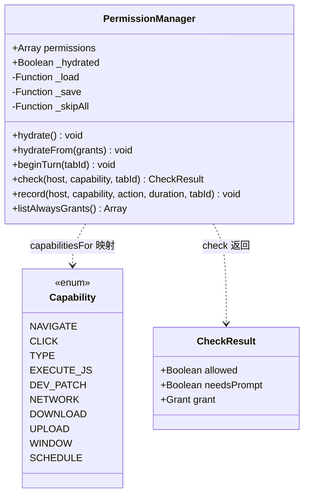
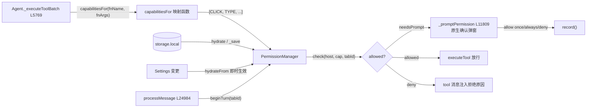

# 🔐 PermissionManager 类职责

> 📁 `src/chrome/src/agent/permission-gate.js:367` — `export class PermissionManager`
> 🧪 纯 JS 无浏览器依赖（文件头约定 L3-5），`test/run.js` 在 Node 中直接加载

## 🎯 类作用

**确定性"能力 × 域"权限门**（设计自述对标 Claude for Chrome，L7-24）：不读按钮文案、不读提示词、不用语言模型——每个有后果的工具调用映射到固定 CAPABILITY，决策纯查表：

```
(capability, host) → allow | deny | prompt
```

用户按 `(capability, host)` 授予 **once（本回合/本 tab）** 或 **always（持久化）**。语言无关（bank.com.tr 上的"Gönder"按钮与"Send"同样按 CLICK 门控）、**不可注入**（门从不读页面内容——人是信任锚）。



## 📋 关键常量（同文件）

| 常量 | 行号 | 内容 |
|---|---|---|
| `Capability` | L29 | 10 种能力：NAVIGATE / CLICK / TYPE / EXECUTE_JS / DEV_PATCH / NETWORK / DOWNLOAD / UPLOAD / WINDOW / SCHEDULE |
| `CAPABILITY_LABEL` | L43 | 人类可读动词（"WebBrain wants to \<label\> \<host\>"） |
| `UNTRUSTED_CONTENT_TOOLS` | L58+ | 结果携带页面字节的工具集（须 `_wrapUntrusted` 包装），与能力映射共存以便穷尽性测试 |

## 🔧 方法表

| 方法 | 行号 | 职责 |
|---|---|---|
| `hydrate()` | L376 | 首次从存储装载 always 授权（失败则空集起步） |
| `hydrateFrom(grants)` | L398 | 存储变更即时生效：保留内存 once 授权，整体替换 always 集 |
| `beginTurn(tabId)` | L413 | **只**清本 tab 的 once 授权/拒绝——多 tab 并发运行共享一个实例，不能误伤在跑 tab（L407-412 注释） |
| `check(host, capability, tabId)` | L422 | 查表：always 全局有效；once 只对授权 tab 有效——**一个 tab 的 Allow-once 不能悄悄授权另一个 tab**（L417-421 注释） |
| `record(host, capability, action, duration, tabId)` | L436 | always：全局取代旧授权 + 持久化；once：tab 作用域内存态 |
| `listAlwaysGrants()` | L454 | 设置页枚举 |

## 💎 核心方法详解：`check`（L422-430）

```javascript
check(host, capability, tabId) {
  if (this._skipAll()) return { allowed: true, needsPrompt: false };  // 危险跳过开关
  const h = normalizeHost(host);
  const g = this.permissions.find(p =>
    p.capability === capability && p.host === h &&
    (p.duration === 'always' || p.tabId === tabId));                  // 双作用域过滤
  if (g) return { allowed: g.action === 'allow', needsPrompt: false, grant: g };
  return { allowed: false, needsPrompt: true };                       // 缺省 → 提示
}
```

Agent 侧的调用点在 `_executeToolBatch`（agent.js L5769-5773）：

```javascript
let capabilities = protectedPageFailure ? [] : capabilitiesFor(fnName, fnArgs);
// 一次调用可能需要多个能力：set_field({submit:true}) 同时 TYPE + CLICK
```

`needsPrompt` 时经 `_promptPermission`（agent.js L11809）弹浏览器原生确认，用户选择 allow once / always / deny 后 `record()` 落账，再放行或拒绝。

## ✨ 设计亮点

1. **零 NLP 决策**：无同义词表、无模型判断——注入攻击面为零（门不消费页面内容）。
2. **多能力合并门控**：`set_field({submit})` 需 TYPE + CLICK 双授权（L34-35 注释）。
3. **tab 作用域隔离的 once 授权**：并发 tab 互不串权。
4. **能力映射与不可信工具集共存**：穷尽性测试可验证"每个模型可见工具要么被门控、要么是已声明的不可信读、要么显式安全"（L55-58 注释）。
5. **读能力刻意不门控**：`read_page`/`get_accessibility_tree` 等映射 null 直通（L25-27 注释），只拦状态变更/高触及动作。

## 🔗 协作图



## 📊 总结

| 维度 | 评价 |
|---|---|
| 决策模型 | 纯查表 `(capability, host) → allow/deny/prompt`，零语言推理 |
| 能力枚举 | 10 种，多能力可叠加门控 |
| 作用域 | always 全局持久 / once 单 tab 单回合 |
| 信任锚 | 人（原生确认弹窗），页面内容零消费 |
| 测试 | 纯 JS，Node 直接加载；与能力映射的穷尽性测试联动 |
