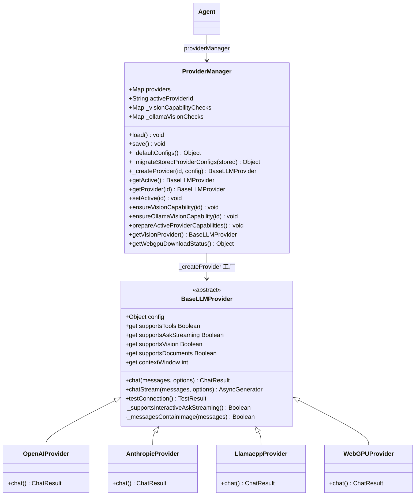
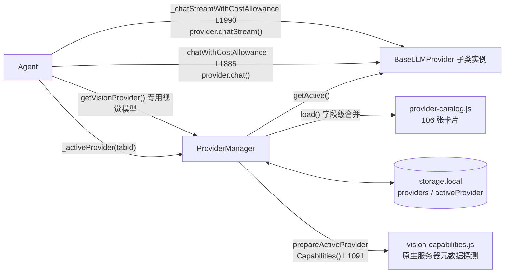

# 🧠 ProviderManager 与 BaseLLMProvider 类职责

> 📁 `src/chrome/src/providers/manager.js:82` — `export class ProviderManager`
> 📁 `src/chrome/src/providers/base.js:12` — `export class BaseLLMProvider`
> 🏭 实现子类（同目录）：`openai.js`、`anthropic.js`、`azure-openai.js`、`aws-bedrock.js`、`vertex-anthropic.js`、`llamacpp.js`、`webgpu.js` 等；卡片定义 `provider-catalog.js`（106 张）

## 🎯 类作用

**LLM 后端的策略层**：`BaseLLMProvider` 定义全部模型交互契约（chat / chatStream / 能力声明），子类归一化各厂商协议到 `{content, toolCalls, usage}`；`ProviderManager` 管理 106 张提供商卡片的配置合并、迁移、实例化、激活切换与能力探测（视觉/上下文窗口），是 Agent 与具体 LLM 之间唯一的边界。



## 📋 ProviderManager 方法表

| 方法 | 行号 | 职责 |
|---|---|---|
| `load()` | L105 | 从 storage.local 装载并**字段级合并**：默认卡片提供形状、存储覆盖字段——升级新增的提供商条目对老用户可见（L93-103 注释）；过滤已弃用条目；处理 Ollama/通用视觉配置迁移与 legacy 激活迁移 |
| `save()` | L201 | 持久化配置 |
| `_defaultConfigs()` | L212 | 从 provider-catalog 生成默认形状 |
| `_migrateStoredProviderConfigs` | L655 | 存储版本迁移 |
| `_createProvider(id, config)` | L807 | **工厂方法**：按卡片类别实例化对应 Provider 子类 |
| `getActive()` / `getProvider(id)` | L861 / L870 | 激活实例 / 指定实例 |
| `setActive(id)` | L1213 | 切换激活并持久化 |
| `ensureVisionCapability(id)` | L939 | 通用视觉能力探测（缓存 + 陈旧守卫 + epoch） |
| `ensureOllamaVisionCapability` | L1042 | Ollama 专用：空 Model 字段 = 服务器可变槽位，每回合重查 |
| `prepareActiveProviderCapabilities()` | L1091 | Agent 每回合首调用（agent.js L24989）：预解析 `supportsVision`，失败非致命、文本请求不受影响 |
| `getVisionProvider()` | L1108 | 专用视觉模型解析（截图描述子调用） |
| WebGPU 管理 | L1139-1210 | 本地 WebGPU 视觉运行时的下载/暂停/停止/释放 |

## 📋 BaseLLMProvider 契约（base.js）

| 成员 | 行号 | 语义 |
|---|---|---|
| `chat(messages, options)` | L27 | 返回 `{content, reasoningContent?, toolCalls, usage}`——所有厂商统一形状 |
| `chatStream(messages, options)` | L37 | async generator，yield `{type:'text'\|'tool_call'\|'done', content}` |
| `get supportsTools` | L83 | 工具调用能力（决定主循环是否传 tools） |
| `get supportsAskStreaming` | L92 | **显式 opt-in**：实现 chatStream 不足够，须声明 `supportsAskStreaming`（L88-91 注释） |
| `get supportsVision` | L99 | 图像输入能力 |
| `get supportsDocuments` | L107 | PDF 直传（当前仅 Anthropic） |
| `get contextWindow` | L125 | `config.contextWindow` 显式值优先；否则模型感知/类别感知推断——本地保守 16k、云默认 128k（L110-124 注释） |
| `_supportsInteractiveAskStreaming()` | L46 | 流式资格内部钩子 |
| `_askStreamTransportError` / `_askStreamTerminalError` | L50-62 | 构造带 `isAskStreamFallbackSafe` / `isAskStreamTerminalError` 标记的错误——Agent 侧据此决定回退还是终止 |

## 💎 核心方法详解：`load()` 的合并语义（L105-150）

```javascript
// 字段级合并：默认提供完整形状（含 apiKeyUrl 等新字段），
// 存储值覆盖个别字段，不丢存储中不存在的键
const defaults = this._defaultConfigs();
for (const [id, config] of Object.entries(defaults)) {
  const hasConfiguredMarker = !!stored[id] && Object.hasOwn(stored[id], 'configured');
  const configured = id !== WEBBRAIN_CLOUD_PROVIDER_ID && (
    storedConfig?.configured === true ||
    (!hasConfiguredMarker && /* legacy 凭据推断 */));        // L129-137
  configs[id] = { ...config, ...this._storedDefaultOverride(config, storedConfig), configured };
}
```

**为什么必须合并不是替换**：老用户已有 `providers` 存储对象时，直接替换会让升级引入的新卡片（如 v6.1 的 `claude_subscription`）永不出现，用户得手动清存储（L92-103 注释）。

## ✨ 设计亮点

1. **归一化契约**：106 家厂商在一个 `{content, toolCalls, usage}` 形状后消失——Agent 主循环零厂商分支（流式解析除外，各 provider 自带 SSE 解析器）。
2. **能力探测的失败关闭**：视觉探测限时 3 秒、失败关闭但不失败文本请求；显式身份缓存 + 陈旧守卫防并发错配；空 Model 槽位每回合重查（服务器热切换生效）。
3. **错误标记驱动回退**：`isAskStreamFallbackSafe` / `isAskStreamTerminalError` 让上层一次性决定"回退重试"还是"立即终止"，不需要字符串嗅探。
4. **显式 opt-in 的流式资格**：防止"实现了 chatStream 的兼容 shim"被误认为完整流式协议。

## 🔗 协作图



## 📊 总结

| 维度 | 评价 |
|---|---|
| 管理卡片数 | 106（Chromium）/ 105（Firefox） |
| 契约方法 | `chat` / `chatStream` + 5 个能力 getter + `testConnection` |
| 归一化形状 | `{content, reasoningContent?, toolCalls, usage}` |
| 配置策略 | 字段级合并（默认形状 + 存储覆盖），升级安全 |
| 能力探测 | 3s 限时、失败关闭、身份缓存 + 陈旧守卫、空槽位每回合重查 |
| 扩展方式 | 子类化 BaseLLMProvider + manager.js 注册 + 镜像 firefox 构建 |
