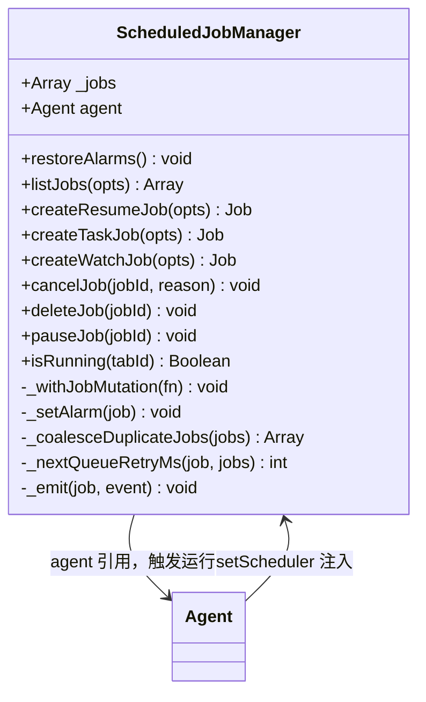
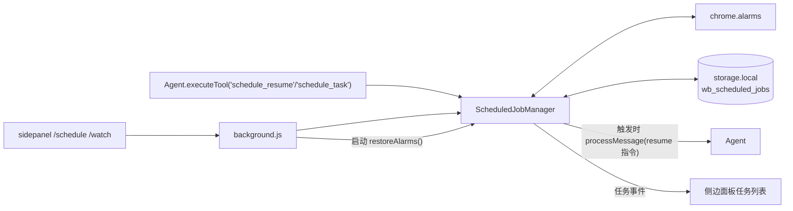

# ⏰ ScheduledJobManager 类职责

> 📁 `src/chrome/src/agent/scheduler.js:548` — `export class ScheduledJobManager`
> 🔌 由 background.js 创建并经 `agent.setScheduler()`（agent.js L1145）注入 Agent

## 🎯 类作用

Agent 的**跨会话时间层**：把"稍后继续"（resume）、"定时/循环任务"（task）、"页面监视"（watch）变成浏览器 `alarms` 驱动的持久任务。任务存 `chrome.storage.local` 的 `wb_scheduled_jobs`；后台重启时把 `running`/`needs_user_input` 状态降级为 `queued` 重试，**没有运行被静默丢失**。



## 🔧 方法表

| 方法 | 行号 | 职责 |
|---|---|---|
| `constructor({agent, ...})` | L549 | 注入 Agent 与设置读取器 |
| `start()` | L575 | 绑定 alarms 监听 |
| `restoreAlarms()` | L695 | 启动恢复：非终态任务重建闹钟，运行中降级 queued |
| `createResumeJob({tabId, conversationId, mode, args, ...})` | L773 | `schedule_resume` 工具后端：未来时间继续当前对话（终态工具，当前运行先结束） |
| `createTaskJob({tabId, args, source, ...})` | L811 | `schedule_task` / `/schedule` 命令：独立提示词任务，可循环 |
| `createWatchJob({args, ...})` | L875 | `/watch` 命令：专用非活动 tab 按 30-120s 轮询，`source:'watch'` |
| `cancelJob` / `deleteJob` / `pauseJob` | L935 / L959 / L979 | 生命周期操作 |
| `isRunning(tabId)` | L588 | Agent 运行占用查询 |
| `_withJobMutation(fn)` | L602 | 任务数组读-改-写串行化 |
| `_coalesceDuplicateJobs` | L639 | 重复任务合并（防同目标堆积） |
| `_nextQueueRetryMs` | L680 | queued 重试退避（30s 起，最多 120 次延迟后失败） |
| `_emit(job, event)` | L766 | 任务事件通知 |

## 💎 任务生命周期（与阶段一 4.1 呼应）

```
pending → running → completed
       ↘ queued ↗ ↘ needs_user_input
                    ↓
               failed / cancelled / paused
```

- `pending`：闹钟已设，等待触发
- `queued`：闹钟触发但 tab 忙，每 30s 重试（上限 120 次延迟）
- `needs_user_input`：任务运行中 `clarify` 挂起
- watch 任务：首查立即，`partial` 记录基线再轮询；连续 3 次失败停止；helper tab 分叉即关新开；`/beep` 暴露一次性 `beep` 工具，验证 `done(outcome="success")` 后经 offscreen 发声

## ✨ 设计亮点

1. **崩溃安全**：状态机 + 存储持久化 + 重启降级恢复，service worker 随时被杀不影响任务。
2. **与 Agent 运行规则协同**：`isRunning(tabId)` 与 Agent 的 `_claimRunEntry` 同一占用语义，定时任务不会与交互运行并发踩踏。
3. **watch 的基线语义**：失败轮询**从不**覆盖基线观察（防误报），成功事件键去重（`--keep`）。
4. **合并与退避**：重复任务合并 + queued 退避，防闹钟风暴。

## 🔗 协作图



## 📊 总结

| 维度 | 评价 |
|---|---|
| 任务类型 | resume / task / watch 三种 |
| 持久层 | storage.local JSON 数组 + alarms 闹钟 |
| 崩溃恢复 | 非终态降级 queued 重试（≤120 次） |
| 注入方式 | `agent.setScheduler()`（agent.js L1145）双向引用 |
