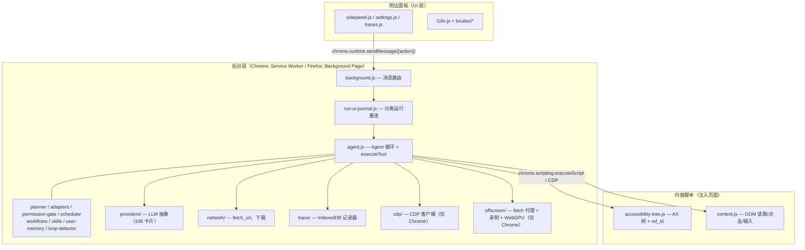

# WebBrain 架构分析

> 分析日期：2026-08-16 · 版本：32.0.0 · 许可证：MIT · 作者：Emre Sokullu
> 证据来源：脚本扫描（`out/01~05`）+ README.md、docs/architecture.md、manifest.json、package.json 及源码目录结构

## 1. 项目概览

WebBrain 是一个**开源 AI 浏览器 Agent 扩展**：在浏览器侧边栏中提供一个 LLM 驱动的自主 Agent，可以读取页面（通过无障碍树而非脆弱的选择器）、点击、输入、导航、上传下载，完成多步骤的浏览器自动化任务。支持自选模型——本地 llama.cpp/Ollama/vLLM 服务、云端 API，或零配置的托管默认（WebBrain Cloud）。

仓库实际上是一个**多包单仓（monorepo-lite）**，包含四个可独立交付的子项目：

| 子项目 | 技术 | 交付形态 |
|---|---|---|
| `src/chrome/` | Manifest V3 扩展（原生 JS, ESM） | Chrome/Edge 商店 & 免构建加载 |
| `src/firefox/` | Manifest V2 扩展（与 chrome 代码镜像） | Firefox Add-ons |
| `mcp-server/` | TypeScript + Node ≥20 | npm 包 `@webbrain/mcp-server`，stdio MCP 服务器 |
| `lmstudio-plugin/` | TypeScript + `@lmstudio/sdk` | LM Studio 插件 `webbrain/web-tools` |
| `web/` + `scripts/` | Node 构建脚本 + 多语言静态站 | 官网 / 文档站 / 博客 |

关键特征：**没有打包器、没有框架**。扩展代码是原生 ES Modules，直接从源码加载（开发即生产），仅两个 devDependencies（`playwright`、`tldts`）。

## 2. 顶层目录结构

```
webbrain/
├── src/
│   ├── chrome/            # Chromium 构建（MV3）—— 主构建
│   │   ├── manifest.json
│   │   ├── skills/        # 打包的默认技能（Markdown + 工具清单）
│   │   ├── vendor/        # 第三方库（pdfjs、katex）
│   │   └── src/           # 源码主体（见下文）
│   └── firefox/          # Firefox 构建（MV2）—— 结构镜像，minus cdp/offscreen/recorder
├── docs/                  # 设计与参考文档（en / zh-CN / fr + vision-models 资料源码）
├── mcp-server/            # MCP 服务器（Claude Code/Codex/Cursor 委托浏览器任务）
├── lmstudio-plugin/       # LM Studio 独立插件
├── web/                   # 落地页 + 文档站（15+ 语言目录）
├── test/                  # Node 测试套件、LLM 场景基准、安全注入语料
├── ci/                    # 端到端 CI 驱动（Playwright）与云捕获测试
├── scripts/               # 构建/发布/资产脚本（Node .mjs + Python）
└── assets/                # 图标、截图、商店物料
```

`src/chrome/src/` 内部：

```
src/
├── background.js          # 3478 行 —— 中央消息路由器（MV3 service worker）
├── run-ui-journal.js      # 分离式运行的重连/重放状态
├── run-reconnect.js / run-capture.js / cloud-runs.js / config-transfer.js ...
├── agent/                 # Agent 核心（50 个模块）
│   ├── agent.js           # 26,590 行 —— Agent 循环 + executeTool()
│   ├── tools.js           # 2101 行 —— 工具 schema + 系统提示词
│   ├── planner.js         # Plan-before-Act 结构化 JSON 规划器
│   ├── adapters.js        # 58+ 站点适配器
│   ├── permission-gate.js # 能力授权门
│   ├── scheduler.js       # 定时任务 / watch（chrome.alarms）
│   ├── workflows.js       # 保存的工作流（webbrain-workflow/1 编译器+重放器）
│   ├── skills.js          # 技能注册表 + 动态工具暴露
│   ├── user-memory.js     # 本地用户偏好记忆
│   ├── loop-detector.js / loop-bucket.js   # 三重循环检测
│   ├── rich-text-toolbar-guard.js/probe.js # 富文本工具栏安全边界
│   ├── captcha-solver.js / captcha-gate.js # CapSolver 集成
│   └── apocalypse-mode.js # 离线 Wikipedia ZIM 归档（OPFS）
├── providers/             # LLM 提供商抽象（BaseLLMProvider）
│   ├── base.js / manager.js / provider-catalog.js（106 张提供商卡片）
│   ├── openai.js / anthropic.js / azure-openai.js / aws-bedrock.js / vertex-anthropic.js
│   ├── llamacpp.js / webgpu.js（端点无关的本地 WebGPU 选项）
│   └── oauth-claude.js / context-windows.js / vision-capabilities.js ...
├── content/               # 注入页面的内容脚本
│   ├── accessibility-tree.js  # 1488 行 —— AX 树构建器 + ref_id 解析
│   ├── content.js             # 6247 行 —— DOM 读取/点击/输入实现
│   ├── teacher-capture.js     # /teach 模式动作捕获
│   └── social-media-downloader.js（MAIN world，社交站点）
├── cdp/                   # Chrome DevTools Protocol 客户端（仅 Chrome）
├── offscreen/             # MV3 offscreen 文档：fetch 代理 + 录制 + 本地 WebGPU 视觉
├── network/               # fetch_url / 下载等网络工具
├── recorder/ / trace/     # 标签页录制编排 / IndexedDB 追踪记录器
└── ui/                    # sidepanel.js（13,014 行）、settings.js（3622 行）、
                          # traces、history、i18n locales、apocalypse-mode 等
```

## 3. 分层架构



（依据 `docs/architecture.md` 的分层图与源码目录验证）

## 4. 架构模式与设计决策

### 4.1 消息路由 + 自主 Agent 循环（核心模式）

整体是**事件驱动的前后台分离**：UI 层只通过 `chrome.runtime.sendMessage` 发送 `{action, ...}` 消息；`background.js` 是唯一的中央路由器，管理 Agent 生命周期（`chat` / `chat_stream` / `continue` / `abort` / `clear_conversation`）、提供商配置和侧边栏可见性。

Agent 循环本身是经典的 **ReAct 工具循环**：调用 LLM → 解析 `toolCalls` → `executeTool()` 执行 → 结果回填 → 循环，直到模型返回纯文本（最终答案）或达到步数上限（可配置至 195 步，默认 130）。

### 4.2 双构建代码镜像（刻意不用共享目录）

`src/shared/` 模式被**刻意回避**——文件在 `chrome/` 与 `firefox/` 之间整体复制，使每个构建自包含、可免构建直接加载。文档明示："files are duplicated ... so each build is self-contained and can be loaded directly without a build step"。部分安全关键模块（如 `rich-text-toolbar-guard.js`）被要求**字节级一致**，并有专门测试（`test/rich-text-toolbar-guard.mjs`）守护。代价是每次改动需镜像到两处。

### 4.3 提供商抽象（策略模式）

所有 LLM 后端归一到 `BaseLLMProvider` 接口：

```
chat(messages, options)       → { content, toolCalls, usage }
chatStream(messages, options) → async generator
supportsTools / supportsVision → boolean
promptTier                    → 'compact' | 'mid' | 'full'
testConnection()              → { ok, error, model }
```

`promptTier` 同时驱动动作提示词与工具子集：本地提供商默认 Mid，云提供商强制 Full。新增提供商 = 子类化 `BaseLLMProvider` + 在 `providers/manager.js` 注册（README 的贡献指南明示此扩展点）。

### 4.4 模式（mode）与层级（tier）正交

- **Mode**（`ask` / `act` / `dev`）：用户授权什么——只读 / 实际操作 / 页面调试。
- **Tier**（`compact` / `mid` / `full`）：模型能看到多少工具——小本地模型 / 完整能力（hover、拖放、frames、shadow DOM）。

### 4.5 多层防御的安全架构

- `<all_urls>` + `debugger` 权限 = 完整浏览器访问；Agent 即用户的浏览器会话，无额外认证。
- Plan-before-Act 人工审批门、per-site 权限提示、`/allow-api` 破坏性 HTTP 方法门。
- 工具结果 8 KB 截断以限制注入面；不可信内容包装器 `_wrapUntrusted()`。
- `strictSecretMode` 凭据脱敏、富文本工具栏义务账本、消息接收者守卫（`message-recipient-guard.js`）。
- 专项文档：`docs/security-model.md`、`docs/prompt-injection-defense.md`、`docs/THREAT-MODEL.md`，并有注入语料安全测试（`test/security/injection-corpus.mjs`）。

### 4.6 其他值得注意的模式

| 模式 | 位置 | 说明 |
|---|---|---|
| 观察者/事件广播 | `onUpdate(type, data)` | Agent 通过 `tool_call`/`text_delta`/`plan_review` 等事件增量驱动 UI |
| 分离式运行 + 日志重放 | `run-ui-journal.js` + `runUi:<tabId>` | 关闭/重载面板不丢失运行，200ms 合并写入 `storage.session` |
| 声明式工具清单 | 技能 Markdown 中 ```` ```webbrain-tools ```` JSON 块 | 运行时解析生成工具 schema，`kind: http / httpDownloadJob` |
| 编译式工作流 | `workflows.js` | 从成功 trace 编译出**无值**的 `webbrain-workflow/1`，重放走语义匹配而非选择器 |
| 状态机 | `scheduler.js` | `pending→running→completed`，`queued`/`needs_user_input`/`paused` 等状态与 `chrome.alarms` 持久化 |
| 断路器 | Ask 流式聚合 | 传输失败自动降级为一次非流式重试，终端错误不重试 |

## 5. 关键文件规模（复杂度热点）

| 文件 | 行数 | 角色 |
|---|---|---|
| `src/chrome/src/agent/agent.js` | 26,590 | Agent 循环、executeTool、上下文管理、循环检测——单文件巨石 |
| `src/chrome/src/ui/sidepanel.js` | 13,014 | 聊天 UI、斜杠命令、渲染 |
| `src/chrome/src/content/content.js` | 6,247 | DOM 操作实现 |
| `src/chrome/src/ui/settings.js` | 3,622 | 设置界面 |
| `src/chrome/src/background.js` | 3,478 | 消息路由器 |
| `src/chrome/src/agent/tools.js` | 2,101 | 工具 schema + 系统提示词 |
| `src/chrome/src/content/accessibility-tree.js` | 1,488 | AX 树构建器 |

源码统计（脚本扫描）：JavaScript 344 个文件、TypeScript 13 个（mcp-server/lmstudio-plugin）、Python 61 个（脚本 + docs/vision-models 中的模型源码资料）。

## 6. 依赖关系

### 6.1 运行时依赖

**主包（扩展）无任何运行时 npm 依赖**——扩展在浏览器内运行，全部能力来自 Chrome/Firefox 平台 API。`vendor/` 内直接内置 pdfjs（PDF 文本提取）与 katex（数学渲染）。

| 包 | 依赖 | 用途 |
|---|---|---|
| `webbrain`（根） | devDeps: `playwright ^1.48`, `tldts 7.4.10` | e2e 测试、公共后缀域解析 |
| `@webbrain/mcp-server` | `@modelcontextprotocol/sdk ^1.12`, `ws ^8.18`, `zod ^3.23` | MCP 协议、桥接 WebSocket、schema 校验 |
| `@webbrain/lmstudio-web-tools` | `@lmstudio/sdk ^1.0`, `ws ^8.18`, `zod ^3.23` | LM Studio 插件接口、桥接 |

### 6.2 内部模块依赖（脚本扫描的高频导入）

```
getApocalypseModeCopy（44 处）  chromeWebStoreLocale（34 处）
t（i18n，15 处）                BaseLLMProvider（11 处，提供商继承）
escapeHtml（8 处）              provider-compatibility（11 处）
secureRandomBase36Token（6 处） fetchWithTimeout / fetchWithFallback（12 处）
formatErrorMessage（6 处）      chat-history-store / workflows / user-memory / skills（各 4 处）
```

导入图呈**星型**：`agent.js`、`sidepanel.js` 是汇聚点；`utils.js`、`i18n.js`、`error-format.js`、`text-sanitize.js` 是公共底座。无循环依赖迹象（纯静态 import，加载顺序由 manifest 的 content_scripts 数组与 ESM 图保证）。

### 6.3 外部系统依赖

```
LLM 提供商（106 张卡片）
 ├─ 云: OpenAI / Anthropic / Gemini / Azure / Bedrock / Mistral / DeepSeek /
 │       xAI / MiniMax / Kimi / Qwen / z.ai / Groq / Together / Cloudflare /
 │       Nvidia NIM / HF / Fireworks / OpenRouter / WebBrain Cloud ...
 └─ 本地: llama.cpp / Ollama / vLLM / SGLang / LM Studio / Jan / LocalAI / GPT4All / WebGPU
CapSolver（验证码）  ·  WebMCP（实验性 CDP 域）  ·  Mail.tm / Open-Meteo / Open Library /
Wikipedia + Kiwix ZIM（技能端点）  ·  桥接端口 17373(Cloud)/17374(MCP)/17375(LM Studio)
```

## 7. Chrome vs Firefox 架构差异

| 维度 | Chrome（MV3） | Firefox（MV2） |
|---|---|---|
| 后台 | Service worker（无常驻） | 常驻 background page |
| 事件 | CDP 可信事件（`isTrusted=true`） | 合成事件（部分 React/Vue 处理器不触发） |
| 截图 | CDP `Page.captureScreenshot` | `browser.tabs.captureTab()` |
| Offscreen 文档 | 有（fetch 代理 + 录制 + WebGPU） | 无 |
| Shadow DOM 穿透 | CDP 闭根穿透 + `shadow_dom_query` | 仅开放根 |
| 可逆 Dev 补丁 / 控制台网络诊断 | 有 | 无 |
| 桥接（MCP/LM Studio/Cloud） | 支持 | 不支持（无 offscreen 文档） |

除 Chromium 专属的 WebGPU 提供商与视觉 sidecar 外，Agent 循环、工具、适配器、循环检测、上下文管理、系统提示词在两个构建间**架构一致**。

## 8. 架构评估

**优势**
- 零构建、零框架的浏览器原生工程，扩展点清晰（`BaseLLMProvider`、站点适配器、技能清单、工具 checklist 文档化）。
- 安全设计深入产品结构（模式/层级正交、多重守卫、威胁模型文档、注入语料测试）。
- 文档质量罕见地高：架构、安全、隐私、工具矩阵、贡献指南齐备，且有中/法语版本。

**风险/权衡**
- `agent.js` 26k 行、`sidepanel.js` 13k 行的巨石文件是显著的维护热点。
- 双构建全量复制使每次跨浏览器改动成本翻倍，依赖"字节一致"测试与人工纪律。
- MV3 service worker 的无常驻性与复杂运行状态（流式、分离运行）之间的张力需要 journal/重连机制持续补偿。
