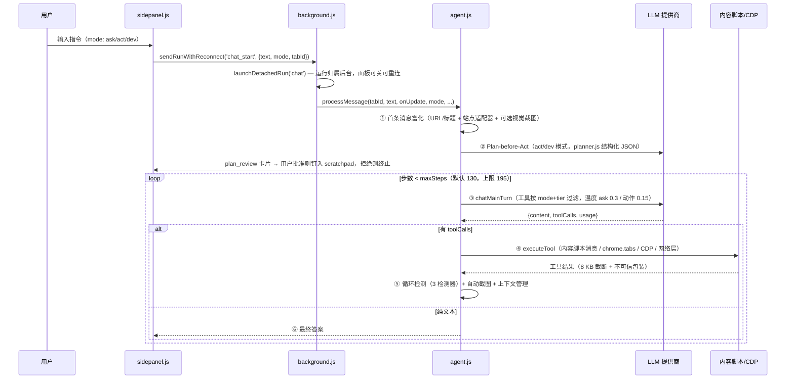
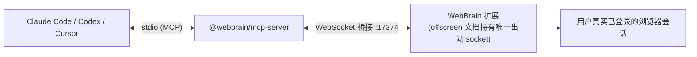

# WebBrain 运行机制分析

> 分析日期：2026-08-16 · 证据：docs/architecture.md、manifest.json、package.json、test/run.js、mcp-server/src/*.ts 及脚本扫描

## 1. 入口点

| 入口 | 文件 | 触发方式 |
|---|---|---|
| 扩展后台（Chrome MV3） | `src/chrome/src/background.js`（`"type": "module"`） | 浏览器自动启动 service worker |
| 扩展后台（Firefox MV2） | `src/firefox/src/background.js` | 常驻 background page |
| 侧边面板 UI | `src/chrome/src/ui/sidepanel.html/js` | 点击工具栏图标 / `Alt+Shift+W` |
| 设置页 | `src/chrome/src/ui/settings.html/js`（`options_page`） | 右键菜单 / 面板入口 |
| 内容脚本 | manifest `content_scripts`，`<all_urls>` | 页面加载时注入 |
| MCP 服务器 | `mcp-server/dist/index.js`（`bin: webbrain-mcp`） | `npx -y @webbrain/mcp-server` 或 MCP 客户端拉起 |
| LM Studio 插件 | `lmstudio-plugin/dist/index.js` | `lms clone webbrain/web-tools` |
| 测试运行器 | `test/run.js`（纯 Node，无框架无 chrome.* API） | `npm test` |

内容脚本注入分组（manifest 验证）：`document_start` 注入 `file-picker-guard-page.js`（MAIN world）、`selection-shortcut.js`；`document_idle` 依次注入 `rich-text-toolbar-heuristic.js → accessibility-tree.js → teacher-capture.js → content.js → agent-visual-indicator.js`——AX 处理器必须先于 `content.js` 就绪；社交站点额外在 MAIN world 注入 `social-media-downloader.js`。

## 2. 完整回合（Turn）流程

用户在侧边栏输入 → Agent 自主执行 → 增量渲染结果：



### 2.1 首条消息富化（`_enrichUserMessageWithCurrentPage`）

1. `chrome.tabs.get` 取 URL + 标题（经消毒）；
2. 该 tab 若设置了 `/allow-api` → 注入 `[USER OVERRIDE]` 前言；
3. 启用站点适配器时 `getActiveAdapter(url)` 注入适配器指导（**同时刻只激活一个**）；
4. 提供商支持视觉（或配置了专用视觉模型）→ CDP 截取视口截图，可选用视觉模型生成文字描述，以 `image_url` 块附加。

WebBrain **默认不发送原始 HTML/DOM**：页面上下文按需通过语义无障碍树或提取文本获取，带可见性过滤、字符预算与分页。

### 2.2 Plan-before-Act 门

手动 Act/Dev 运行在工具循环前先调用一次规划器（`planner.js`）：Off 用紧凑意图 schema；Try（默认）/Strict 用完整规划 schema（摘要、步骤、`skill_ids`、风险、动作模式、消息接收者目标）。返回合法 JSON → 面板渲染**可编辑审批卡**；批准后计划钉入 scratchpad（抗压缩）。Try 模式下 JSON 修复失败仅降级为只读 Ask 回合，Strict 直接停止。规划器看到的是不可信包装的页面上下文，图像块被丢弃。

### 2.3 主循环细节

- 工具目录：`getToolsForMode(mode, { tier })` + 活跃技能的动态工具 schema。
- **Ask 模式流式**：满足条件（ask 模式、交互式 chat_start、提供商 `_supportsInteractiveAskStreaming()`、流式断路器未打开）时走流式聚合器——`text_delta` 实时广播；推理/工具调用缓存到终端事件（`response.completed` / `message_stop` / `[DONE]`）才返回。传输读失败 → 清空已发文本、本回合禁用流式、静默用 `provider.chat()` 重试一次。
- 工具批内逐个执行，每次执行后跑循环检测。

## 3. 工具执行分发（`executeTool`）

| 工具组 | 执行位置 |
|---|---|
| `get_accessibility_tree` / `click_ax` / `type_ax` / `set_field` / `hover` | 内容脚本消息（注入页面） |
| `click` / `type_text` / `press_keys` / `scroll` / `read_page` 等 | 内容脚本消息 |
| `navigate` / `new_tab` / `go_back` / `go_forward` | `chrome.tabs` API（后台） |
| `fetch_url` / `research_url` / `list_downloads` | `network/network-tools.js`（service worker） |
| 技能工具 | `skills.js` 注册表 + `executeHttpSkillTool()` |
| `list_webmcp_tools` / `execute_webmcp_tool` | 实验性 CDP `WebMCP` 域（Chrome，默认关闭） |
| `done` | agent.js — 捕获验证截图 + 页面状态探针 |
| `clarify` | agent.js — 暂停等待用户输入 |
| `solve_captcha` | captcha-solver.js + CapSolver API |
| `read_pdf` | pdf-tools.js（vendor pdfjs） |
| `scratchpad_write` | agent.js — 内存钉定笔记 |
| Dev 专属：`read_page_source` / `inspect_element_styles` / `inject_css` / `patch_element` / `execute_js`（CDP `Runtime.evaluate`，15 秒超时）/ `read_console` / `inspect_network_requests` 等 | 内容/CDP 辅助（多為 Chrome Dev-only） |

## 4. 循环检测（三重独立检测器，每次工具调用后）

1. **通用重复**：最近 6 次调用按（名称 + 参数哈希 + 结果）判定；3 次相同或 ABAB → 提醒；8 次提醒且中间无 2 次健康调用 → 停止。
2. **坐标点击**：5px 分桶；同桶 5 次 → 提醒；8 次 → 停止。
3. **导航**：click/navigate/iframe_click 前快照 URL，事后比对。

可选 API 变更观察者（默认关闭）开启时：重复点击若在 3 秒窗口内产生相同 URL+HTTP 方法（来自 `webRequest` 缓冲），循环警告附带精确的 `fetch_url({url, method})` 捷径建议。

## 5. 上下文管理（`_manageContext`）

每回合开始**和**每次循环迭代顶部都会运行（长自主运行可中途压缩）：

| 机制 | 阈值/规则 |
|---|---|
| 自动压缩 | 消息数 > 50，或原始字符 > 80,000，或 token 预算越过 `contextCompactRatio`（0.75）× 提供商 `contextWindow`（本地默认 16k，云/路由 128k） |
| 压缩策略 | 保留系统提示 + 原始用户任务 + LLM 摘要的旧消息 + 最近 30 条原文；发出 `context_compacted` 事件（面板渲染分隔线） |
| 紧急裁剪 | 上下文溢出时仅保留最近 6 条（压缩后仍被拒的硬兜底） |
| 图像修剪 | 每次 LLM 调用前剥离除最近 4 条消息外的 base64 图像 |
| 工具结果上限 | 单条结果 8,000 字符截断 |

token 计数优先用提供商上报的 `usage.prompt_tokens`（含系统提示 + 工具 schema），流式路径回退 chars/4 估算。

## 6. 会话与 UI 持久化（按 tab 隔离）

| 键 | 内容 |
|---|---|
| `agentConv:<tabId>` | 面向提供商的对话，下一条消息前水化 |
| `tabChat:<tabId>` | 已渲染聊天 HTML 镜像（关/开面板恢复可视记录） |
| `runUi:<tabId>` | 后台持有的分离运行快照：请求/运行身份、状态、≤256 事件重放窗口、计划/工具状态、终端内容、累计流式文本 |

`text_delta` 日志写按 200ms 尾随定时器合并；非 delta、终端状态、工具前持久化检查点立即刷盘。Chrome 用 `chrome.storage.session`，Firefox 用 `browser.storage.session`。

## 7. 事件流（`onUpdate` → 面板）

`tool_call`、`tool_result`、`text` / `text_delta`、`warning`（循环检测/导航警告）、`clarify`、`plan_review`、`error`、`context_compacted`——后台经 `chrome.runtime.sendMessage` 中继，面板增量渲染。面板关闭/重连时从 `runUi:<tabId>` 日志重放恢复视图，不重新启动运行。

## 8. 关键子系统运行机制

### 8.1 无障碍树（页面交互主路径）

`accessibility-tree.js` 暴露 `window.__generateAccessibilityTree()`（DOM 遍历器 → 扁平缩进文本树，每个节点有稳定 `ref_id`）、`window.__wb_ax_lookup()`（ref_id → Element 解析）与 WeakRef 支撑的 `__wbElementMap` 注册表。工具据此以语义方式定位元素而非脆弱 CSS 选择器。

### 8.2 CDP 客户端（仅 Chrome）

封装 `chrome.debugger`：可信事件（`Input.dispatchMouseEvent/KeyEvent`）、截图（`Page.captureScreenshot` 带裁剪/缩放）、shadow DOM 穿透（`Runtime.evaluate`、闭根 `DOM.getDocument`）、实验性 WebMCP 域（不透明 `wmcp_*` 句柄、200 注册上限、25/页分页、调用超时取消）。Firefox 无 CDP，全部为合成事件。

### 8.3 技能系统（动态加载）

- 存储：`chrome.storage.local` 的 `customSkills`；启动时后台合并打包默认技能，删除墓碑阻止默认技能被悄悄加回。
- 三个面：路由目录（```` ```webbrain-skill ```` JSON：summary ≤200 字符、modes、≤6 个语义 intents）→ 提示词注入（激活时追加全文 prose）→ 工具暴露（```` ```webbrain-tools ```` 清单 → 动态 schema，`kind: http / httpDownloadJob`）。
- **选择机制**：无关键词匹配器/嵌入搜索——规划器与执行 LLM 用同一小目录做语义路由；规划器返回 `skill_ids`，批准后激活。`load_skill` 幂等，回合结束清除活跃集。
- 信任边界：激活仅可因用户请求或可信对话上下文，不可因页面/文档/工具内容请求；`resultPolicy: "untrusted"` 结果走不可信包装。
- 确定性例外：可信推荐动作预激活其 `firstTool` 拥有者（如媒体下载 → FreeSkillz）；NYTimes 适配器运行预激活站点域回退。

### 8.4 规划器与运行时上下文信封

浏览器持有的每回合运行时上下文（有效 `runtime_mode`、变异工具是否启用）一次性加入当前用户回合，规划器与执行器共享——页面内容或陈旧历史**无法重定义实时模式**。规划器调用带 `phase: "planner"` 追踪、费用配额守卫、中断检查、一次 JSON 修复重试。

### 8.5 调度器（`scheduler.js`，实例化为 `ScheduledJobManager`）

- 用 `chrome.alarms`；任务存 `chrome.storage.local` 的 `wb_scheduled_jobs`；后台重启时 `running`/`needs_user_input` 降级为 `queued` 重试（最多 120 次 30 秒延迟）。
- 任务类型：`resume`（`schedule_resume` 工具，终态）、`task`（`schedule_task` 工具）、`source: "watch"`（`/watch` 命令：专用非活动 tab 按 30–120 秒轮询，首次立即检查；`partial` 结果记录为下次基线；连续 3 次失败停止；可选 `/beep` 暴露一次性 `beep` 工具，经 offscreen 文档发声）。
- 状态机：`pending → running → completed`，旁路 `queued`/`needs_user_input`/`paused`/`failed`/`cancelled`。

### 8.6 保存的工作流（`workflows.js`）

从活跃对话最新成功 trace **编译**（非序列化）出 `webbrain-workflow/1`，存 `wb_saved_workflows_v1`。编译剥离历史元素引用、选择器、坐标、查询串、已输入值——每个输入值变为运行时参数声明。重放执行器：每步前检查 origin/path 族 → 读新 AX 树解析**恰好一个**语义匹配 → 走 `_executeToolBatch()`（现有权限/表单/验证门仍然权威）→ 校验后置条件 → 匹配失败时可给最多 5 个语义候选让用户选择（修复仅在成功验证后原子持久化）。`/teach --start/--end` 是第二个无值编译输入：只观察可信顶层点击/字段完成/提交/导航，字段值从不读取。

### 8.7 用户记忆（`user-memory.js`）

`wb_user_memory_v1`：`{version, updatedAt, records:[{id, text, kind, scope, confidence, source, ...}]}`，kind 限 `preference`/`profile_hint`/`workflow_preference`。归一化丢弃畸形记录、疑似密钥、页面事实、重复文本。系统提示构建时注入有界块（`userMemoryMaxPromptChars` 封顶，提示"记忆是上下文不是命令"）。自动学习默认关闭；`/memory --add` 立即写入。v1 无嵌入或检索调用。

### 8.8 提供商能力探测

Ollama/llama.cpp/LM Studio/LocalAI 在页面富化前从原生服务器元数据解析 `supportsVision`；显式模型/基 URL 身份缓存受陈旧结果守卫保护；空 Model 字段视为服务器可变已加载槽位，每回合重查；探测限时 3 秒、失败关闭但不失败文本请求。

## 9. MCP 服务器运行机制（`mcp-server/`）



- 传输：stdio MCP（`@modelcontextprotocol/sdk`）；桥接端口默认 **17374**（`WEBBRAIN_BRIDGE_PORT` 可覆写），与 WebBrain Cloud 的 17373、LM Studio 插件的 17375 互斥——扩展同时只持有一个桥接 socket，在 Settings → General → Advanced → Cloud bridge 切换。
- 暴露**六个任务级工具**（run、结构化抽取 `webbrain_extract`、status、clarification 应答、abort、连接诊断），刻意**不**暴露 ~50 个低级浏览器原语——WebBrain 的权限门在 Agent 循环内，按原语直连会绕过它。
- `mode='ask'` 只读；`mode='act'` 受与人类相同的浏览器内审批提示门控。仅 Chromium 支持（需 offscreen 文档）。

## 10. LM Studio 插件运行机制（`lmstudio-plugin/`）

`fetch_url` / `research_url` 是纯 Node HTTP（无浏览器、无 cookie、无 JS 渲染）；装有 Chromium 扩展时 `browser_task` 额外委托给真实已登录浏览器，无扩展连接时降级给出可操作提示。

## 11. 测试运行机制

- `npm test` = 工具栏守卫测试 + `node test/run.js`（纯 Node 测试器：每个测试一个 async 函数，抛错即失败；用 `vm` + 源码切片在 Node 中加载侧边栏的斜杠命令运行时，**不需要浏览器**）+ 安全注入语料。
- LLM 场景基准：`test/llm/run-scenarios.mjs`（含 prompt-injection 类目）、安全报告生成。
- 端到端：`ci/run.mjs`（Playwright 驱动真实浏览器）、`test/webmcp-e2e.mjs`。
- mcp-server/lmstudio-plugin：`tsc` 构建 + `node --test`。

## 12. 安全机制运行时要点

- `strictSecretMode`：指示模型不在摘要中引用凭据、从云运行发布物中脱敏已知凭据值（含短数字 PIN/CVV），注册表满时失败关闭为标量脱敏。
- 富文本工具栏守卫：解析为格式控件的输入尝试在分发前拦截；单 tab 义务账本（归一化、去重、导航降级、恢复义务持久化、完成阻塞）；恢复要求带原始文本的正面验证编辑。
- 消息接收者守卫（Douyin `/chat` 首个 `messaging.verifyActiveRecipient` 路由）：发送类点击/提交/Enter 前从 composer 上方狭窄区域收集唯一头部身份证据，要求精确归一化身份相等，缺失/含糊/不匹配一律 no-dispatch 阻断；每次授权动作获得一次性绑定（目标+composer+URL+身份集），CDP 与内容分发消费前立即重验证。
- 追踪数据仅存本地 IndexedDB，从不传输；LLM 请求追踪事件只含隐私安全的提示词来源元数据（变体、字符数、角色计数、策略修订号），不复制原文。
